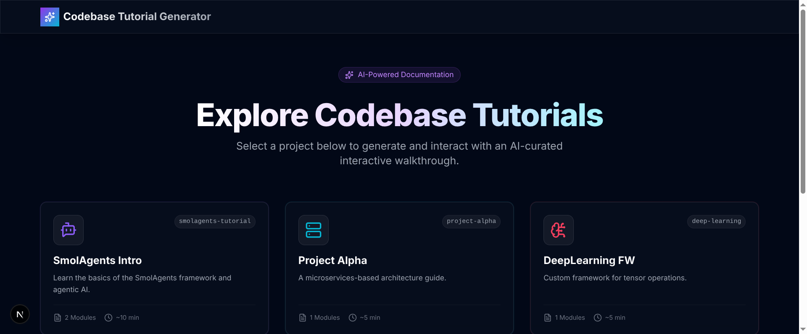
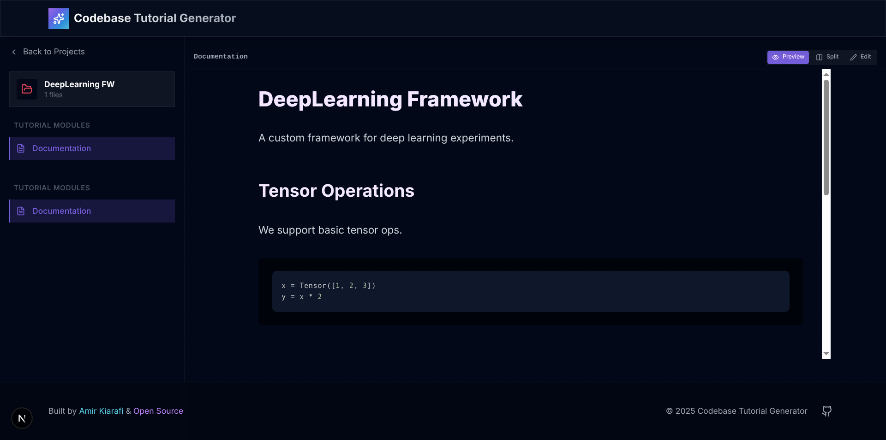

# Smolagents Quickstart Template

A minimal template for building AI agents with [Smolagents](https://huggingface.co/docs/smolagents). Features tool-calling agents, filesystem operations, optional multi-agent orchestration, and OpenTelemetry tracing.

## Features

- Knowledge-base pipeline that orchestrates typed analyzer sub-agents
- Tutorial generation pipeline with optional code search and RAG helpers
- CLI utilities for question-answering and ad-hoc sub-agent runs
- Easy LLM provider integration via LiteLLM
- OpenTelemetry tracing with Phoenix and OpenInference for pipeline observability
- Optional retrieval-augmented generation backed by a local Chroma vector store

## Quick Start

1. **Install dependencies:**

   ```bash
   uv sync
   ```

1. **Set up environment:**
   ```bash
   cp env.example .env
   ```
1. **Configure API key:** See [API Key Setup Guide](docs/api_key.md) for detailed instructions

1. **Run a pipeline:**
   ```bash
   ./run.sh knowledge-base
   # or run directly
   uv run pipelines/cli.py knowledge-base
   ```
   Follow up with tutorials once the knowledge base is ready:
   ```bash
   ./run.sh tutorials --rag --code-search
   ```

### Pipeline CLI (Knowledge Base & Tutorials)

Use the bundled CLI to generate knowledge-base docs, tutorials, and Q&A responses:

```bash
uv run pipelines/cli.py knowledge-base
uv run pipelines/cli.py tutorials --code-search --rag --rag-max-snippets 3
uv run pipelines/cli.py qa "How do background jobs work?"
uv run pipelines/cli.py spawn-subagents "Analyze src/utils and document helper utilities"
uv run pipelines/cli.py bench --codebase /path/to/repo1 --codebase /path/to/repo2 --rag
```

`bench` runs both the baseline (single agent) and deep-with-KB pipelines for each codebase you pass, then writes artifacts under `data/bench/<repo>/` plus a rollup at `data/bench/bench_results.json`. Use `--skip-baseline` or `--skip-deep` to limit runs and `--force-rebuild-kb` to ignore cached KB outputs.

You can also control these defaults with environment variables:

| Feature             | CLI flag                                | Env var                               |
| ------------------- | --------------------------------------- | ------------------------------------- |
| Code search tools   | `--code-search` / `--no-code-search`    | `TUTORIAL_ENABLE_CODE_SEARCH=true`    |
| Retrieval helper    | `--rag` / `--no-rag`                    | `TUTORIAL_ENABLE_RAG=true`            |
| Snippet cap         | `--rag-max-snippets N`                  | `TUTORIAL_RAG_MAX_SNIPPETS=N`         |
| Tutorial step delay | `tutorials --step-delay-seconds 1.5`    | `TUTORIAL_STEP_DELAY_SECONDS=1.5`     |
| KB step pad         | `knowledge-base --step-delay-seconds 2` | `KNOWLEDGE_BASE_STEP_DELAY_SECONDS=2` |
| KB target cap       | `knowledge-base --max-targets 4`        | `KNOWLEDGE_BASE_MAX_TARGETS=4`        |

With `--rag` enabled the tutorial toolkit rebuilds a persistent Chroma collection under `data/rag_vector_store`, embedding knowledge-base markdown and selected source files via LiteLLM. Subsequent queries are answered with semantic matches pulled from that vector store.

During knowledge-base generation the pipeline now writes a `scouting_report.md` snapshot (tree view plus README excerpts) before delegating to analyzer sub-agents, making the process easier to audit.

When enabled, the tutorial agent instructions remind it to call these helpers before guessing, leading to more grounded guides that include inline code samples from the repo.

## Documentation

- **[How to Use Guide](docs/how_to.md)** - Student-friendly tutorials and exercises
- **[API Key Setup](docs/api_key.md)** - Complete guide for getting API keys

## Requirements

- Python 3.13+
- uv package manager

## License

MIT

## Web UI

A modern web interface is available for browsing and editing generated tutorials.

<div align="center">
  
  <br/><br/>
  
</div>

### Quick Start (UI)

```bash
cd ui
npm install
npm run dev
```

Open [http://localhost:3000](http://localhost:3000) to view the tutorial browser.

See [ui/GUIDE.md](ui/GUIDE.md) for detailed setup instructions.
