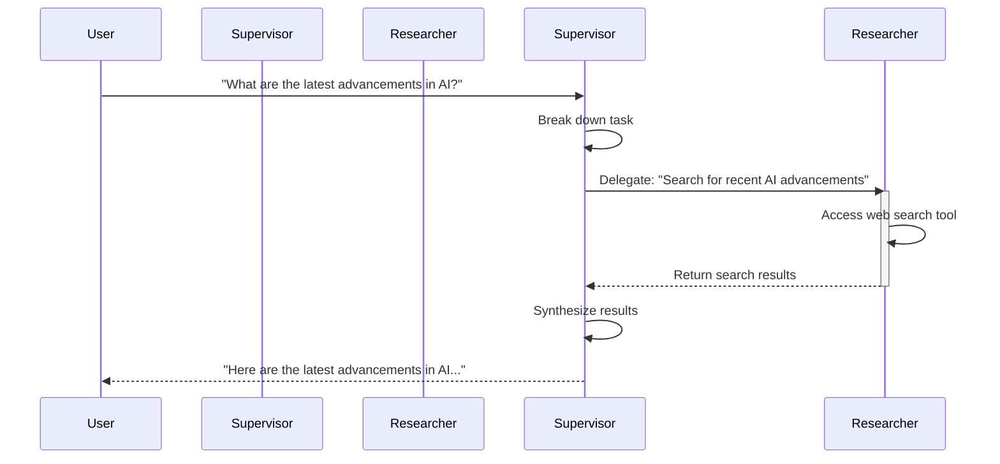

'''
# Advanced Architecture: Supervisors and Sub-agents

In complex AI systems, it's often beneficial to move beyond a single, monolithic agent and instead adopt a multi-agent architecture. A powerful pattern for this is the **Supervisor-Sub-agent** model. This tutorial will explore this concept and demonstrate how to implement it using the `deepagents` library.

## The Supervisor-Sub-agent Model

The Supervisor-Sub-agent model is a hierarchical architecture where a central **Supervisor** agent coordinates the work of one or more specialized **Sub-agents**.

- **Supervisor Agent**: The Supervisor is the "manager" of the system. It receives a high-level task, breaks it down into smaller, more manageable sub-tasks, and delegates them to the appropriate Sub-agents. After the Sub-agents complete their tasks, the Supervisor synthesizes their outputs to produce the final result.

- **Sub-agents**: Sub-agents are "specialists" designed to perform specific types of tasks. For example, you might have a `researcher` agent for web searches, a `coder` agent for writing code, or a `database` agent for interacting with a database. This specialization allows for better performance and more modular, maintainable code.

This architecture is particularly useful for tasks that are too complex for a single agent to handle, or that require a combination of different skills or access to different tools.

## Architecture Diagram

Here's a Mermaid diagram illustrating the flow of a task from a user to a Supervisor, which then delegates to a Sub-agent:



## Defining a Sub-agent

In `deepagents`, a Sub-agent is defined as a dictionary containing its configuration. Let's create a `researcher` sub-agent that can search the web.

First, we need a tool for our sub-agent to use. We'll use the `TavilyClient` for web searches.

```python
import os
from typing import Literal
from tavily import TavilyClient

tavily_client = TavilyClient(api_key=os.environ["TAVILY_API_KEY"])

def internet_search(
    query: str,
    max_results: int = 5,
    topic: Literal["general", "news", "finance"] = "general",
    include_raw_content: bool = False,
):
    """
    Searches the internet for a given query using the Tavily API.
    """
    return tavily_client.search(query=query, max_results=max_results, search_depth="advanced")
```

Now, we can define the sub-agent itself:

```python
research_subagent = {
    "name": "research-agent",
    "description": "Used to research in-depth questions",
    "system_prompt": "You are an expert researcher who is great at searching the web.",
    "tools": [internet_search],
}
```
As you can see, the sub-agent is a dictionary specifying its `name`, `description`, `system_prompt`, and the `tools` it has access to.

## Creating a Supervisor and Delegating Tasks

Now that we have our `researcher` sub-agent, we can create a Supervisor agent and pass the sub-agent to it. The Supervisor will be able to delegate tasks to the `research-agent` using the built-in `task` tool.

```python
from deepagents import create_deep_agent

# The Supervisor agent
supervisor = create_deep_agent(
    subagents=[research_subagent]
)

# Give the supervisor a task that requires research
result = supervisor.run("What are the main features of the new Python 3.12 release?")

print(result)
```

In this example, the `supervisor` agent is created with the `research_subagent` in its list of sub-agents. When the supervisor receives the task "What are the main features of the new Python 3.12 release?", it will recognize that this requires web research and delegate the task to the `research-agent`. The `research-agent` will use its `internet_search` tool to find the information, and the supervisor will then synthesize the results into a final answer.

This example demonstrates the power and simplicity of the Supervisor-Sub-agent architecture in `deepagents`. By breaking down complex tasks and delegating them to specialized sub-agents, you can build more robust and capable AI systems.
'''