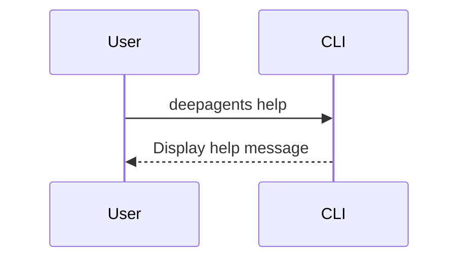

# Quickstart: Your First Deep Agent

Welcome to the world of Deep Agents! This guide will walk you through the installation of the `deepagents-cli` and running your first command. The CLI is a powerful tool that brings an AI coding assistant to your terminal.

## Installation

The `deepagents-cli` is a Python package that can be installed using `pip`. Open your terminal and run the following command:

```bash
pip install deepagents-cli
```

This will install the necessary packages and make the `deepagents` command available in your shell.

## Running Your First Command

Once the installation is complete, you can interact with your deep agent. The simplest command is to ask for help, which will display all the available options and commands.

```bash
deepagents help
```

This command provides a comprehensive overview of the CLI's capabilities. Here's a sample of what you should see:

```text
Usage: deepagents [OPTIONS] COMMAND [ARGS]...

  A powerful, extensible CLI for interacting with Deep Agents.

Options:
  --agent TEXT          Specify the agent to use for the session.
  --auto-approve        Automatically approve all tool usage, skipping human-
                        in-the-loop prompts.
  --sandbox [modal|runloop|daytona]
                        Execute code in a remote sandbox environment.
  --sandbox-id TEXT     Reuse an existing sandbox by providing its ID.
  --help                Show this message and exit.

Commands:
  create  Create a new agent configuration.
  help    Show this message and exit.
  list    List all available agent configurations.
```

## Understanding the Workflow

The interaction with the `deepagents-cli` follows a simple flow. You issue a command, and the agent responds. This can be a simple request for information or a more complex task involving code generation and file manipulation.

Here's a Mermaid diagram illustrating the basic interaction:



## Next Steps

You have successfully installed the `deepagents-cli` and run your first command. You are now ready to explore more advanced features, such as creating custom agents and adding new skills. In the next tutorial, we will dive deeper into the agent's architecture and explore its core components.