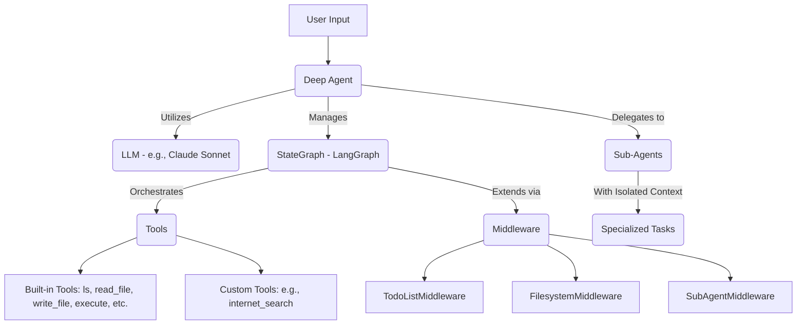

# Getting Started with Deep Agents

## 1. Goal
In this tutorial, you will learn how to get started with `deepagents`, a simple yet powerful agent harness that provides capabilities like planning, filesystem access, and sub-agent delegation. By the end, you will have a working understanding of how to create and customize a deep agent, and how to utilize its built-in tools.

## 2. Prerequisites
- Python 3.9+
- Basic understanding of large language models (LLMs) and agent concepts.
- An API key for Tavily (for web search functionality) and optionally for Anthropic or OpenAI.

## 3. Architecture
Deep agents leverage LangGraph to create a `StateGraph` that orchestrates various components. The core idea is to provide an agent with a set of tools and the ability to plan and execute tasks, including delegating to specialized sub-agents. Middleware plays a crucial role in extending the agent's capabilities, such as managing a todo list or interacting with a filesystem.



## 4. Step 1: Installation and Setup
First, we need to install the `deepagents` library and any additional tools we plan to use, such as `tavily-python` for web search. We'll also set up our API keys.

```bash
pip install deepagents tavily-python
```

Next, set your API key for Tavily (and potentially Anthropic or OpenAI, depending on your chosen model) as environment variables. You can obtain a Tavily API key from [tavily.com](https://www.tavily.com/).

```bash
export TAVILY_API_KEY="your_tavily_api_key"
# export ANTHROPIC_API_KEY="your_anthropic_api_key" # If using Anthropic models
# export OPENAI_API_KEY="your_openai_api_key" # If using OpenAI models
```

## 5. Step 2: Creating Your First Deep Agent
Now, let's create a basic deep agent. We will provide it with a custom tool for internet search and a system prompt that defines its role.

```python
import os
from deepagents import create_deep_agent
from tavily import TavilyClient # Ensure you have 'tavily-python' installed

# Initialize Tavily client
tavily_client = TavilyClient(api_key=os.environ.get("TAVILY_API_KEY"))

# Define a custom tool for internet search
def internet_search(query: str, max_results: int = 5):
    """Run a web search"""
    return tavily_client.search(query, max_results=max_results)

# Create the deep agent
# The agent is configured with our custom internet_search tool.
# The system_prompt guides the agent on its overall objective.
agent = create_deep_agent(
    tools=[internet_search],
    system_prompt="Conduct research and write a polished report.",
)

# Invoke the agent with a user query
# The agent will use its tools and instructions to fulfill this request.
result = agent.invoke({"messages": [{"role": "user", "content": "What is LangGraph?"}]})

# Print the result
print(result)
```

### Understanding `create_deep_agent`

The `create_deep_agent` function is the entry point for configuring your agent. It takes several key parameters:

-   `model`: Specifies the underlying language model to use (defaults to Claude Sonnet 4). You can pass a `BaseChatModel` instance or a string identifier.
-   `tools`: A list of `BaseTool` instances or callables that the agent can use. In our example, we provided `internet_search`.
-   `system_prompt`: A string that provides high-level instructions and context to the agent. This prompt is *appended* to a set of default instructions that deep agents automatically inject, which include guidance on using built-in tools.

Crucially, `create_deep_agent` returns a compiled `LangGraph StateGraph`. This means that deep agents are fully compatible with LangGraph's powerful features, such as streaming, human-in-the-loop workflows, memory management, and integration with LangChain's ecosystem.

### Built-in Tools
Every deep agent comes with a standard set of powerful built-in tools, provided by default middleware. These tools significantly enhance the agent's capabilities right out of the box:

-   `write_todos`, `read_todos`: For managing structured task lists and tracking progress.
-   `ls`, `read_file`, `write_file`, `edit_file`, `glob`, `grep`: A comprehensive suite for filesystem operations, allowing the agent to read, write, and manipulate files. The `execute` tool allows running shell commands in a sandboxed environment.
-   `task`: This tool enables the agent to delegate complex parts of a task to specialized sub-agents with their own isolated contexts. This is key for breaking down large problems into manageable components.

These tools are seamlessly integrated and explained to the agent through the default system prompts injected by the middleware.

## 6. Conclusion
You've successfully created your first deep agent, integrated a custom tool, and understood the core concepts behind `deepagents`. You've seen how `create_deep_agent` leverages LangGraph and provides a rich set of built-in tools to empower your agents. To further extend your agent's capabilities, explore customizing middleware, defining sub-agents for complex workflows, and configuring different backends for persistent storage or execution environments.