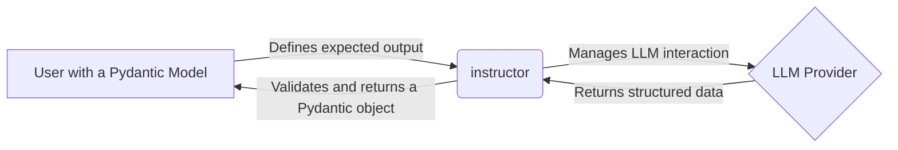

# Getting Started with Instructor

## 1. Goal

In this tutorial, you will learn how to use `instructor` to reliably get structured data from Large Language Models (LLMs). By the end, you will be able to extract information from a natural language string into a Pydantic object.

## 2. Prerequisites

- Python 3.9+
- Basic understanding of Python and Pydantic models.

## 3. Architecture

`instructor` simplifies the process of getting structured data from LLMs. Instead of manually defining JSON schemas, handling API responses, and parsing the output, you just define a Pydantic model and `instructor` does the rest.



## 4. Step 1: Installation

First, you need to install `instructor`. You can do this using `pip`:

```bash
pip install instructor
```

## 5. Step 2: Basic Extraction

Let's start with a simple example. We want to extract a user's name and age from a sentence.

First, define the data structure you want to extract using a Pydantic model:

```python
from pydantic import BaseModel

class User(BaseModel):
    name: str
    age: int
```

Now, let's use `instructor` to extract the data. We will use OpenAI's GPT-4o-mini as an example.

```python
import instructor
from pydantic import BaseModel

# Define the model
class User(BaseModel):
    name: str
    age: int

# Patch the client
client = instructor.from_provider("openai/gpt-4o-mini")

# Extract the data
user = client.chat.completions.create(
    response_model=User,
    messages=[{"role": "user", "content": "John is 25 years old"}],
)

assert isinstance(user, User)
print(user)
# > User(name='John', age=25)
```

That's it! `instructor` handles the conversation with the LLM, and you get a validated Pydantic object back.

## 6. Step 3: Working with Different Providers

`instructor` supports various LLM providers. You can easily switch between them.

### OpenAI
```python
import instructor
client = instructor.from_provider("openai/gpt-4o")
```

### Anthropic
```python
import instructor
client = instructor.from_provider("anthropic/claude-3-5-sonnet")
```

### Google
```python
import instructor
client = instructor.from_provider("google/gemini-pro")
```

The `chat.completions.create` interface remains the same across all providers.

## 7. Step 4: Validation and Retries

`instructor` shines when it comes to data validation. If the data extracted by the LLM doesn't match your Pydantic model, `instructor` will automatically retry with the validation error to guide the LLM.

Let's add a validator to our `User` model:

```python
from pydantic import BaseModel, field_validator

class User(BaseModel):
    name: str
    age: int

    @field_validator('age')
    def validate_age(cls, v):
        if v < 18:
            raise ValueError("User must be 18 or older")
        return v
```

If the LLM returns an age less than 18, `instructor` will automatically retry up to `max_retries` times.

```python
import instructor
from pydantic import BaseModel, field_validator

# Define the model with validation
class User(BaseModel):
    name: str
    age: int

    @field_validator('age')
    def validate_age(cls, v):
        if v < 18:
            raise ValueError("User must be 18 or older")
        return v

# Patch the client
client = instructor.from_provider("openai/gpt-4o-mini")

try:
    # This will fail if the LLM suggests an age below 18
    user = client.chat.completions.create(
        response_model=User,
        messages=[{"role": "user", "content": "Tommy is 16 years old"}],
        max_retries=2
    )
except Exception as e:
    print(f"Extraction failed after multiple retries: {e}")

```

## 8. Conclusion

You've learned the basics of `instructor`! You can now extract structured data from text, use different LLM providers, and leverage automatic validation and retries. To learn more, check out the official documentation and examples.
