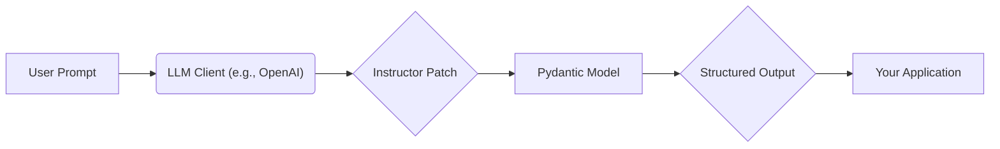

# Getting Started with Instructor

## 1. Goal
In this tutorial, you will learn the basics of `instructor`, a library that simplifies getting reliable structured data from Large Language Models (LLMs). We will cover installation, basic usage with OpenAI, and a simple extraction example. By the end, you will be able to define a Pydantic model and use `instructor` to extract structured information from natural language.

## 2. Prerequisites
- Python 3.9+
- An OpenAI API key
- Basic understanding of Pydantic and Python type hints.

## 3. Architecture
`instructor` acts as a wrapper around your LLM client, injecting the necessary logic to enforce structured outputs based on your Pydantic models. This diagram illustrates the flow:


## 4. Step 1: Installation
First, you need to install `instructor`. Open your terminal and run:
```bash
pip install instructor openai pydantic
```
We include `openai` and `pydantic` as they are common dependencies for using `instructor`.

## 5. Step 2: Basic Extraction
Let's start by defining a simple Pydantic model to represent the data we want to extract. Then, we'll use `instructor` to get an instance of this model from a natural language input.

First, create a file named `extraction_example.py` and add the following code:

```python
from pydantic import BaseModel
import instructor
import openai

# 1. Define your desired data structure using Pydantic
class User(BaseModel):
    name: str
    age: int

# 2. Patch the OpenAI client with instructor
# This enables the `response_model` argument in `create` calls
client = instructor.from_openai(openai.OpenAI())

# 3. Use the patched client to extract structured data
# We pass our Pydantic model to `response_model`
user_data = client.chat.completions.create(
    model="gpt-3.5-turbo",  # Or any other OpenAI model
    response_model=User,
    messages=[
        {"role": "user", "content": "Extract the name and age of John Doe, who is 30 years old."}
    ],
)

# 4. Print the extracted data
print(user_data)
print(f"Name: {user_data.name}, Age: {user_data.age}")
```

### Explanation:
-   **`class User(BaseModel):`**: We define a Pydantic model `User` with `name` (string) and `age` (integer) fields. `instructor` uses this schema to guide the LLM's output.
-   **`client = instructor.from_openai(openai.OpenAI())`**: This is the core step. `instructor.from_openai` takes an instance of `openai.OpenAI()` and "patches" it. This patch adds the `response_model` argument to the `chat.completions.create` method, allowing you to specify your Pydantic model.
-   **`model="gpt-3.5-turbo"`**: We specify the LLM model to use. Ensure you have access to this model through your OpenAI API key.
-   **`response_model=User`**: This is where `instructor` works its magic. It tells the LLM to generate output that conforms to the `User` Pydantic model. If the initial output doesn't conform, `instructor` will automatically retry, providing feedback to the LLM to correct its output until it matches the schema.
-   The `messages` argument is standard for OpenAI chat completions, providing the context for the LLM to generate a response from.

## 6. Step 3: Run the Example
Execute the `extraction_example.py` file from your terminal:
```bash
python extraction_example.py
```

You should see output similar to this:
```
name='John Doe' age=30
Name: John Doe, Age: 30
```

This demonstrates how `instructor` successfully extracted the `name` and `age` into a `User` object, with proper type casting and validation.

## 7. Conclusion
Congratulations! You've just built your first application using `instructor` to get structured output from an LLM. You learned how to:
- Install `instructor` along with its dependencies.
- Define a Pydantic model for structured data.
- Patch the OpenAI client to enable `response_model`.
- Extract data that adheres to your defined schema.

`instructor` handles the complexities of schema enforcement, retries, and error handling, allowing you to focus on defining your data structures and application logic. From here, you can explore more advanced features like custom validation, streaming, and extracting nested objects, all of which are made simple with `instructor`.