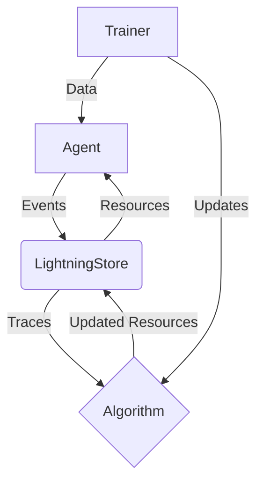

'''
# Getting Started with Agent Lightning

## 1. Goal

This tutorial will guide you through the basics of using Agent Lightning to optimize your AI agents. We will cover the core concepts of Agent Lightning and provide a simple, runnable example to get you started.

## 2. Prerequisites

Before we begin, you need to have Agent Lightning installed. You can install it using pip:

```bash
pip install agentlightning
```

## 3. Architecture

Agent Lightning is designed to be a minimally invasive framework for optimizing AI agents. It works by decoupling the agent's logic from the optimization algorithm. The following diagram illustrates the high-level architecture:



-   **Agent**: Your AI agent, which can be built with any framework.
-   **LightningStore**: A central hub for storing traces, resources, and tasks.
-   **Algorithm**: The optimization algorithm (e.g., Reinforcement Learning, Supervised Fine-tuning).
-   **Trainer**: Orchestrates the training process by feeding data to the agent and updating the algorithm.

## 4. Implementation

Now, let's dive into a simple example of how to use Agent Lightning. We will use the `DevTaskLoader` to simulate a local development environment. This allows us to test our agent without needing to set up a full Agent Lightning server.

First, let's define a simple task and some resources. The task will be a simple prompt, and the resources will be a model name.

```python
import time
from agentlightning.client import DevTaskLoader
from agentlightning.types import TaskInput, NamedResources

def main():
    # 1. Define the tasks
    tasks = [
        TaskInput(input={"prompt": "Hello, world!"}),
        TaskInput(input={"prompt": "Translate the following to French: Hello"})
    ]

    # 2. Define the resources
    resources = NamedResources(
        resources={"model": "gpt-3.5-turbo"}
    )

    # 3. Initialize the DevTaskLoader
    loader = DevTaskLoader(tasks=tasks, resources=resources)

    # 4. Poll for a task
    task = loader.poll_next_task()
    if task:
        print(f"Received task: {task.input}")

        # 5. Get the resources for the task
        task_resources = loader.get_resources_by_id(task.resources_id)
        if task_resources:
            print(f"Received resources: {task_resources.resources}")

if __name__ == "__main__":
    main()

```

### Running the Example

To run the example, save the code as a Python file (e.g., `getting_started.py`) and run it from your terminal:

```bash
python getting_started.py
```

You should see the following output:

```
Received task: {'prompt': 'Hello, world!'}
Received resources: {'model': 'gpt-3.5-turbo'}
```

This simple example demonstrates the basic workflow of using Agent Lightning. You can now start building your own agents and optimizing them with Agent Lightning.
'''