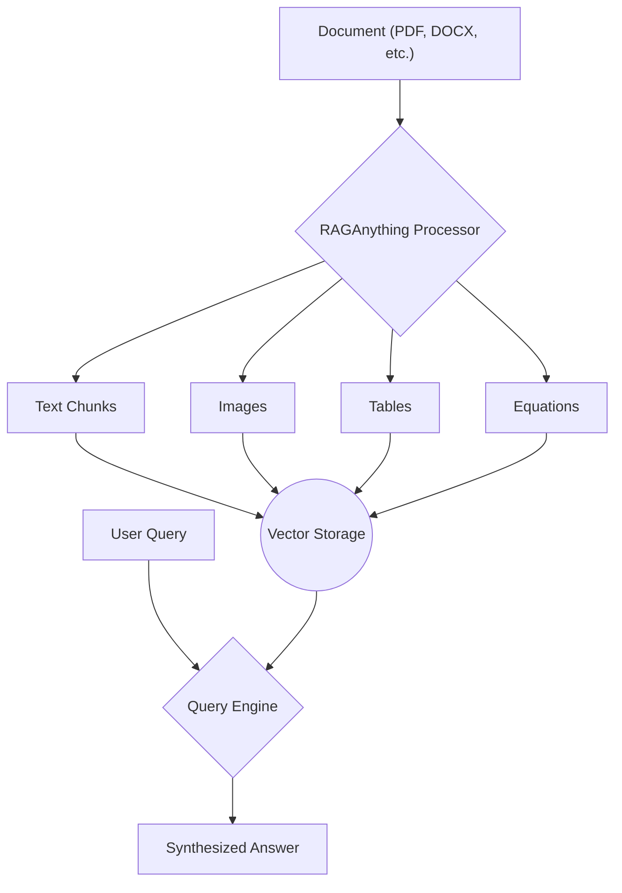

> ## **Getting Started with RAGAnything**

### **1. Goal**

In this tutorial, you will learn how to set up and use `RAGAnything`, an all-in-one framework for building Retrieval-Augmented Generation (RAG) systems that can process multimodal documents, including text, images, tables, and more.

### **2. Architecture**

The `RAGAnything` pipeline is designed to handle complex documents by parsing them into their constituent parts, processing each modality, and then making them available for querying.



### **3. Prerequisites**

- Python 3.10+
- An OpenAI API key (or another compatible LLM provider)
- **LibreOffice**: Required for processing Office documents (.doc, .docx, .ppt, .pptx, .xls, .xlsx).
  - **macOS**: `brew install --cask libreoffice`
  - **Ubuntu/Debian**: `sudo apt-get install libreoffice`

### **4. Installation**

You can install `RAGAnything` directly from PyPI. For this tutorial, we'll install the core package and the optional dependencies for handling various file formats.

```bash
pip install 'raganything[all]'
```

This command installs `RAGAnything` along with all the necessary extras for image and text processing.

### **5. Core Concepts**

- **`RAGAnything`**: The main class that orchestrates the entire pipeline, from document processing to querying.
- **`RAGAnythingConfig`**: A configuration object to customize the behavior, such as setting the parser, enabling or disabling different modal processors, and defining storage directories.
- **Model Functions**: `RAGAnything` requires you to provide functions for the LLM, vision model, and embeddings. This makes it highly flexible and allows you to use any provider.

### **6. Step-by-Step Guide**

Let's walk through the process of setting up `RAGAnything`, processing a document, and asking questions.

#### **Step 1: Configuration and Initialization**

First, we need to import the necessary classes and define our model and embedding functions. For this example, we'll use OpenAI.

```python
import asyncio
from raganything import RAGAnything, RAGAnythingConfig
from lightrag.llm.openai import openai_complete_if_cache, openai_embed
from lightrag.utils import EmbeddingFunc

# --- 1. Set up your API keys and endpoints ---
# It is recommended to use environment variables for your keys
# For example: os.environ["OPENAI_API_KEY"]
api_key = "your-openai-api-key"
base_url = "https://api.openai.com/v1" # Or your custom endpoint

# --- 2. Create a RAGAnything Configuration ---
config = RAGAnythingConfig(
    working_dir="./rag_storage", # Directory to store processed data
    parser="mineru",             # Use the MinerU parser
    enable_image_processing=True,
    enable_table_processing=True,
    enable_equation_processing=True,
)

# --- 3. Define the LLM and Vision Model Functions ---
def llm_model_func(prompt, **kwargs):
    return openai_complete_if_cache(
        "gpt-4o-mini",
        prompt,
        api_key=api_key,
        base_url=base_url,
        **kwargs,
    )

def vision_model_func(prompt, image_data, **kwargs):
    messages = [
        {
            "role": "user",
            "content": [
                {"type": "text", "text": prompt},
                {
                    "type": "image_url",
                    "image_url": {
                        "url": f"data:image/jpeg;base64,{image_data}"
                    },
                },
            ],
        }
    ]
    return openai_complete_if_cache(
        "gpt-4o",
        "",
        messages=messages,
        api_key=api_key,
        base_url=base_url,
        **kwargs
    )

# --- 4. Define the Embedding Function ---
embedding_func = EmbeddingFunc(
    embedding_dim=3072, # Based on text-embedding-3-large
    func=lambda texts: openai_embed(
        texts,
        model="text-embedding-3-large",
        api_key=api_key,
        base_url=base_url,
    ),
)

# --- 5. Initialize RAGAnything ---
rag = RAGAnything(
    config=config,
    llm_model_func=llm_model_func,
    vision_model_func=vision_model_func,
    embedding_func=embedding_func,
)

print("RAGAnything initialized successfully!")

```

#### **Step 2: Process a Document**

Now that `RAGAnything` is initialized, we can process a document. Create a sample PDF file named `example.pdf` to test the system. `RAGAnything` will handle the parsing, processing, and indexing automatically.

```python
async def process_my_document():
    # Ensure you have a file named 'example.pdf' in the same directory
    file_path = "example.pdf"

    print(f"Processing document: {file_path}")
    await rag.process_document_complete(
        file_path=file_path,
        output_dir="./output" # Where to save intermediate results
    )
    print("Document processing complete!")

# To run this, you would use:
# asyncio.run(process_my_document())
```

This function will:
1.  Parse the PDF using the `mineru` parser.
2.  Extract text, images, tables, and equations.
3.  Generate summaries and captions for the multimodal content.
4.  Embed and index everything into the vector store.

#### **Step 3: Query Your Document**

Once the document is processed, you can ask questions. `RAGAnything` supports both simple text queries and more advanced queries that can reference specific multimodal content.

```python
async def run_queries():
    # Example 1: Pure text-based query
    print("\n--- Running Text Query ---")
    text_query = "What is the main topic of this document?"
    text_result = await rag.aquery(text_query, mode="hybrid")
    print(f"Query: {text_query}")
    print(f"Answer: {text_result}")

    # Example 2: Query with a specific multimodal element
    # This is useful if you want to ask about a specific formula or image
    # that you have already identified.
    print("\n--- Running Multimodal Query ---")
    multimodal_query = "Explain this formula in the context of the document."
    multimodal_content = [{
        "type": "equation",
        "latex": "E=mc^2", # Example LaTeX
        "equation_caption": "Einstein's mass-energy equivalence"
    }]
    multimodal_result = await rag.aquery_with_multimodal(
        multimodal_query,
        multimodal_content=multimodal_content,
        mode="hybrid"
    )
    print(f"Query: {multimodal_query}")
    print(f"Answer: {multimodal_result}")

async def main():
    await process_my_document()
    await run_queries()

if __name__ == "__main__":
    # Make sure to replace 'your-openai-api-key' before running
    # and have an 'example.pdf' file available.
    asyncio.run(main())

```

### **7. Conclusion**

Congratulations! You have successfully set up `RAGAnything`, processed a multimodal document, and performed both text and multimodal queries. This framework provides a powerful and flexible foundation for building advanced RAG applications that can understand the full context of your documents.

From here, you can explore more advanced features like batch processing multiple files, customizing the processing steps, and integrating different LLM and embedding providers.
