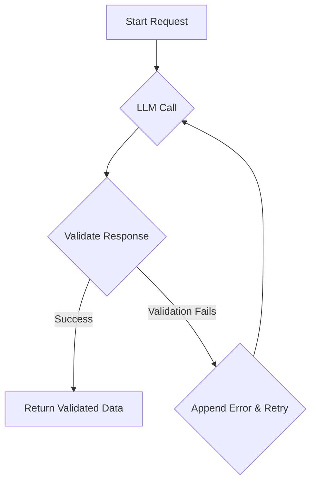
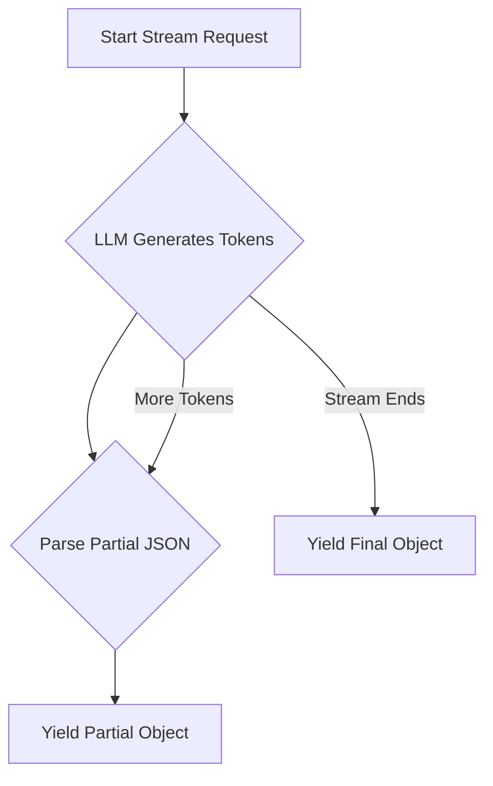

# Advanced Features: Retries and Streaming

When building production systems with LLMs, reliability and user experience are paramount. Instructor provides powerful, out-of-the-box support for two crucial features: automatic retries for handling failures and streaming for responsive, real-time applications.

## 1. Goal

In this tutorial, you'll learn how to leverage Instructor's built-in capabilities to:

- Automatically retry LLM calls that fail validation.
- Stream structured data as it's being generated.

## 2. Prerequisites

- Python 3.9+
- Basic understanding of Pydantic models.
- `instructor` library installed (`pip install instructor`).

## 3. Architecture

Let's visualize the flow for both retries and streaming to understand what happens under the hood.

### Retry Mechanism



### Streaming Mechanism



## 4. Automatic Retries

Getting valid structured data from an LLM doesn't always work on the first try. Instead of writing complex error handling and retry logic yourself, you can let Instructor handle it.

By setting the `max_retries` parameter, Instructor will automatically re-run the completion call if the model's output fails Pydantic validation. On each retry, it includes the validation error in the context, helping the model self-correct.

### Step 1: Define a Model with Validation

First, let's create a Pydantic model with a custom validator. This validator will raise a `ValueError` if the condition isn't met, triggering Instructor's retry mechanism.

```python
from pydantic import BaseModel, field_validator
import instructor

class User(BaseModel):
    name: str
    age: int

    @field_validator('age')
    def validate_age(cls, v):
        if v < 18:
            raise ValueError("Age must be 18 or over.")
        return v
```

### Step 2: Make the Call with `max_retries`

Now, we'll instantiate the client and call `chat.completions.create` with `response_model=User`. We'll pass a prompt that is likely to produce an invalid age initially and set `max_retries`.

```python
# This assumes you have your API key in an environment variable
# e.g., OPENAI_API_KEY
client = instructor.from_provider("openai/gpt-4o-mini")

# The LLM might initially suggest an age less than 18
try:
    user = client.chat.completions.create(
        response_model=User,
        messages=[{
            "role": "user", 
            "content": "Create a user profile for a young student named Alex."
        }],
        max_retries=3,
    )

    print("Successfully extracted user:")
    print(user)

except Exception as e:
    print(f"Failed after multiple retries: {e}")

# Expected output (after self-correction):
# Successfully extracted user:
# User(name='Alex', age=18) # or some other valid age
```

Instructor catches the `ValueError` from our validator, sends it back to the model, and asks it to try again. The result is a valid `User` object without any manual intervention.

## 5. Streaming Partial Objects

For applications where users are waiting for a response (like chatbots or live data dashboards), streaming is essential. It provides a much better user experience than showing a loading spinner.

Instructor makes it easy to stream partially complete Pydantic objects as tokens are generated by the LLM.

### Step 1: Use `Partial[T]`

To enable streaming, you wrap your response model with `instructor.Partial` and set `stream=True` in your request. `Partial[User]` tells Instructor to expect incomplete `User` objects.

```python
from instructor import Partial
from pydantic import BaseModel
import instructor

class User(BaseModel):
    name: str
    age: int

# Assumes client is already defined
client = instructor.from_provider("openai/gpt-4o-mini")
```

### Step 2: Iterate Over the Stream

The `create` method now returns a generator. As you iterate over it, you receive `Partial[User]` objects. Each object represents the current state of the JSON being built, with `None` for fields that haven't been populated yet.

```python
response_stream = client.chat.completions.create(
    response_model=Partial[User],
    messages=[{
        "role": "user", 
        "content": "Extract a user profile for John Doe, a 30-year-old software engineer."
    }],
    stream=True,
)

print("Streaming partial responses:")
for partial_user in response_stream:
    print(partial_user)
```

This will produce an output that builds up the final object, token by token:

```
Streaming partial responses:
User(name=None, age=None)
User(name='John', age=None)
User(name='John Doe', age=None)
User(name='John Doe', age=30)
```

This allows you to update your UI in real-time as the data arrives.

## 6. Conclusion

You've now learned how to implement two of Instructor's most powerful features. With `max_retries`, you can build robust and self-correcting data extraction pipelines. With `stream=True` and `Partial`, you can create highly responsive, real-time applications.

These features eliminate significant boilerplate code and let you focus on what matters: building great products with reliable, structured data from LLMs.
