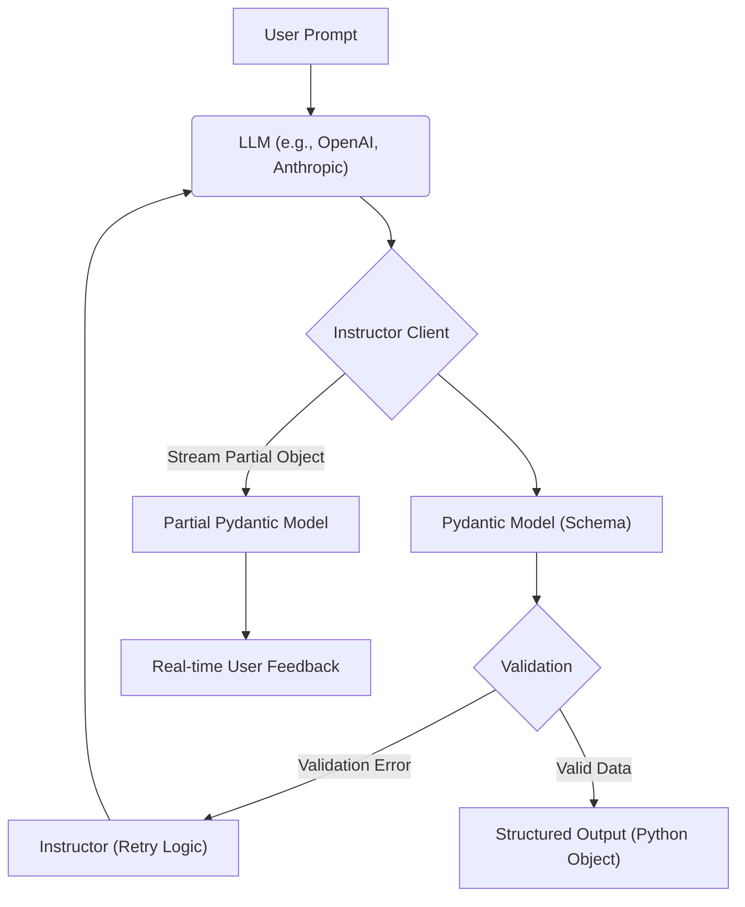

# Advanced Features with Instructor

## 1. Goal
In this tutorial, you will learn how to leverage advanced features of the `instructor` library to build more robust and intelligent LLM applications. Specifically, we will cover automatic retries for validation, streaming partial objects for real-time feedback, and extracting complex nested data structures. By the end, you will have a solid understanding of how to use these features to improve the reliability and user experience of your LLM-powered applications.

## 2. Prerequisites
- Python 3.9+
- Familiarity with `pydantic` for data modeling.
- Basic understanding of how to use `instructor` for structured extraction (as covered in the `README.md`).
- `instructor` library installed (`pip install instructor`).

## 3. Architecture
The following diagram illustrates the flow of data and the role of `instructor` in handling advanced features like retries and streaming.



## 4. Step 1: Setup and Basic Extraction
First, let's set up our environment and define a basic Pydantic model to recap how `instructor` works for simple extractions.

```python
import instructor
from pydantic import BaseModel, Field
import openai

# For demonstration, we'll use OpenAI, but instructor supports many providers.
# Make sure your OpenAI API key is set as an environment variable or passed directly.

# Initialize the instructor-patched OpenAI client
client = instructor.from_openai(openai.OpenAI())

class User(BaseModel):
    name: str = Field(description="The name of the user")
    age: int = Field(description="The age of the user")

# Example of basic extraction
def get_user_info(text: str) -> User:
    return client.chat.completions.create(
        model="gpt-3.5-turbo",
        response_model=User,
        messages=[
            {"role": "user", "content": f"Extract user information from: {text}"}
        ]
    )

# user_data = get_user_info("My name is John Doe and I am 30 years old.")
# print(user_data)
# Expected: name='John Doe' age=30
```

## 5. Step 2: Automatic Retries for Validation
`instructor` can automatically retry LLM calls if the initial response fails Pydantic validation. This is crucial for building resilient applications. We'll add a `field_validator` to our `User` model to enforce a business rule (age must be positive) and demonstrate how `max_retries` works.

```python
from pydantic import BaseModel, Field, field_validator
import instructor
import openai

client = instructor.from_openai(openai.OpenAI())

class UserWithValidation(BaseModel):
    name: str = Field(description="The name of the user")
    age: int = Field(description="The age of the user")

    @field_validator('age')
    @classmethod
    def validate_age(cls, v: int) -> int:
        if v < 0:
            raise ValueError('Age must be a positive number')
        return v

def get_validated_user_info(text: str) -> UserWithValidation:
    # `max_retries` instructs instructor to re-attempt the LLM call
    # if validation fails, providing the error message to the LLM.
    return client.chat.completions.create(
        model="gpt-3.5-turbo",
        response_model=UserWithValidation,
        messages=[
            {"role": "user", "content": f"Extract user information from: {text}"}
        ],
        max_retries=3 # Try up to 3 times if validation fails
    )

# This might fail validation initially if the LLM tries a negative age,
# but instructor will retry and guide the LLM to a correct response.
# user_data_validated = get_validated_user_info("A person named Jane is -5 years old.")
# print(user_data_validated)
# Expected (after retry): name='Jane' age=0 (or some other positive number as corrected by LLM)

# user_data_validated_correct = get_validated_user_info("Michael is 42 years old.")
# print(user_data_validated_correct)
# Expected: name='Michael' age=42
```

## 6. Step 3: Streaming Partial Objects
For long-running LLM calls or to provide a more dynamic user experience, `instructor` supports streaming partial objects. This allows you to receive and process parts of your structured data as they are generated by the LLM.

```python
from pydantic import BaseModel, Field
import instructor
import openai
from typing import Optional

client = instructor.from_openai(openai.OpenAI())

class StoryElement(BaseModel):
    character_name: Optional[str] = Field(None, description="The name of a character")
    action: Optional[str] = Field(None, description="An action performed by the character")
    location: Optional[str] = Field(None, description="The location of the scene")

# When stream=True and response_model is wrapped in `instructor.Partial`,
# instructor will yield partial objects as tokens are generated.
def stream_story_elements(prompt: str):
    print("Streaming story elements:")
    for partial_element in client.chat.completions.create(
        model="gpt-3.5-turbo",
        response_model=instructor.Partial[StoryElement],
        messages=[
            {"role": "user", "content": f"Describe a short story in terms of character, action, and location: {prompt}"}
        ],
        stream=True,
    ):
        print(partial_element)

# stream_story_elements("A knight battles a dragon in a fiery cave.")
# Expected output would show incremental updates to the StoryElement object:
# StoryElement(character_name=None, action=None, location=None)
# StoryElement(character_name='A knight', action=None, location=None)
# StoryElement(character_name='A knight', action='battles', location=None)
# StoryElement(character_name='A knight', action='battles a dragon', location=None)
# StoryElement(character_name='A knight', action='battles a dragon', location='in a fiery cave')
```

## 7. Step 4: Extracting Complex Nested Data Structures
`instructor` excels at extracting deeply nested and complex data structures directly into Pydantic models, simplifying what would otherwise be a tedious parsing task.

```python
from pydantic import BaseModel, Field
import instructor
import openai
from typing import List, Optional

client = instructor.from_openai(openai.OpenAI())

class Author(BaseModel):
    name: str = Field(description="The name of the author")
    nationality: Optional[str] = Field(None, description="The nationality of the author")

class Book(BaseModel):
    title: str = Field(description="The title of the book")
    author: Author = Field(description="The author of the book")
    year_published: int = Field(description="The year the book was published")
    genres: List[str] = Field(description="A list of genres for the book")

class LibraryCatalog(BaseModel):
    library_name: str = Field(description="The name of the library")
    books: List[Book] = Field(description="A list of books in the catalog")

def get_library_catalog(description: str) -> LibraryCatalog:
    return client.chat.completions.create(
        model="gpt-4o-mini", # Using a more capable model for complex structures
        response_model=LibraryCatalog,
        messages=[
            {"role": "user", "content": f"Create a library catalog from the following description: {description}"}
        ]
    )

description = """
Our library, "Knowledge Hub", has two main books. 
The first is called "The Great Adventure" by a French author named Jules Verne, published in 1870, belonging to Adventure and Sci-Fi genres. 
The second book is "Mystery of the Old Manor" by Agatha Christie, a British writer, published in 1920, and it's a classic Mystery novel.
"""

# library_catalog = get_library_catalog(description)
# print(library_catalog.model_dump_json(indent=2))

# Expected output would be a JSON representation of the LibraryCatalog object:
# {
#   "library_name": "Knowledge Hub",
#   "books": [
#     {
#       "title": "The Great Adventure",
#       "author": {
#         "name": "Jules Verne",
#         "nationality": "French"
#       },
#       "year_published": 1870,
#       "genres": [
#         "Adventure",
#         "Sci-Fi"
#       ]
#     },
#     {
#       "title": "Mystery of the Old Manor",
#       "author": {
#         "name": "Agatha Christie",
#         "nationality": "British"
#       },
#       "year_published": 1920,
#       "genres": [
#         "Mystery"
#       ]
#     }
#   ]
# }
```

## 8. Conclusion
Congratulations! You've explored the advanced capabilities of `instructor`, including automatic retries for robust validation, streaming for real-time data processing, and handling complex nested data structures with ease. These features empower you to build more sophisticated, reliable, and user-friendly LLM applications. Experiment with different models, validation rules, and nested structures to further enhance your understanding and unlock new possibilities with `instructor`.