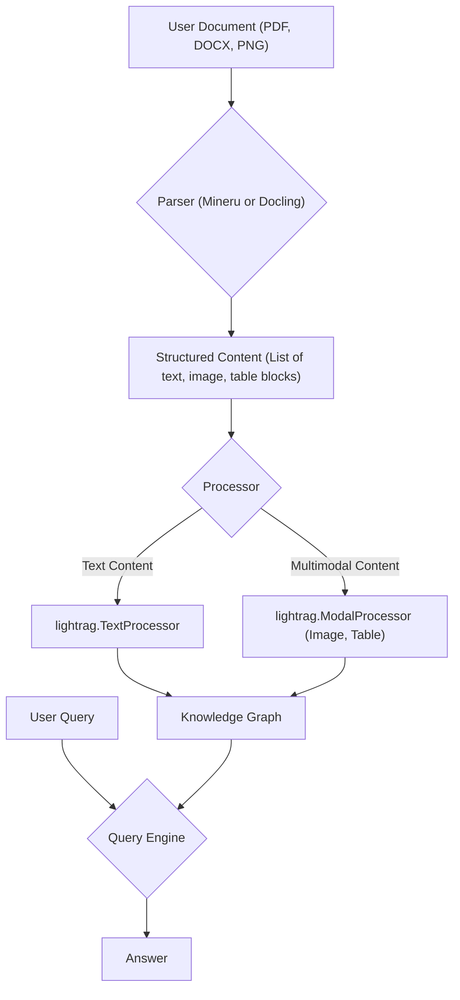

> ## Error Panel
> 
> **Error executing tool 'write_workspace_file' with arguments {'content': '', 'file_path': '02_core_concepts.md'}: ValueError: Content cannot be empty or only whitespace. You must generate the file content (the plan or the summary) in your thought process FIRST, and then call this tool with the complete text.**
> 
> Please try again or use another tool

# RAGAnything: Core Concepts and Architecture

Welcome to the core concepts guide for RAGAnything! This tutorial will walk you through the fundamental components of the library, explaining how it turns diverse documents into a queryable knowledge base.

## 1. Goal

By the end of this tutorial, you will understand:

- The high-level architecture of RAGAnything.
- The role of each core component: `Parser`, `Processor`, and `Query`.
- How documents are ingested, processed, and made ready for querying.

## 2. Architecture Overview

RAGAnything is designed with a modular, pipeline-based architecture. The primary goal is to take any document, parse its content, process it into a structured format, and then allow a user to query it using natural language. This process involves both text and multimodal elements like images and tables.

Here’s a visual representation of the data flow:



This diagram shows the journey from a raw file to a final answer. Let's break down each major step.

## 3. The `Parser` Component

The first step in the RAGAnything pipeline is parsing. The `Parser` is responsible for reading a raw file and extracting its content into a standardized, structured format.

The base `Parser` class can be found in `raganything/parser.py`. It defines a standard interface for different parsing backends.

### Key Implementations

RAGAnything comes with two primary parser implementations:

1.  **`MineruParser`**: A powerful parser that leverages the `mineru` command-line tool. It excels at parsing **PDFs and images (through OCR)**. It can extract text, tables, and identify formulas with high fidelity.

2.  **`DoclingParser`**: This parser uses the `docling` command-line tool and is specialized for **Microsoft Office documents (`.docx`, `.pptx`) and HTML files**.

When you process a document, RAGAnything selects the appropriate parser based on the file type.

### How It Works

The parser takes a file path, runs the underlying `mineru` or `docling` tool, and then reads the output. This output is a list of dictionaries, where each dictionary represents a block of content (like a paragraph of text, an image, or a table).

Here is a conceptual look at what the parser does:

```python
# This is a conceptual example. In practice, you interact with the RAGAnything class.
from raganything.parser import MineruParser

# 1. Initialize a parser
parser = MineruParser()

# 2. Parse a document
# This runs the `mineru` CLI tool as a subprocess
content_list = parser.parse_document("path/to/your/document.pdf")

# The output `content_list` is a list of structured data blocks
# e.g., [{"type": "text", "text": "..."}, {"type": "image", "img_path": "..."}]
```

## 4. The `Processor` Component

Once the document is parsed into a `content_list`, the `Processor` takes over. Its job is to prepare and insert this content into a `lightrag` knowledge graph.

The logic for this is primarily within `raganything/processor.py` in the `ProcessorMixin` class.

### Key Responsibilities

1.  **Separate Content**: The processor first separates the `content_list` into two streams: pure text content and multimodal content (images, tables, equations).

    ```python
    from raganything.utils import separate_content

    text_content, multimodal_items = separate_content(content_list)
    ```

2.  **Process Text**: The text is processed using `lightrag`'s standard pipeline. This involves splitting the text into chunks, extracting entities and relationships, and building a knowledge graph.

3.  **Process Multimodal Content**: Each multimodal item is handled by a specialized processor (e.g., `ImageProcessor`, `TableProcessor`). These processors generate detailed descriptions and summaries of the content. For example, an `ImageProcessor` might use a vision model to create a rich description of what an image contains. These descriptions are then added to the knowledge graph and linked to the original document.

4.  **Caching**: To speed up reprocessing, the `Processor` implements a caching layer. It generates a unique key based on the file and its parsing configuration. If the file hasn't changed, RAGAnything can reuse the parsed output from the cache instead of running the parser again.

## 5. The `Query` Component

After processing, your document resides in a knowledge graph, ready to be queried. The `QueryMixin`, found in `raganything/query.py`, provides the interface for asking questions.

### Query Modes

RAGAnything leverages `lightrag`'s powerful querying capabilities and offers several modes:

- **`aquery`**: For pure text-based questions. It retrieves relevant text chunks and entities from the knowledge graph to synthesize an answer.

- **`aquery_with_multimodal`**: This method allows you to include multimodal content (like an image or table) *in your query*. The system first analyzes the content you provided and then uses that analysis to perform a more informed search on the knowledge graph.

- **`aquery_vlm_enhanced`**: A powerful feature for querying a knowledge base that contains images. When the retrieval process finds context that includes an image, this method passes both the text and the image to a Vision Language Model (VLM). This allows the model to "see" the image and answer questions about it directly.

Here’s a brief example of querying:

```python
# This is a conceptual example.
# Assume `rag` is an initialized RAGAnything instance that has processed documents.

# 1. Ask a simple text question
response = await rag.aquery("What are the main conclusions of the report?")

# 2. Ask a question enhanced with an image from your local machine
response = await rag.aquery_with_multimodal(
    "What does this chart show?",
    multimodal_content=[{"type": "image", "img_path": "./my_chart.png"}]
)
```

## 6. Conclusion

You now have a high-level understanding of RAGAnything's core architecture. The key takeaway is its pipeline approach:

1.  **Parse**: Convert any document into a standard `content_list` format using `MineruParser` or `DoclingParser`.
2.  **Process**: Separate text and multimodal content, enriching them and storing them in a `lightrag` knowledge graph.
3.  **Query**: Use a flexible query engine to ask questions, with powerful support for multimodal and VLM-enhanced retrieval.

This modular design allows RAGAnything to be a versatile and powerful tool for building sophisticated RAG applications over a wide variety of documents.
