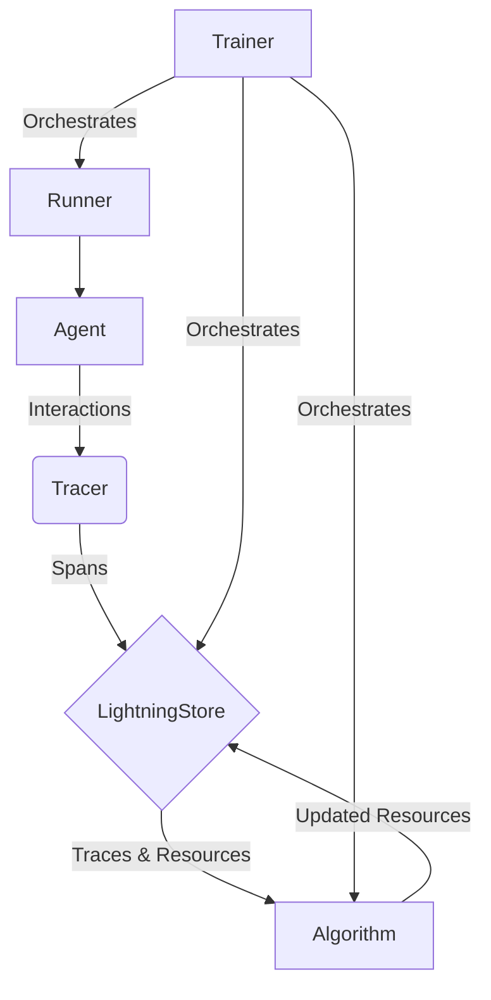

# Agent Lightning: Core Concepts and Architecture

Welcome to the core concepts guide for Agent Lightning! This tutorial will walk you through the fundamental components and architectural design of the framework, providing you with a solid understanding of how Agent Lightning enables the optimization of AI agents.

## 1. Goal

The primary goal of Agent Lightning is to provide a flexible and powerful framework for training and optimizing AI agents with minimal code changes. It allows you to use any agent framework and selectively optimize your agents using various algorithms like Reinforcement Learning, Supervised Fine-tuning, and more.

## 2. Prerequisites

Before we dive in, make sure you have Agent Lightning installed. If not, you can install it using pip:

```bash
pip install agentlightning
```

## 3. Core Components

Agent Lightning's architecture is designed to be modular and decoupled, allowing for easy customization and extension. The three main components are the **Tracer**, the **LightningStore**, and the **Trainer**.

### Tracer

The `Tracer` is responsible for capturing the interactions of your AI agent. It records events such as prompts, tool calls, and rewards as structured "spans." These spans provide a detailed record of the agent's behavior, which is essential for analysis and optimization.

- **`Tracer`**: An abstract base class that defines the interface for tracing. You can use or create implementations for different backends like AgentOps or OpenTelemetry.
- **`trace_context`**: A context manager that simplifies the process of starting and stopping traces.

### LightningStore

The `LightningStore` is the central nervous system of Agent Lightning. It acts as a persistent control plane that coordinates training rollouts and stores all the data related to the agent's interactions. Key responsibilities include:

- **Rollout Lifecycle Management**: Manages the entire lifecycle of a rollout, from queuing and preparation to execution and completion.
- **Span Ingestion**: Ingests and stores the spans captured by the `Tracer`.
- **Resource Versioning**: Manages different versions of resources like prompt templates and model checkpoints.

### Trainer

The `Trainer` orchestrates the entire training process. It connects the `Tracer` and the `LightningStore` with the optimization algorithm. The `Trainer` is responsible for:

- **Streaming Datasets**: Feeds data to the agent runners.
- **Resource Management**: Ferries resources between the `LightningStore` and the optimization algorithm.
- **Updating Inference Engine**: Updates the agent's inference engine with the latest improvements from the algorithm.

## 4. Architecture

The following diagram illustrates the flow of data between the core components of Agent Lightning:



**Data Flow:**

1.  The **Agent** interacts with its environment.
2.  The **Tracer** captures these interactions as spans.
3.  The spans are sent to the **LightningStore** for persistence.
4.  The **Algorithm** (e.g., a Reinforcement Learning algorithm) reads the traces and resources from the `LightningStore`.
5.  The algorithm learns from the data and produces updated resources (e.g., a new policy or prompt template).
6.  The updated resources are stored back in the `LightningStore`.
7.  The **Trainer** orchestrates this entire process, ensuring that the agent runners are using the latest resources.

## 5. Implementation Example

Here's a simplified example of how you might use the `Tracer` to capture a custom span:

```python
from agentlightning.tracer.base import get_active_tracer

# Assuming a tracer is active
tracer = get_active_tracer()

if tracer:
    with tracer.operation_context("my_custom_operation") as span_context:
        # Your agent's logic here
        result = "Hello, Agent Lightning!"
        span_context.set_attribute("my_result", result)

```

## 6. Conclusion

Agent Lightning provides a robust and flexible architecture for optimizing AI agents. By understanding the roles of the `Tracer`, `LightningStore`, and `Trainer`, you can effectively leverage the framework to improve the performance of your agents. The decoupled nature of these components allows for easy integration with your existing agent frameworks and custom optimization algorithms.
