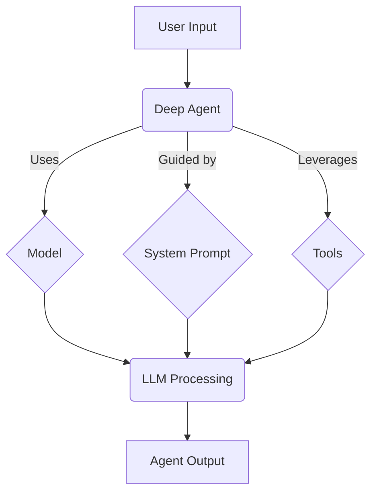

# Customizing Deep Agents

## 1. Goal
In this tutorial, you will learn how to customize a deep agent created with `deepagents`. Specifically, we will cover how to change the underlying language model, set a custom system prompt, and add your own tools to enhance the agent's capabilities. By the end, you will have a clear understanding of how to tailor deep agents to your specific needs.

## 2. Prerequisites
- Python 3.9+
- Basic understanding of large language models and agents.
- `deepagents` and `langchain` installed.

```bash
pip install deepagents langchain langchain-anthropic langchain-openai
```

## 3. Architecture
The `create_deep_agent` function acts as a central hub for configuring your agent. It takes several parameters to allow for extensive customization, including the `model`, `system_prompt`, and `tools`. These parameters directly influence how the agent perceives its task, processes information, and interacts with the environment.



## 4. Step 1: Using a Custom Model
By default, `deepagents` uses `"claude-sonnet-4-5-20250929"`. However, you can easily switch to any LangChain-compatible model, such as `GPT-4o`, by passing a `BaseChatModel` instance to the `model` parameter of `create_deep_agent`.

This is useful when you have a preferred model, need specific capabilities offered by another model, or want to manage costs by using a different tier of models.

```python
import os
from deepagents import create_deep_agent
from langchain_openai import ChatOpenAI

# Ensure your OpenAI API key is set as an environment variable
# os.environ["OPENAI_API_KEY"] = "YOUR_OPENAI_API_KEY"

# Initialize the custom model
custom_model = ChatOpenAI(model="gpt-4o", temperature=0.7)

# Create the deep agent with the custom model
agent_with_custom_model = create_deep_agent(
    model=custom_model,
)

# Example of invoking the agent (replace with your actual use case)
# result = agent_with_custom_model.invoke({
#     "messages": [{"role": "user", "content": "Hello, who are you?"}]
# })
# print(result)
```

## 5. Step 2: Setting a Custom System Prompt
The `system_prompt` parameter allows you to inject custom instructions and guidance into your agent's behavior. This prompt is appended to the default instructions provided by `deepagents` middleware, enabling you to refine the agent's persona, define specific workflows, or add domain-specific knowledge.

When crafting your custom system prompt, focus on defining specific methodologies, providing concrete examples, and setting clear boundaries. Avoid re-explaining standard tool functions or contradicting default instructions.

```python
from deepagents import create_deep_agent

custom_system_prompt = """
You are an expert research assistant specialized in technology trends.
Your goal is to conduct thorough research, synthesize information from various sources,
and present findings in a clear, concise, and unbiased manner.
When asked to research a topic, always start by outlining a research plan,
use the `internet_search` tool to gather information, and then summarize your findings.
Batch similar research tasks into a single TODO item.
"""

# Create the deep agent with the custom system prompt
agent_with_custom_prompt = create_deep_agent(
    system_prompt=custom_system_prompt,
)

# Example of invoking the agent (replace with your actual use case)
# result = agent_with_custom_prompt.invoke({
#     "messages": [{"role": "user", "content": "Research the latest advancements in AI ethics."}]
# })
# print(result)
```

## 6. Step 3: Adding Custom Tools
Deep agents are highly extensible, allowing you to integrate your own custom tools. This is crucial for enabling the agent to interact with external systems, perform specialized computations, or access proprietary data sources. You pass a list of tool functions to the `tools` parameter.

For this example, we'll create a simple `internet_search` tool using `tavily-python`, which demonstrates how to provide external capabilities to your agent.

```python
import os
from deepagents import create_deep_agent
from tavily import TavilyClient # Make sure you have tavily-python installed: pip install tavily-python
from langchain_core.tools import tool # Import tool decorator

# Ensure your TAVILY API key is set as an environment variable
# os.environ["TAVILY_API_KEY"] = "YOUR_TAVILY_API_KEY"

# Initialize Tavily client
# tavily_client = TavilyClient(api_key=os.environ.get("TAVILY_API_KEY", "YOUR_TAVILY_API_KEY"))

# Define a custom tool using the @tool decorator
# Note: In a real scenario, you'd initialize TavilyClient properly with your API key.
# For demonstration, we'll create a placeholder if the key isn't set.
class MockTavilyClient:
    def search(self, query: str, max_results: int = 5):
        print(f"Performing mock search for: {query}")
        return {
            "results": [
                {"content": f"Mock search result 1 for {query}"},
                {"content": f"Mock search result 2 for {query}"}
            ]
        }

# Use the actual TavilyClient if API key is available, else use mock
if os.environ.get("TAVILY_API_KEY"):
    tavily_client = TavilyClient(api_key=os.environ["TAVILY_API_KEY"])
else:
    print("TAVILY_API_KEY not found. Using mock Tavily client for demonstration.")
    tavily_client = MockTavilyClient()

@tool
def internet_search(query: str, max_results: int = 5) -> str:
    """Run a web search using Tavily."""
    results = tavily_client.search(query, max_results=max_results)
    # Tavily returns a dictionary, convert to string for the tool output
    return str(results.get("results", []))

# Create the deep agent with the custom tool
agent_with_custom_tool = create_deep_agent(
    tools=[internet_search],
    system_prompt="You have access to the internet_search tool. Use it to answer questions that require current information."
)

# Example of invoking the agent (replace with your actual use case)
# result = agent_with_custom_tool.invoke({
#     "messages": [{"role": "user", "content": "What is the capital of France?"}]
# })
# print(result)
```

## 7. Conclusion

You've successfully learned how to customize deep agents by changing their underlying model, setting a custom system prompt, and integrating your own tools. These powerful customization options allow you to adapt `deepagents` to a wide array of tasks and integrate them seamlessly into your applications. Experiment with different models, refine your prompts, and build specialized tools to unlock the full potential of your deep agents!
