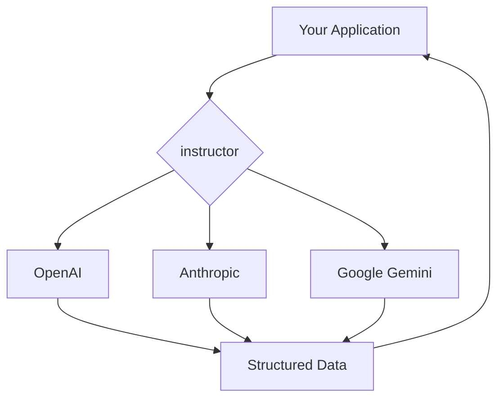

# How to Use Different LLM Providers with Instructor

## 1. Goal

This tutorial will guide you on how to use `instructor` with various Large Language Model (LLM) providers like OpenAI, Anthropic, and Google Gemini. By the end of this tutorial, you will be able to seamlessly switch between different providers while maintaining structured data extraction capabilities.

## 2. Prerequisites

- `instructor` library installed.
- API keys for the respective LLM providers you intend to use.

## 3. Architecture

`instructor` provides a unified interface that adapts to different LLM provider clients. It patches the client's `create` method to enforce structured data extraction based on your Pydantic models.



## 4. Implementation

### OpenAI

When working with OpenAI, you can use the `from_openai` function to patch the `OpenAI` client.

```python
import instructor
from openai import OpenAI
from pydantic import BaseModel

# Define your data model
class User(BaseModel):
    name: str
    age: int

# Patch the OpenAI client
client = instructor.from_openai(OpenAI())

# Extract structured data
user = client.chat.completions.create(
    model="gpt-3.5-turbo",
    response_model=User,
    messages=[
        {"role": "user", "content": "Extract Jason who is 25 years old"},
    ],
)

assert isinstance(user, User)
print(user.model_dump_json(indent=2))
```

### Anthropic

For Anthropic, use the `from_anthropic` function. It supports both JSON and tool-based modes.

```python
import instructor
from anthropic import Anthropic
from pydantic import BaseModel

# Define your data model
class User(BaseModel):
    name: str
    age: int

# Patch the Anthropic client
client = instructor.from_anthropic(Anthropic())

# Extract structured data
user = client.messages.create(
    model="claude-3-opus-20240229",
    max_tokens=1024,
    response_model=User,
    messages=[
        {"role": "user", "content": "Extract John who is 30 years old"},
    ],
)

assert isinstance(user, User)
print(user.model_dump_json(indent=2))
```

### Google Gemini

To use Google's Gemini models, you can utilize the `from_gemini` function. Note that this function is deprecated in favor of `from_genai`.

```python
import instructor
import google.generativeai as genai
from pydantic import BaseModel

# Recommended: Configure your API key
# from google.colab import userdata
# genai.configure(api_key=userdata.get("GEMINI_API_KEY"))

# Define your data model
class User(BaseModel):
    name: str
    age: int

# Patch the Gemini client
# Note: from_gemini is deprecated. Use from_genai for new projects.
client = instructor.from_gemini(genai.GenerativeModel("gemini-pro"))

# Extract structured data
user = client.generate_content(
    response_model=User,
    prompt="Extract Sarah who is 40 years old",
)

assert isinstance(user, User)
print(user.model_dump_json(indent=2))
```

## 5. Conclusion

`instructor` simplifies working with different LLM providers by offering a consistent API for structured data extraction. By using the appropriate `from_*` function for your chosen provider, you can easily integrate powerful language models into your applications while ensuring data integrity with Pydantic models.
