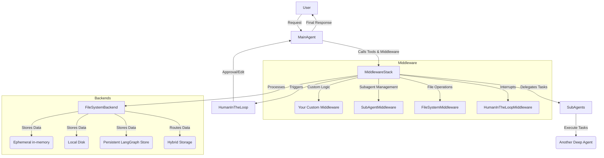

# Advanced Deep Agent Customization

## 1. Goal
In this tutorial, you will learn how to customize `deepagents` to build powerful, flexible, and robust agents. We will explore advanced customization options such as adding custom middleware, defining sub-agents for specialized tasks, configuring human-in-the-loop interruptions, and setting up different backends for file management and long-term memory.

By the end of this tutorial, you will be able to:
- Integrate custom logic into your agent's lifecycle using middleware.
- Delegate complex tasks to specialized sub-agents with isolated contexts.
- Implement human oversight for sensitive operations.
- Configure various file system backends for ephemeral, persistent, and routed storage.

## 2. Prerequisites
- Basic understanding of `deepagents` and `LangGraph`.
- Python 3.9+
- `deepagents` installed (`pip install deepagents`)

## 3. Architecture
At its core, a `deepagent` is a `LangGraph StateGraph` augmented with extensible middleware and flexible backend options. This allows for modular customization of its behavior, tool access, and data persistence.



## 4. Step 1: Setting up a Basic Deep Agent
First, let's create a basic deep agent. This will serve as our foundation for adding advanced customizations.

```python
import os
from deepagents import create_deep_agent
from langchain_community.chat_models import ChatAnthropic
from langchain_core.tools import tool

# Define a simple tool
@tool
def get_current_time() -> str:
    """Returns the current time."""
    return "The current time is 10:00 AM."

# Initialize the model (using Anthropic for this example)
# Ensure ANTHROPIC_API_KEY is set in your environment
model = ChatAnthropic(model="claude-3-sonnet-20240229", temperature=0)

# Create a basic deep agent with a custom tool
agent = create_deep_agent(
    model=model,
    tools=[get_current_time],
    system_prompt="You are a helpful assistant. Use the tools provided.",
)

async def run_agent(query: str):
    print(f"\n--- Running Agent with Query: {query} ---")
    async for chunk in agent.astream({
        "messages": [{"role": "user", "content": query}]
    }):
        print(chunk)

# Example usage:
# import asyncio
# asyncio.run(run_agent("What is the current time?"))
```

## 5. Step 2: Customizing with Middleware
Middleware allows you to inject custom logic into various stages of the agent's lifecycle. This can include modifying prompts, adding/removing tools dynamically, or handling tool results. DeepAgents already uses several built-in middleware components (e.g., `FilesystemMiddleware`, `SubAgentMiddleware`).

Let's create a custom middleware that modifies the system prompt to encourage the agent to be more polite.

```python
from langchain.agents.middleware import AgentMiddleware
from langchain.agents.middleware.types import ModelRequest, ModelResponse
from typing import Callable, Awaitable

class PoliteAgentMiddleware(AgentMiddleware):
    """A middleware that injects politeness into the system prompt."""

    def wrap_model_call(
        self,
        request: ModelRequest,
        handler: Callable[[ModelRequest], ModelResponse],
    ) -> ModelResponse:
        # Append politeness instructions to the system prompt
        polite_prompt = "Always respond in a very polite and helpful manner."
        new_system_prompt = request.system_prompt + "\n\n" + polite_prompt if request.system_prompt else polite_prompt
        request = request.override(system_prompt=new_system_prompt)
        return handler(request)

    async def awrap_model_call(
        self,
        request: ModelRequest,
        handler: Callable[[ModelRequest], Awaitable[ModelResponse]],
    ) -> ModelResponse:
        polite_prompt = "Always respond in a very polite and helpful manner."
        new_system_prompt = request.system_prompt + "\n\n" + polite_prompt if request.system_prompt else polite_prompt
        request = request.override(system_prompt=new_system_prompt)
        return await handler(request)

# Now, let's integrate this middleware into our agent
polite_agent = create_deep_agent(
    model=model,
    tools=[get_current_time],
    system_prompt="You are a helpful assistant.",
    middleware=[PoliteAgentMiddleware()], # Add our custom middleware here
)

# Example usage:
# asyncio.run(run_agent_polite("What is the current time?"))
# You should notice the agent's response is now more polite.
```

## 6. Step 3: Defining Sub-Agents
Sub-agents allow your main agent to delegate specialized tasks to other agents with their own isolated context, tools, and prompts. This is particularly useful for complex workflows where different parts of the task require distinct expertise or a dedicated set of tools.

We'll define a `research-agent` sub-agent that has access to an `internet_search` tool.

```python
from tavily import TavilyClient
import os

# Ensure TAVILY_API_KEY is set in your environment
tavily_client = TavilyClient(api_key=os.environ.get("TAVILY_API_KEY", "YOUR_TAVILY_API_KEY"))

@tool
def internet_search(query: str, max_results: int = 5) -> str:
    """Run a web search and return results."""
    return tavily_client.search(query, max_results=max_results)

# Define the sub-agent specification
research_subagent_spec = {
    "name": "research-agent",
    "description": "Used to conduct in-depth research on various topics.",
    "system_prompt": "You are an expert researcher. Use the internet_search tool to gather information.",
    "tools": [internet_search], # This sub-agent only has the internet_search tool
    "model": model, # It can use the same model as the main agent or a different one
}

# Create the main agent with the sub-agent configured
subagent_enabled_agent = create_deep_agent(
    model=model,
    system_prompt="You are a capable agent. Use the 'task' tool to delegate research if needed.",
    subagents=[research_subagent_spec], # Register our research sub-agent
)

# Example usage:
# async def run_subagent_example():
#     print("\n--- Running Sub-Agent Example ---")
#     async for chunk in subagent_enabled_agent.astream({
#         "messages": [
#             {"role": "user", "content": "Delegate to the research-agent to find out who won the FIFA World Cup in 2022."}
#         ]
#     }):
#         print(chunk)
# asyncio.run(run_subagent_example())
```

## 7. Step 4: Human-in-the-Loop Interruptions (`interrupt_on`)
For sensitive operations or tasks requiring human approval, `deepagents` supports human-in-the-loop (HITL) interruptions using the `interrupt_on` parameter. This leverages LangGraph's interruption capabilities to pause agent execution and wait for user feedback.

Let's configure our agent to interrupt before using a `deploy_code` tool, which might be a sensitive operation.

```python
@tool
def deploy_code(service_name: str, version: str) -> str:
    """Deploys a specified version of code to a given service."""
    return f"Code version {version} deployed to {service_name} successfully."

hitl_agent = create_deep_agent(
    model=model,
    tools=[deploy_code],
    system_prompt="You are a deployment automation agent.",
    interrupt_on={
        "deploy_code": {
            "allowed_decisions": ["approve", "edit", "reject"] # Human can approve, edit, or reject the tool call
        },
    },
)

# Example usage:
# async def run_hitl_example():
#     print("\n--- Running HITL Example ---")
#     async for chunk in hitl_agent.astream({
#         "messages": [
#             {"role": "user", "content": "Deploy version 1.2.3 of the user-service."}
#         ]
#     }):
#         # Agent will pause here, waiting for human intervention
#         # In a real application, you'd have an interface to send the approval/rejection.
#         print(chunk)
# asyncio.run(run_hitl_example())
```

## 8. Step 5: Configuring Backends for File Management and Memory
`deepagents` uses pluggable backends to manage file operations. By default, files are ephemeral (in-memory). You can configure different backends for local disk access, persistent storage, or even route different paths to different backends, enabling long-term memory.

### 8.1. `FilesystemBackend` for Local Disk Access
Use `FilesystemBackend` to allow the agent to read from and write to the local file system.

```python
from deepagents.backends import FilesystemBackend

# The agent will operate within the specified root directory
local_fs_agent = create_deep_agent(
    model=model,
    backend=FilesystemBackend(root_dir="./agent_data"), # Files will be stored in ./agent_data
    system_prompt="You can read and write files to the local disk.",
)

# Example usage:
# import asyncio
# async def run_local_fs_example():
#     print("\n--- Running Local Filesystem Example ---")
#     await local_fs_agent.ainvoke({
#         "messages": [{"role": "user", "content": "Create a file named /report.txt with content 'Monthly report for January'."}]
#     })
#     await local_fs_agent.ainvoke({
#         "messages": [{"role": "user", "content": "Read the content of /report.txt."}]
#     })
# asyncio.run(run_local_fs_example())
```

### 8.2. `CompositeBackend` for Hybrid Memory (Long-Term Memory)
`CompositeBackend` allows you to route different file paths to different underlying backends. This is ideal for implementing hybrid memory, where some data (e.g., working files) is ephemeral, while other data (e.g., knowledge base, user preferences) is persistent.

Here, we'll configure a `CompositeBackend` to use an `InMemoryStore` (from LangGraph) for persistent memories under the `/memories/` path, while other paths remain ephemeral (`StateBackend`).

```python
from deepagents.backends import CompositeBackend, StateBackend, StoreBackend
from langgraph.store.memory import InMemoryStore

# Initialize an in-memory store for persistent data
memory_store = InMemoryStore()

# Configure CompositeBackend:
# - `default=StateBackend()`: All paths by default use ephemeral in-memory storage.
# - `routes={"/memories/": StoreBackend(store=memory_store)}`: Anything under /memories/ is persistent.
long_term_memory_agent = create_deep_agent(
    model=model,
    backend=CompositeBackend(
        default=StateBackend(),
        routes={
            "/memories/": StoreBackend(store=memory_store) # Persistent memory for this path
        },
    ),
    system_prompt="You have long-term memory for files stored under /memories/.",
)

# Example usage:
# async def run_long_term_memory_example():
#     print("\n--- Running Long-Term Memory Example ---")
#     # This file will be stored persistently
#     await long_term_memory_agent.ainvoke({
#         "messages": [{"role": "user", "content": "Create a file named /memories/user_preferences.txt with content 'User prefers dark mode and email notifications.'"}]
#     })
#     # This file will be ephemeral
#     await long_term_memory_agent.ainvoke({
#         "messages": [{"role": "user", "content": "Create a file named /scratchpad.txt with content 'Temporary notes.'"}]
#     })
#     # Now, if you restart the agent (in a real scenario, this would be a new agent instance
#     # with the same memory_store), /memories/user_preferences.txt would still exist.
#     await long_term_memory_agent.ainvoke({
#         "messages": [{"role": "user", "content": "Read the content of /memories/user_preferences.txt."}]
#     })
#     await long_term_memory_agent.ainvoke({
#         "messages": [{"role": "user", "content": "Read the content of /scratchpad.txt."}] # This might fail if state reset
#     })
# asyncio.run(run_long_term_memory_example())
```

## 9. Conclusion
Congratulations! You've learned how to leverage `deepagents`' advanced customization features to build more sophisticated and specialized agents. By effectively using middleware, sub-agents, human-in-the-loop interruptions, and various backends, you can create agents that are more adaptable, secure, and capable of handling complex, long-running tasks.

Experiment with combining these techniques to develop agents tailored to your specific application needs. Consider exploring further:
- Creating more complex sub-agent hierarchies.
- Developing middleware for logging, monitoring, or cost optimization.
- Integrating with external storage solutions for backends beyond `InMemoryStore`.