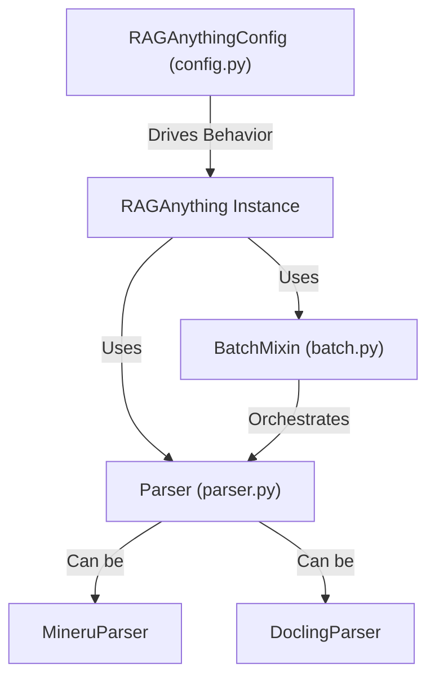

'''
# Advanced Features and Customization in RAGAnything

Welcome to the advanced guide for `RAGAnything`! While the basic setup is designed to be simple and effective, this library offers a rich set of features for customizing its behavior to fit your specific needs. In this tutorial, we'll explore how to fine-tune the library, process documents in bulk, and leverage different parsing engines.

## 1. Goal

By the end of this tutorial, you will be able to:

-   Customize `RAGAnything`'s behavior using the `RAGAnythingConfig` class.
-   Efficiently process entire folders of documents using the batch processing module.
-   Understand and select different document parsing backends.
-   Integrate batch parsing directly with the RAG indexing workflow.

## 2. Prerequisites

-   A working Python environment with `RAGAnything` installed.
-   Familiarity with the basic usage of `RAGAnything` for processing single documents.

## 3. Architecture: The Customization Engine

Most of `RAGAnything`'s advanced capabilities are controlled through a clear, layered architecture. The `RAGAnythingConfig` object acts as the central control panel, influencing everything from batch processing to the underlying parsing engine.



## 4. Step 1: Centralized Configuration with `RAGAnythingConfig`

The `RAGAnythingConfig` dataclass, found in `raganything/config.py`, is your primary tool for customization. You can instantiate it and pass it to the `RAGAnything` constructor to override default settings. Alternatively, you can set environment variables.

Here’s how you can customize the configuration:

```python
from raganything import RAGAnything, RAGAnythingConfig

# 1. Create a custom configuration instance
custom_config = RAGAnythingConfig(
    # Use the 'docling' parser instead of the default 'mineru'
    parser="docling",
    # Increase the number of concurrent files for batch processing
    max_concurrent_files=4,
    # Disable image processing to speed up parsing
    enable_image_processing=False,
    # Only process PDF and DOCX files
    supported_file_extensions=[".pdf", ".docx"],
)

# 2. Initialize RAGAnything with the custom config
ragg = RAGAnything(config=custom_config)

print(f"Using parser: {ragg.config.parser}")
print(f"Max concurrent files: {ragg.config.max_concurrent_files}")
```

This approach gives you fine-grained control over directories, context extraction, file types, and more without changing the core code.

## 5. Step 2: High-Performance Batch Processing

Processing files one by one is fine for a few documents, but for large collections, you need the power of batch processing. The `BatchMixin` in `raganything/batch.py` adds powerful methods to handle this.

The `process_documents_batch()` method is the recommended way to parse a large number of files efficiently. It uses a `BatchParser` to manage a pool of workers and process files in parallel.

```python
from raganything import RAGAnything
import asyncio

# Initialize with default settings
ragg = RAGAnything()

# A list of files and directories to process
file_paths = ["./my_docs/report.pdf", "./my_images/", "./archive.zip"]

# Process the whole batch in parallel
# This will find all supported files recursively and parse them
batch_result = ragg.process_documents_batch(
    file_paths=file_paths, 
    output_dir="./parsed_output",
    show_progress=True, # Display a handy progress bar
)

print(f"Successfully parsed: {len(batch_result.successful_files)} files")
print(f"Failed to parse: {len(batch_result.failed_files)} files")

# You can also run it asynchronously
async def main():
    async_batch_result = await ragg.process_documents_batch_async(file_paths)
    print(f"Async success: {len(async_batch_result.successful_files)}")

# asyncio.run(main())
```

This method is ideal for pre-populating your document store before making it available for queries.

## 6. Step 3: Integrating Batch Parsing with RAG

Parsing files is just the first step. The ultimate goal is to get their content into the Retrieval-Augmented Generation (RAG) system. The `process_documents_with_rag_batch()` method streamlines this entire workflow.

It performs two key actions:
1.  **Parses** all documents using the efficient batch processor.
2.  **Indexes** each successfully parsed document into the RAG system.

```python
import asyncio
from raganything import RAGAnything

ragg = RAGAnything()

file_paths = ["./my_docs/"]

async def run_full_pipeline():
    # This single method handles both parsing and RAG indexing
    full_result = await ragg.process_documents_with_rag_batch(
        file_paths=file_paths,
        output_dir="./parsed_output",
        show_progress=True
    )
    
    print("--- Parse Results ---")
    print(f"Successful: {full_result['parse_result'].successful_files}")
    print(f"Failed: {full_result['parse_result'].failed_files}")
    
    print("\n--- RAG Indexing Results ---")
    print(f"Successfully indexed: {full_result['successful_rag_files']} files")
    print(f"Failed to index: {full_result['failed_rag_files']} files")

# Run the integrated workflow
# asyncio.run(run_full_pipeline())

# After this runs, you can immediately start querying
# results = ragg.query("What is the main conclusion of the report?")
# print(results)
```

This powerful method provides a one-shot solution for turning a directory of raw documents into a fully queryable knowledge base.

## 7. Step 4: Advanced Parser Customization

`RAGAnything` uses a pluggable parser system defined in `raganything/parser.py`. The two main parsers are `MineruParser` (default) and `DoclingParser`.

-   **`MineruParser`**: A powerful, all-in-one parser for PDFs, images, and other formats. It can even convert Office documents to PDF using LibreOffice if it's installed.
-   **`DoclingParser`**: A specialized parser that is particularly good with Office documents (`.docx`, `.pptx`) and HTML.

You can select the parser via `RAGAnythingConfig`, as shown in Step 1. More advanced users can pass parser-specific arguments directly into the processing methods. These arguments are passed down as `**kwargs` to the underlying parser.

For example, to use the `MineruParser` with a specific OCR language:

```python
from raganything import RAGAnything

ragg = RAGAnything()

async def process_with_lang():
    # The 'lang' argument is passed down to the MineruParser
    await ragg.process_document_complete(
        "path/to/german_document.pdf",
        lang="deu"  # Specify German for OCR
    )

# asyncio.run(process_with_lang())
```

This allows you to access deep features of the parsing backend without modifying the `RAGAnything` source code.

## 8. Conclusion

You've now seen how to move beyond the basics and tailor `RAGAnything` to your needs. By using the `RAGAnythingConfig` object, leveraging the powerful batch processing capabilities, and passing custom arguments to the underlying parsers, you can build sophisticated document processing pipelines capable of handling large, diverse sets of files with speed and precision.
'''