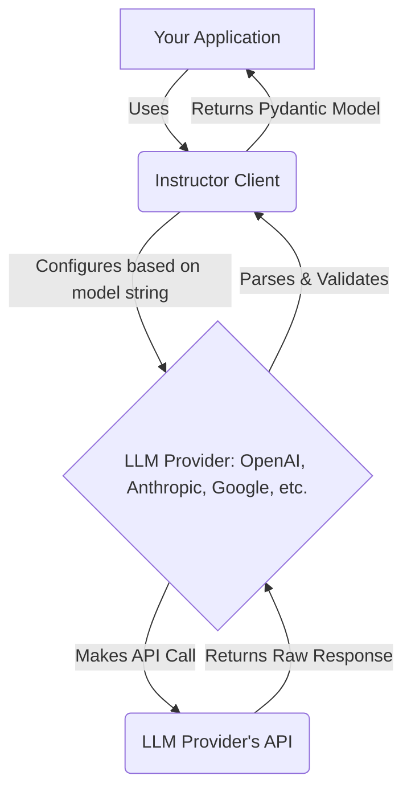

# Using Instructor with Multiple Providers

## 1. Goal
In this tutorial, you will learn how to use `instructor` with various LLM providers such as OpenAI, Anthropic, and Google. We will explore the `from_provider` function to seamlessly switch between models from different providers and extract structured data.

## 2. Prerequisites
- Python 3.9+
- Basic understanding of Pydantic and Large Language Models (LLMs)
- Installation of `instructor` and the respective LLM provider libraries (e.g., `openai`, `anthropic`, `google-generativeai`). You can install them via `pip install instructor openai anthropic google-generativeai`.

## 3. Architecture
`instructor` acts as a wrapper around the client of each LLM provider, normalizing the API calls to return Pydantic models. The `from_provider` function intelligently configures the `instructor` client based on the specified model string, handling the underlying provider-specific details.



## 4. Step 1: Setup
First, let's define a simple Pydantic model that we'll use to extract structured data.

```python
from pydantic import BaseModel
import instructor
import os

# Define what you want to extract
class User(BaseModel):
    name: str
    age: int

# For demonstration, ensure your API keys are set as environment variables
# For OpenAI: OPENAI_API_KEY
# For Anthropic: ANTHROPIC_API_KEY
# For Google: GOOGLE_API_KEY

# If you don't have them set, you can uncomment and set them directly
# os.environ["OPENAI_API_KEY"] = "YOUR_OPENAI_API_KEY"
# os.environ["ANTHROPIC_API_KEY"] = "YOUR_ANTHROPIC_API_KEY"
# os.environ["GOOGLE_API_KEY"] = "YOUR_GOOGLE_API_KEY"
```

## 5. Step 2: Using `from_provider` with OpenAI

`instructor.from_provider` simplifies the process of initializing an instructor-patched client for various providers. For OpenAI, you can specify an OpenAI model name.

```python
# Initialize instructor with an OpenAI model
print("--- Using OpenAI ---")
openai_client = instructor.from_provider("openai/gpt-4o-mini")

# Use the client to extract data
user_openai = openai_client.chat.completions.create(
    response_model=User,
    messages=[{"role": "user", "content": "Extract a user named John who is 30 years old."}],
)

print(f"Extracted User (OpenAI): {user_openai}")
# Expected output: User(name='John', age=30)
```

## 6. Step 3: Switching to Anthropic

To switch to Anthropic, simply change the model string in `from_provider` to an Anthropic model.

```python
# Initialize instructor with an Anthropic model
print("\n--- Using Anthropic ---")
anthropic_client = instructor.from_provider("anthropic/claude-3-5-sonnet")

# Use the client to extract data
user_anthropic = anthropic_client.chat.completions.create(
    response_model=User,
    messages=[{"role": "user", "content": "Extract a user named Jane who is 25 years old."}],
)

print(f"Extracted User (Anthropic): {user_anthropic}")
# Expected output: User(name='Jane', age=25)
```

## 7. Step 4: Switching to Google

Similarly, for Google models, provide the appropriate model string.

```python
# Initialize instructor with a Google model
print("\n--- Using Google ---")
google_client = instructor.from_provider("google/gemini-pro")

# Use the client to extract data
user_google = google_client.chat.completions.create(
    response_model=User,
    messages=[{"role": "user", "content": "Extract a user named Mike who is 40 years old."}],
)

print(f"Extracted User (Google): {user_google}")
# Expected output: User(name='Mike', age=40)
```

## 8. Conclusion

This tutorial demonstrated how `instructor` allows you to seamlessly integrate with multiple LLM providers using the `from_provider` function. By abstracting away provider-specific client initializations and API calls, `instructor` enables you to write clean, consistent code for extracting structured data, regardless of the underlying LLM. You can now easily switch between different models and providers to find the best fit for your application's needs.