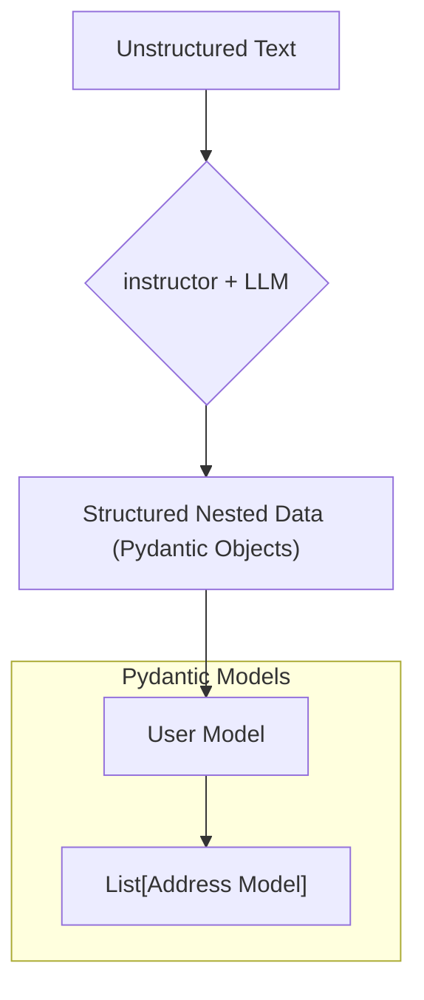

# Working with Nested Data

LLMs often process text containing complex, hierarchical information. For example, a single user might have multiple addresses, or a product could have a list of components. Manually parsing this nested data from an LLM's output is brittle and error-prone.

With `instructor`, you can extract deeply nested structures by simply defining your data model with Pydantic.

## 1. Goal

In this tutorial, you'll learn how to extract a list of objects nested within another object. We will define a `User` who has a list of `Address` objects and extract their information from a block of text.

## 2. Architecture

`instructor` leverages Pydantic's recursive model composition to build the correct JSON schema, which is then used to guide the LLM in generating the desired nested output.



## 3. Step 1: Define Your Nested Pydantic Models

First, we define our desired data structure. Notice that the `User` model contains a `List` of `Address` models. `instructor` will automatically understand this relationship and extract a list of addresses.

```python
from pydantic import BaseModel
from typing import List
import instructor

# Define the nested model first
class Address(BaseModel):
    street: str
    city: str
    country: str

# Define the main model that contains the nested list
class User(BaseModel):
    name: str
    age: int
    addresses: List[Address]
```

By defining `addresses: List[Address]`, you are telling `instructor` to look for and extract multiple address objects for a single user.

## 4. Step 2: Extract from Text

Now, let's create a client and pass a prompt that includes information for multiple addresses. `instructor` will handle the complex task of identifying each address and mapping it to the `Address` model.

```python
# This will work with any provider
client = instructor.from_provider("openai/gpt-4o-mini")

text_block = """
John Doe is 25 years old. His primary residence is at 123 Main St, 
Anytown, USA. He also has a vacation home at 456 Beach Rd, Sunville, USA.
"""

# Extract the structured data
user = client.chat.completions.create(
    response_model=User,
    messages=[
        {
            "role": "user", 
            "content": f"Extract the user and all of their addresses from the following text: {text_block}"
        }
    ],
)

assert isinstance(user, User)
assert len(user.addresses) == 2
assert isinstance(user.addresses[0], Address)
```

## 5. Step 3: Verify the Output

Let's print the extracted `user` object. You'll see a fully populated, type-safe Pydantic object with a nested list of addresses, ready to be used in your application.

```python
import json

print(json.dumps(user.model_dump(), indent=2))
#> {
#>   "name": "John Doe",
#>   "age": 25,
#>   "addresses": [
#>     {
#>       "street": "123 Main St",
#>       "city": "Anytown",
#>       "country": "USA"
#>     },
#>     {
#>       "street": "456 Beach Rd",
#>       "city": "Sunville",
#>       "country": "USA"
#>     }
#>   ]
#> }
```

## 6. Conclusion

You have successfully extracted a nested list of objects from unstructured text. This same principle applies to any level of nesting—you could have a list of users, each with a list of addresses, each with a postal code object. As long as you can model it in Pydantic, `instructor` can help you extract it.
