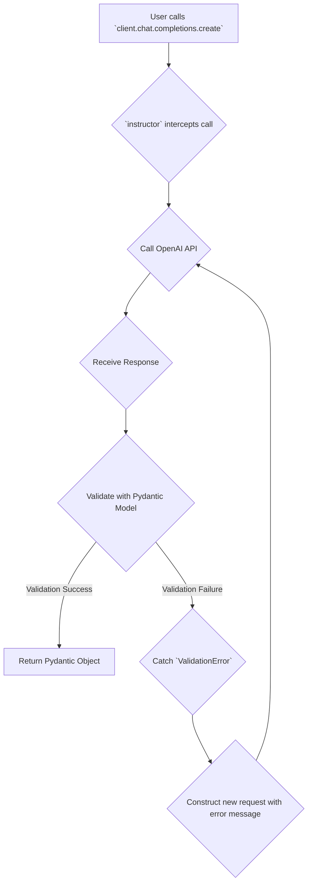

# Automatic Retries and Pydantic Validation

## 1. Goal

This tutorial will demonstrate how `instructor` leverages Pydantic validators to ensure the responses from a Large Language Model (LLM) adhere to specific, custom-defined rules. We will also explore how `instructor` automatically retries requests when validation fails, significantly improving the reliability of your LLM-powered applications.

## 2. Prerequisites

Make sure you have `instructor` and `openai` installed:

```bash
pip install instructor openai
```

## 3. The Power of Validation

When working with structured data, you often need to enforce rules beyond simple type checking. For instance, you might need to ensure a number falls within a certain range, or that a string represents a valid URL. Pydantic's validators are perfect for this.

`instructor` seamlessly integrates with Pydantic, meaning any validator you add to your `BaseModel` will be automatically applied to the LLM's output. If the output fails validation, `instructor` will catch the `ValidationError`, inform the LLM of the mistake, and ask it to correct its response.

### Architecture of a Retry-Enabled Request

Here's a diagram illustrating the automatic retry mechanism:



## 4. Implementation

Let's build a simple example to extract user information from a text, but with a twist. We want to ensure that the user's age is between 18 and 99. We'll use a Pydantic validator to enforce this rule.

### Step 1: Define the Pydantic Model with a Validator

We'll create a `UserInfo` model with `name` and `age` fields. We'll add a validator for the `age` field using Pydantic's `@field_validator`.

```python
import openai
import instructor
from pydantic import BaseModel, Field, field_validator

# Patch the OpenAI client
client = instructor.patch(openai.OpenAI())

class UserInfo(BaseModel):
    name: str
    age: int = Field(description="The user's age")

    @field_validator("age")
    def validate_age(cls, v):
        if not (18 <= v <= 99):
            raise ValueError("Age must be between 18 and 99")
        return v
```

### Step 2: Make the LLM Call with Retries

The `instructor`-patched client includes a `max_retries` parameter. By setting `max_retries` to a value greater than 1, you enable the automatic retry mechanism. If the LLM returns an age outside our specified range (e.g., 17), the `validate_age` function will raise a `ValueError`. `instructor` will catch this, and because we've set `max_retries`, it will automatically send a new request to the LLM, including the validation error in the prompt to guide the model toward a correct answer.

```python
def extract_user_info(text: str) -> UserInfo:
    return client.chat.completions.create(
        model="gpt-3.5-turbo",
        response_model=UserInfo,
        messages=[{"role": "user", "content": text}],
        max_retries=2, # Enable automatic retries on validation failure
    )

try:
    # This text will likely cause the model to first suggest an age of 17,
    # which will fail validation.
    user = extract_user_info("Extract user info from this text: John Doe is 17 years old and will be 18 on his next birthday.")
    print(f"Successfully extracted user: {user.name}, Age: {user.age}")
    assert user.age >= 18
except Exception as e:
    print(f"An error occurred: {e}")

# Expected Output:
# Successfully extracted user: John Doe, Age: 18
```

In this example, the model's first attempt might be to extract "17". Our validator will reject this, and `instructor` will automatically retry. On the second attempt, the model, now aware of the "Age must be between 18 and 99" constraint, will correctly infer the age should be 18.

## 5. Conclusion

By combining `instructor`'s `max_retries` feature with Pydantic's powerful validation system, you can build incredibly robust and reliable applications that self-correct in response to invalid LLM outputs. This shifts the burden of error handling and data validation from your application logic to the `instructor` library, resulting in cleaner, more resilient code.
