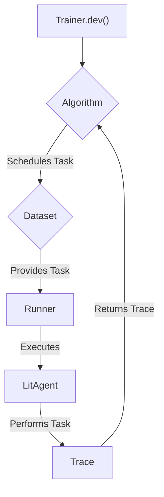

'''
# Train Your First Agent

In this tutorial, you'll learn the fundamentals of training an agent with Agent-Lightning. We'll walk through the essential components, create a simple agent, and run it through a training loop.

## 1. Goal

By the end of this guide, you will be able to:
- Understand the roles of `Trainer`, `LitAgent`, and `Algorithm`.
- Implement a basic `LitAgent`.
- Prepare a dataset for training.
- Use the `Trainer` to run a development loop.

## 2. Prerequisites

- Python 3.9+
- Agent-Lightning installed. If you haven't installed it yet, please follow the [Installation guide](tutorials/installation.md).

## 3. Core Architecture

Agent-Lightning's training process revolves around a few key components:

-   **`LitAgent`**: The agent you want to train. You define its behavior by implementing the `rollout` method, which executes a single task.
-   **`Dataset`**: An iterable of tasks that your agent will learn from.
-   **`Algorithm`**: The logic that drives the training process. It schedules tasks, processes the agent's outputs (traces), and updates the agent (e.g., through reinforcement learning or supervised fine-tuning). For this tutorial, we'll use a simple `Baseline` algorithm.
-   **`Trainer`**: The orchestrator that brings everything together. It manages the `Algorithm`, runs the `LitAgent` on multiple workers, and handles all the underlying plumbing.

Here's how they interact:



## 4. Step 1: Create Your Agent

First, let's define a simple agent. Our agent will take a dictionary with two numbers, `{"x": int, "y": int}`, and its task is to add them. The result is returned as the "reward".

We create a class `MyAgent` that inherits from `agentlightning.litagent.LitAgent` and implements the `rollout` method.

```python
# my_agent.py
from agentlightning.litagent import LitAgent
from agentlightning.types import Rollout, NamedResources, RolloutRawResult

class MyAgent(LitAgent[dict]):
    def rollout(self, task: dict, resources: NamedResources, rollout: Rollout) -> RolloutRawResult:
        """Adds two numbers from the task dictionary and returns the sum as the reward."""
        x = task.get("x", 0)
        y = task.get("y", 0)
        result = x + y
        print(f"Agent processing task: {task} -> Result: {result}")
        # The return value is the reward for this rollout
        return result
```

The `rollout` method is the heart of your agent. It receives the `task` payload, a dictionary of `resources` (like LLMs or other tools, which we ignore for now), and `rollout` metadata.

## 5. Step 2: Prepare the Dataset

An agent needs data to learn from. For our simple case, the dataset is just a Python list of dictionaries, where each dictionary is a task for our `MyAgent`.

```python
# train.py

# 1. Your dataset of tasks
train_dataset = [
    {"x": 1, "y": 2},
    {"x": 5, "y": 3},
    {"x": 10, "y": -2},
]
```

## 6. Step 3: Configure and Run the Trainer

The `Trainer` orchestrates the entire training process. It connects the agent, dataset, and training algorithm.

For this first example, we'll use `trainer.dev()`. This is a convenience method for running a fast, local, synchronous training loop, perfect for debugging and getting started. It uses a simple `Baseline` algorithm by default, which just runs each task once.

Let's create a `train.py` script to put everything together.

```python
# train.py
from agentlightning.trainer import Trainer
from my_agent import MyAgent

# 1. Your dataset of tasks
train_dataset = [
    {"x": 1, "y": 2},
    {"x": 5, "y": 3},
    {"x": 10, "y": -2},
]

# 2. Instantiate your agent
agent = MyAgent()

# 3. Instantiate the Trainer
# By default, dev() uses a simple Baseline algorithm and runs locally.
trainer = Trainer()

# 4. Run the development loop
print("Starting agent training...")
trainer.dev(agent, train_dataset)
print("Training finished!")

```

## 7. Putting it all together

Your directory should look like this:

```
.
├── my_agent.py
└── train.py
```

Now, run the training script from your terminal:

```bash
python train.py
```

You will see the agent process each task from the dataset:

```
Starting agent training...
Agent processing task: {'x': 1, 'y': 2} -> Result: 3
Agent processing task: {'x': 5, 'y': 3} -> Result: 8
Agent processing task: {'x': 10, 'y': -2} -> Result: 8
Training finished!
```

## 8. Conclusion

Congratulations! You've successfully trained your first agent using Agent-Lightning. You learned how to:

- Define an agent's logic by implementing `LitAgent`.
- Provide a simple list of tasks as a dataset.
- Use the `Trainer.dev()` method to run a complete training loop.

This is the foundation for building much more complex and powerful agents. In the next tutorials, you will learn how to write a custom algorithm to control the agent's learning process.
'''