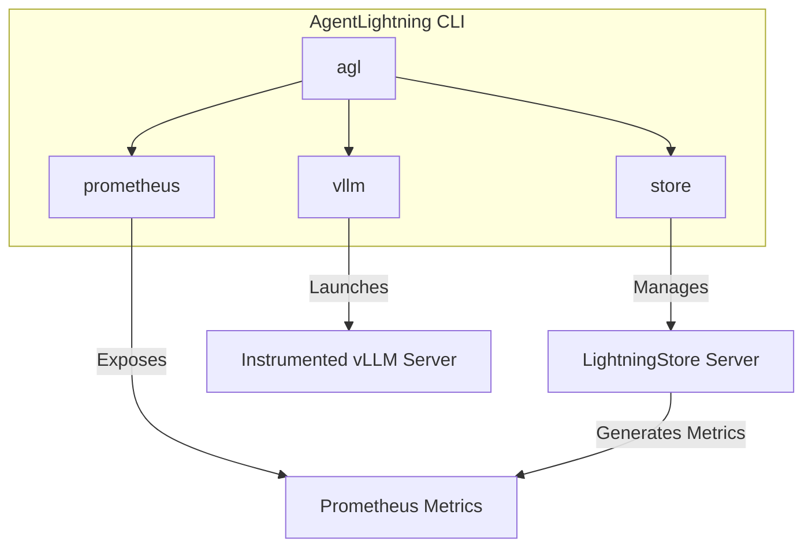

# Tutorial: Command-Line Interface (CLI)

This tutorial provides a guide to using the `agentlightning` command-line interface (CLI). The CLI allows you to start and manage key components of the AgentLightning framework, including the `LightningStore`, Prometheus metrics exporter, and instrumented vLLM servers.

## 1. Goal

The goal of this tutorial is to understand the available CLI commands, their purposes, and how to use them effectively.

## 2. Prerequisites

- The `agentlightning` package must be installed. You can typically install it using pip:
  ```bash
  pip install agentlightning
  ```
- Basic familiarity with command-line operations.

## 3. Architecture

The AgentLightning CLI is structured into several subcommands, each responsible for a specific service. The main entry point `agl` acts as a dispatcher to these services.



- **`agl store`**: Starts the `LightningStore`, a high-performance key-value store for sharing data between agent processes.
- **`agl prometheus`**: Runs a server to expose metrics generated by the `LightningStore` in a format compatible with Prometheus.
- **`agl vllm`**: Launches a vLLM (Very Large Language Model) server with AgentLightning's instrumentation automatically enabled.

## 4. Implementation

The `agentlightning` CLI is exposed through the `agl` command. While the user-provided files do not show the main dispatcher, we can infer the structure from the individual command modules.

### 4.1. `agl store`: The LightningStore Server

The `store` command starts the central `LightningStore` server. This server can use an in-memory backend or a persistent MongoDB backend.

**Usage:**

```bash
# Start a store server with default in-memory backend
python -m agentlightning.cli.store --port 4747

# Start a store server with a MongoDB backend and Prometheus tracking
python -m agentlightning.cli.store --backend mongo --mongo-uri "mongodb://localhost:27017/" --tracker prometheus
```

**Key Arguments:**
- `--host`: Server host (default: `0.0.0.0`).
- `--port`: Server port (default: `4747`).
- `--backend`: Storage backend, `memory` or `mongo` (default: `memory`).
- `--mongo-uri`: Connection URI for MongoDB.
- `--tracker`: Metrics backend to enable, `console` or `prometheus`.
- `--n-workers`: Number of worker processes.

### 4.2. `agl prometheus`: The Prometheus Metrics Exporter

This command starts a dedicated server to expose metrics for monitoring with Prometheus. For it to work, the `LightningStore` must be configured with the `prometheus` tracker and the `PROMETHEUS_MULTIPROC_DIR` environment variable must be set and point to a valid directory.

**Usage:**

First, set the environment variable:
```bash
export PROMETHEUS_MULTIPROC_DIR=/tmp/prometheus_metrics
mkdir -p $PROMETHEUS_MULTIPROC_DIR
```

Then, run the `store` and `prometheus` servers (typically in separate terminals):

```bash
# Terminal 1: Start the store with prometheus tracking
python -m agentlightning.cli.store --tracker prometheus

# Terminal 2: Start the prometheus metrics server
python -m agentlightning.cli.prometheus --port 4748
```

Metrics will be available at `http://localhost:4748/v1/prometheus`.

**Key Arguments:**
- `--host`: Server host (default: `0.0.0.0`).
- `--port`: Server port (default: `4748`).
- `--metrics-path`: The URL path for the metrics endpoint (default: `/v1/prometheus`).

### 4.3. `agl vllm`: Instrumented vLLM Server

This command acts as a wrapper around the standard vLLM CLI. It automatically applies AgentLightning instrumentation to the vLLM server, allowing you to capture detailed performance metrics and traces without modifying the vLLM code.

You can pass any standard vLLM arguments to this command.

**Usage:**

```bash
# Launch an instrumented vLLM server
# All arguments after the subcommand are passed to the vLLM CLI
python -m agentlightning.cli.vllm --model facebook/opt-125m --host 0.0.0.0 --port 8000
```
This is equivalent to running the standard vLLM entrypoint but with instrumentation enabled.

## 5. Conclusion

The `agentlightning` CLI provides a powerful and convenient way to launch and manage the different services that make up the AgentLightning ecosystem. By understanding the `store`, `prometheus`, and `vllm` commands, you can effectively deploy and monitor your AI agent applications.
