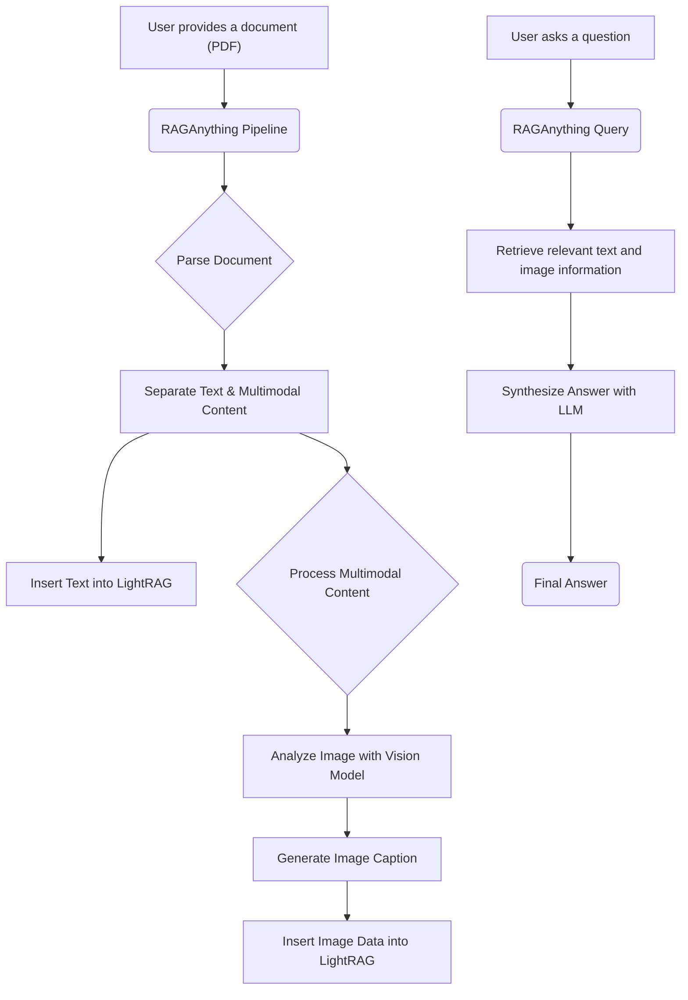

# Putting It All Together: A Complete Example

Welcome to this complete, end-to-end tutorial where we'll walk through a full example of using `RAGAnything` to build a multimodal RAG system. You'll learn how to ingest a document containing text and images, process it, and then ask questions that require understanding both the text and the visuals.

## 1. Goal

By the end of this tutorial, you will be able to:

- Initialize the `RAGAnything` pipeline.
- Process a local document (e.g., a PDF) and extract its content.
- Automatically analyze and caption images and other multimodal content within the document.
- Build a knowledge graph from the document's text and image descriptions.
- Perform queries that retrieve information from both text and images.

## 2. Prerequisites

- Python 3.9+
- An environment with the `raganything` library and its dependencies installed.
- Access to large language models (LLMs) for text and vision, as well as an embedding model. This tutorial will use placeholders, but you can swap in your preferred models (e.g., from OpenAI, Anthropic, or a local provider).

## 3. Architecture

The process flow for our example looks like this:



## 4. Step 1: Initializing RAGAnything

First, we need to set up our `RAGAnything` instance. This involves defining our model functions, configuring the pipeline, and creating the main object.

Let's create a Python script named `run_example.py`.

### Mock Model and Embedding Functions

For this example, we'll create mock functions for the LLM, vision model, and embeddings. In a real-world application, you would replace these with actual API calls to your chosen services.

```python
import asyncio

# Mock functions for demonstration
async def mock_llm_model_func(prompt: str, **kwargs):
    """Mocks a language model, returning a canned response."""
    print(f"\n--- Mock LLM called with prompt: ---\n{prompt[:200]}...\n")
    if "table" in prompt.lower():
        return '''{
            "detailed_description": "This table shows a simple two-column layout. The left column contains item names (Item A, Item B) and the right column lists their corresponding values (100, 200).",
            "entity_info": {
                "entity_name": "item_value_table",
                "entity_type": "table",
                "summary": "A summary table of items and their numeric values."
            }
        }'''
    return '''{
        "detailed_description": "A generic description based on the input prompt.",
        "entity_info": {
            "entity_name": "generic_entity",
            "entity_type": "text",
            "summary": "A summary of the content."
        }
    }'''

async def mock_vision_model_func(prompt: str, image_path: str, **kwargs):
    """Mocks a vision model, returning a description of a placeholder image."""
    print(f"\n--- Mock Vision Model called for image: {image_path} ---\n")
    return '''{
        "detailed_description": "This is a detailed description of a placeholder image. It features a simple geometric shape, like a blue square, on a white background. The image is clean and minimalist.",
        "entity_info": {
            "entity_name": "placeholder_image",
            "entity_type": "image",
            "summary": "A placeholder image containing a blue square."
        }
    }'''

async def mock_embedding_func(texts: list[str], **kwargs):
    """Mocks an embedding function, returning zero vectors."""
    print(f"\n--- Mock Embedding called for {len(texts)} texts ---\n")
    return [[0.0] * 768 for _ in texts]

```

### Setting up the RAGAnything Instance

Now, let's import `RAGAnything` and initialize it. We'll use an in-memory SQLite database for this example by setting `lightrag_kwargs`.

```python
from raganything import RAGAnything
import os

async def main():
    # Create a directory for our RAG system to work in
    working_dir = "./rag_anything_workspace"
    if not os.path.exists(working_dir):
        os.makedirs(working_dir)

    # Initialize RAGAnything
    rag_anything = RAGAnything(
        llm_model_func=mock_llm_model_func,
        vision_model_func=mock_vision_model_func,
        embedding_func=mock_embedding_func,
        lightrag_kwargs={
            "vector_storage_cls_kwargs": {"db_path": ":memory:"} # Use in-memory vector DB
        }
    )

    print("RAGAnything initialized successfully.")

    # In the next steps, we will process a file and query it.

if __name__ == "__main__":
    asyncio.run(main())
```

## 5. Step 2: Processing a Document

With our pipeline ready, let's process a document. For this example, create a dummy file named `my_document.txt`. In a real scenario, this could be a PDF, DOCX, or other supported file types.

**`my_document.txt`:**
```
This is a simple document to test the RAGAnything pipeline.

It contains some text and references an image.

Here is an image:


This text follows the image and provides additional context.
```

Also, create a placeholder image `my_image.png` in the same directory.

Now, add the processing logic to your `run_example.py` script:

```python
# (Add this inside the main() function from the previous step)

# Create dummy files for the example
    with open("my_document.txt", "w") as f:
        f.write("This is a test document with an image.\n")
    with open("my_image.png", "w") as f:
        f.write("dummy image content")

    # Process the document
    file_path = "my_document.txt"
    print(f"\nProcessing file: {file_path}\n")

    try:
        result = await rag_anything.process_file(file_path)

        if result and result.get("success"):
            print("\nFile processing completed successfully.")
            print("Summary:", result.get("summary"))
        else:
            print("\nFile processing failed.")
            print("Error:", result.get("error"))

    except Exception as e:
        print(f"An error occurred during file processing: {e}")

```

The `process_file` method performs the heavy lifting:
1.  It calls the configured parser (`MineruParser` or `DoclingParser`) to extract structured content.
2.  It uses `separate_content` from `raganything.utils` to divide the content into pure text and multimodal items (like images).
3.  The text is inserted directly into the `LightRAG` knowledge graph.
4.  Each multimodal item is passed to a specialized processor (e.g., `ImageModalProcessor`).
5.  The `ImageModalProcessor` uses our `mock_vision_model_func` to generate a detailed description and summary of the image.
6.  This generated metadata is then added to the knowledge graph, linked to the original document.

## 6. Step 3: Querying the Knowledge Graph

After processing, all the information is indexed and ready to be queried. Let's ask a question that requires understanding the image.

Add the following code to the end of your `main()` function:

```python
# (Add this inside the main() function)

# Now, let's query the processed information
    query_text = "What is the image in the document about?"
    print(f"\n--- Sending query: '{query_text}' ---\n")

    try:
        query_result = await rag_anything.query(query_text)

        if query_result:
            print("\n--- Query Result ---")
            print("Answer:", query_result.answer.text)
            # The sources will include both text chunks and image analysis results
            print("\n--- Sources ---")
            for i, source in enumerate(query_result.sources):
                print(f"Source {i+1}:")
                print(f"  Type: {source.get('type')}")
                print(f"  Content: {source.get('text', '')[:200]}...")
                print("-" * 20)
        else:
            print("Query failed to return a result.")

    except Exception as e:
        print(f"An error occurred during querying: {e}")

    finally:
        # Clean up resources
        await rag_anything.finalize_storages()
        print("\nCleaned up resources.")
        # Clean up dummy files
        os.remove("my_document.txt")
        os.remove("my_image.png")

```

When you run the `query` method:
1.  Your question is converted into an embedding.
2.  `LightRAG` performs a vector search to find the most relevant chunks of information. Because we processed the image, the generated description ("This is a detailed description of a placeholder image...") is now a searchable chunk in our vector database.
3.  The top search results (which will include the image's description) are passed to the `mock_llm_model_func` as context.
4.  The LLM synthesizes this context to generate a final, human-readable answer.

## 7. Conclusion

Congratulations! You've successfully built and queried a multimodal RAG system using `RAGAnything`. We've demonstrated the entire lifecycle: initialization, document processing, multimodal content analysis, and querying.

From here, you can:
-   Swap the mock functions with real models from providers like OpenAI, Anthropic, or Hugging Face.
-   Experiment with different document types like PDFs and Word documents.
-   Explore the rich configuration options in `RAGAnythingConfig` to fine-tune the behavior of the pipeline, such as adjusting the context window for modal processors or changing parsing strategies.
-   Dig deeper into the `raganything.prompt` module to customize the analysis for different types of content.
