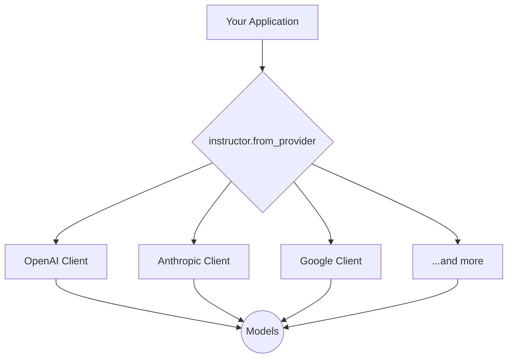

# Effortless Multi-Provider LLM Calls with Instructor

One of the most powerful features of `instructor` is its ability to provide a single, consistent interface for interacting with a wide variety of LLM providers. This means you can write your code once and seamlessly switch between models from OpenAI, Anthropic, Google, and more, without changing your application logic.

## 1. Goal

In this tutorial, you'll learn how to use `instructor.from_provider` to build applications that are portable across different LLM providers. We will demonstrate how to extract structured data using OpenAI, Anthropic, and Google models with minimal code changes.

## 2. Prerequisites

- Python 3.9+
- An installation of the `instructor` library.
- API keys for the providers you wish to use (e.g., OpenAI, Anthropic, Google).

First, make sure you have `instructor` and the necessary client libraries installed:

```bash
pip install instructor openai anthropic google-generativeai
```

## 3. Architecture: The Provider-Agnostic Flow

`instructor` acts as a unified facade over the native client libraries of different providers. This decouples your application logic from the specific implementation details of each API.



## 4. Step 1: Define Your Data Model

Let's start with a simple `Pydantic` model. This model defines the structure of the data we want to extract, and it will remain the same regardless of the provider we use.

```python
from pydantic import BaseModel

class User(BaseModel):
    name: str
    age: int
```

## 5. Step 2: Extraction with OpenAI

OpenAI is a common starting point. To use it, simply import `instructor` and use `from_provider` with the string `"openai/gpt-4o-mini"`.

```python
import instructor
from pydantic import BaseModel

# Define the data model
class User(BaseModel):
    name: str
    age: int

# Create a client for OpenAI
client = instructor.from_provider("openai/gpt-4o-mini")

# Extract the data
user = client.chat.completions.create(
    response_model=User,
    messages=[
        {"role": "user", "content": "John is 25 years old and lives in SF."}
    ],
)

print(f"OpenAI Extraction: {user}")
#> OpenAI Extraction: name='John' age=25
```

## 6. Step 3: Switch to Anthropic with One Line

Now, let's switch to Anthropic's Claude 3.5 Sonnet. The only change required is in the client initialization. The `create` call remains identical.

```python
import instructor
from pydantic import BaseModel

# Define the data model (re-used)
class User(BaseModel):
    name: str
    age: int

# Create a client for Anthropic - This is the only line that changes!
client = instructor.from_provider("anthropic/claude-3-5-sonnet")

# The rest of your code stays the same
user = client.chat.completions.create(
    response_model=User,
    messages=[
        {"role": "user", "content": "Jane is 30 years old and lives in LA."}
    ],
)

print(f"Anthropic Extraction: {user}")
#> Anthropic Extraction: name='Jane' age=30
```

## 7. Step 4: Switch to Google Gemini

Similarly, switching to Google's Gemini is just as simple. `instructor` handles the mapping of the API to the consistent `client.chat.completions.create` interface.

```python
import instructor
from pydantic import BaseModel

# Define the data model (re-used)
class User(BaseModel):
    name: str
    age: int

# Create a client for Google Gemini
client = instructor.from_provider("google/gemini-1.5-pro-latest")

# The rest of your code stays the same
user = client.chat.completions.create(
    response_model=User,
    messages=[
        {"role": "user", "content": "Peter is 42 years old and lives in NYC."}
    ],
)

print(f"Google Gemini Extraction: {user}")
#> Google Gemini Extraction: name='Peter' age=42
```

## 8. Step 5: Using Local Models with Ollama

You can even use local models running via Ollama. This is perfect for offline development, testing, or privacy-sensitive applications.

```python
import instructor
from pydantic import BaseModel

# Define the data model (re-used)
class User(BaseModel):
    name: str
    age: int

# Create a client for a local Ollama model
client = instructor.from_provider("ollama/llama3")

# The rest of your code stays the same
user = client.chat.completions.create(
    response_model=User,
    messages=[
        {"role": "user", "content": "Local Larry is 55 years old."}
    ],
)

print(f"Ollama Extraction: {user}")
#> Ollama Extraction: name='Local Larry' age=55
```

## 9. Passing API Keys Directly

While `instructor` automatically reads API keys from environment variables (e.g., `OPENAI_API_KEY`), you can also pass them directly during client initialization. This is useful in environments where you can't set environment variables.

```python
# For OpenAI
client = instructor.from_provider("openai/gpt-4o", api_key="sk-...")

# For Anthropic
client = instructor.from_provider("anthropic/claude-3-5-sonnet", api_key="sk-ant-...")

# For Groq
client = instructor.from_provider("groq/llama-3.1-8b-instant", api_key="gsk_...")
```

## 10. Conclusion

`instructor`'s multi-provider support is a game-changer for building robust and flexible AI applications. By abstracting away the specifics of each provider's API, you can:

- **Avoid vendor lock-in** and switch models as new, better, or cheaper ones become available.
- **Simplify your codebase** with a single, unified interface for extraction.
- **Test different models** with ease to find the best one for your use case.

Now, try experimenting with different providers and models to see how they perform on your own data!
