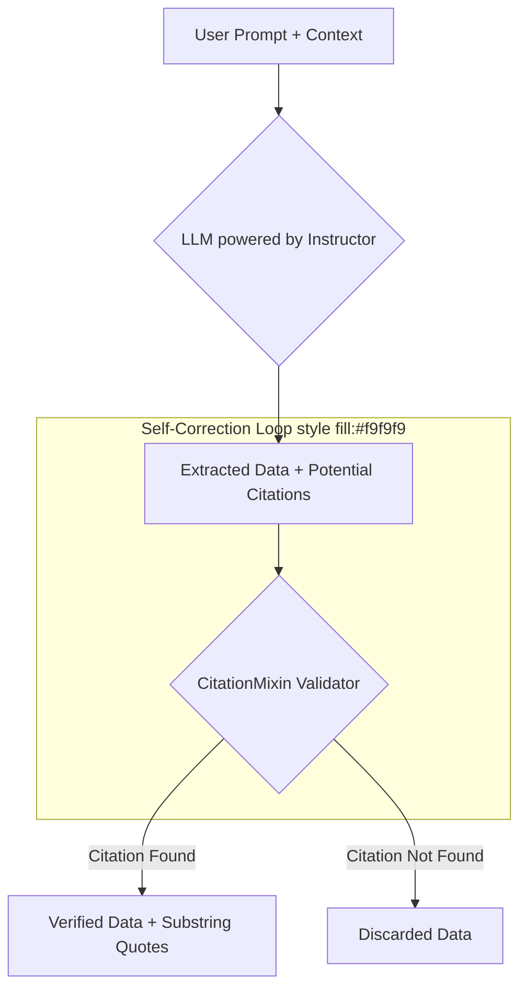

> In this guide, we'll explore how to use the `CitationMixin` to add citations to your models and perform self-correction. This ensures that the model's responses are grounded in the provided context.

## Why Citations Matter

When working with language models, especially for extraction tasks, it's crucial to ensure that the generated information is accurate and verifiable. The `CitationMixin` helps achieve this by forcing the model to cite the exact substrings from the context that support its answer.

This process acts as a form of self-correction. If the model generates a piece of information that isn't directly supported by the text, the citation validation will fail, and the unsupported information can be filtered out. This grounds the model's output in reality and increases trust in the results.

## Architecture: The Citation Flow

Let's visualize how the `CitationMixin` works. The process involves passing a context to the model, which then uses it to both extract information and provide citations. Our validator then cross-references these citations against the original context.



## Step 1: Defining the Data Model

First, let's define the data structure we want to extract. We'll create a simple `UserInfo` model. Notice that we don't need to add the `CitationMixin` yet.

```python
from pydantic import BaseModel, Field

class UserInfo(BaseModel):
    name: str = Field(description="The name of the person")
    age: int = Field(description="The age of the person")
```

## Step 2: Adding the `CitationMixin`

Now, let's incorporate the `CitationMixin`. By inheriting from it, our `UserInfo` model automatically gains the `substring_quotes` field and the validation logic that powers the self-correction.

```python
import instructor
from openai import OpenAI
from pydantic import BaseModel, Field

# By inheriting from CitationMixin, we add the `substring_quotes` field
# and the validation logic to our model.
class UserInfo(instructor.CitationMixin, BaseModel):
    name: str = Field(description="The name of the person")
    age: int = Field(description="The age of the person")

# Patch the OpenAI client
client = instructor.patch(OpenAI())
```

The `CitationMixin` adds a `substring_quotes: list[str]` field to your model, which will be populated with the parts of the context that the model used to generate its response.

## Step 3: Running the Extraction

The key to making this work is the `validation_context`. When we make the API call, we pass our source text into this argument. The `CitationMixin`'s validator will then use this context to verify the `substring_quotes` provided by the model.

```python
context = "Jason is 20 years old and is a student."

# The `validation_context` is used by the CitationMixin to validate the sources.
user = client.chat.completions.create(
    model="gpt-4-turbo",
    messages=[
        {
            "role": "user",
            "content": f"Extract the user from the following context: {context}",
        }
    ],
    response_model=UserInfo,
    validation_context={"context": context},
)

print(user.model_dump_json(indent=2))
```

## Step 4: Verifying the Output

Let's examine the result. The output now includes the `substring_quotes` field, which contains the exact phrases from the context that the model used to determine the user's name and age. This confirms the data is grounded and traceable.

```json
{
  "name": "Jason",
  "age": 20,
  "substring_quotes": [
    "Jason is 20 years old"
  ]
}
```

If the model had hallucinated an answer (e.g., claiming Jason was 25), the mixin's validator would have searched the `context`, failed to find a matching quote, and automatically removed that invalid citation.

## How It Works: Under the Hood

The `CitationMixin` uses a `model_validator` from Pydantic, which runs after the model is initially populated by the LLM. Here’s a simplified breakdown of the process:

1.  **Receive Context**: The validator accesses the `context` string you passed into `validation_context`.
2.  **Fuzzy Search**: For each quote in the `substring_quotes` list generated by the LLM, it performs a fuzzy search (using the `regex` library) against the context. This allows for minor variations or typos.
3.  **Validate and Replace**: If a quote is found in the context, it's kept. The raw quote from the LLM is replaced with the *exact* span of text from the source `context` to ensure perfect accuracy.
4.  **Discard**: If a quote is not found, it's removed from the `substring_quotes` list.

This powerful feature lets you build more reliable and auditable extraction systems with just one extra line of code.