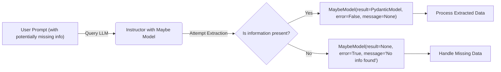

# Handling Missing Information with Instructor's `Maybe` Model

## 1. Goal
In this tutorial, you will learn how to gracefully handle scenarios where information might be missing from an LLM's output using Instructor's `Maybe` model. By the end, you will understand how to wrap a Pydantic model with `Maybe` and interpret the results to ensure robust data extraction.

## 2. Prerequisites
- Python 3.9+
- Basic understanding of Pydantic models.
- `instructor` library installed (`pip install instructor pydantic openai`)
- An OpenAI API key (or access to another supported LLM provider).

## 3. Architecture
The `Maybe` model acts as a wrapper around your Pydantic model, allowing the LLM to return either a fully structured object or an indication that the information was not found, along with an optional message. This prevents validation errors when data is legitimately absent.



## 4. Step 1: Setup and Defining Your Model
First, let's set up our environment and define a simple Pydantic model that we expect to extract from text. We'll use `instructor` to patch our OpenAI client.

```python
import instructor
from openai import OpenAI
from pydantic import BaseModel, Field
from instructor import Maybe

# Patch the OpenAI client
client = instructor.from_openai(OpenAI())

# Define the Pydantic model we want to extract
class User(BaseModel):
    name: str = Field(description="The name of the user")
    age: int = Field(description="The age of the user")
    occupation: str = Field(description="The occupation of the user")

# Create a Maybe version of our User model
MaybeUser = Maybe(User)
```

## 5. Step 2: Extracting Information with `Maybe`
Now, we'll use our `MaybeUser` model to extract information. We'll demonstrate with two examples: one where all information is present, and one where some key information is missing.

```python
# Example 1: All information is present
response_present = client.chat.completions.create(
    model="gpt-4o-mini", # or any other suitable model
    response_model=MaybeUser,
    messages=[
        {
            "role": "user",
            "content": "Extract the user details: John Doe is 30 years old and works as a software engineer."
        }
    ],
)

print("--- Information Present ---")
print(f"Error: {response_present.error}")
print(f"Message: {response_present.message}")
if response_present.result:
    print(f"Name: {response_present.result.name}")
    print(f"Age: {response_present.result.age}")
    print(f"Occupation: {response_present.result.occupation}")
else:
    print("No user details found.")

print("\n--- Information Missing ---")

# Example 2: Some information is missing (e.g., age)
response_missing_age = client.chat.completions.create(
    model="gpt-4o-mini",
    response_model=MaybeUser,
    messages=[
        {
            "role": "user",
            "content": "Extract the user details: Jane Smith, works as a doctor."
        }
    ],
)

print(f"Error: {response_missing_age.error}")
print(f"Message: {response_missing_age.message}")
if response_missing_age.result:
    print(f"Name: {response_missing_age.result.name}")
    print(f"Age: {response_missing_age.result.age}")
    print(f"Occupation: {response_missing_age.result.occupation}")
else:
    print("No user details found because some required fields were missing.")

print("\n--- Entirely Missing Information ---")

# Example 3: Entirely missing information
response_no_info = client.chat.completions.create(
    model="gpt-4o-mini",
    response_model=MaybeUser,
    messages=[
        {
            "role": "user",
            "content": "This text is about a cat playing with a ball."
        }
    ],
)

print(f"Error: {response_no_info.error}")
print(f"Message: {response_no_info.message}")
if response_no_info.result:
    print(f"Name: {response_no_info.result.name}")
    print(f"Age: {response_no_info.result.age}")
    print(f"Occupation: {response_no_info.result.occupation}")
else:
    print("No user details found in the text.")
```

## 6. Conclusion
You've successfully learned how to use Instructor's `Maybe` model to handle situations where expected information might be absent from your LLM's output. This pattern allows your applications to be more resilient and gracefully handle partial or entirely missing data, leading to more robust and user-friendly AI integrations. By checking the `error` and `result` fields of the `Maybe` wrapped model, you can implement conditional logic to adapt to various extraction outcomes.