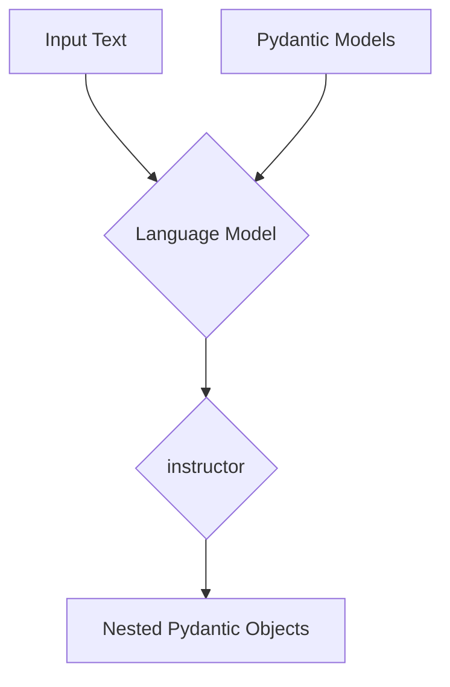

# Extracting Complex and Nested Data

## 1. Goal

This tutorial demonstrates how to extract complex and nested data structures from text using the `instructor` library. We will define nested Pydantic models and use them to guide the extraction process, resulting in clean, validated, and structured data.

## 2. Prerequisites

Make sure you have the `instructor` and `openai` libraries installed:

```bash
pip install instructor openai
```

## 3. Architecture

The process of extracting nested data involves defining a clear schema using Pydantic models. This schema is then passed to the language model, which uses it as a guide to structure its output. `instructor` handles the conversion of the model's output into the desired Pydantic objects.



## 4. Implementation

Let's say we have a piece of text containing information about a user and their associated addresses. We can define a nested structure to capture this information.

### Step 1: Define Pydantic Models

First, we define our Pydantic models. We'll have an `Address` model and a `User` model, where the `User` model contains a list of `Address` objects.

```python
from pydantic import BaseModel
from typing import List
import instructor
from openai import OpenAI

# Define the nested model
class Address(BaseModel):
    street: str
    city: str
    country: str

# Define the main model
class User(BaseModel):
    name: str
    age: int
    addresses: List[Address]
```

### Step 2: Use `instructor` to Extract Data

Now, we can use `instructor` to extract the data from a given text. We will use the `instructor.from_provider` to patch the OpenAI client.

```python
# Patch the OpenAI client
client = instructor.from_provider("openai/gpt-4o-mini")

# Text containing the data to extract
text = "John Doe is 25 years old. He lives at 123 Main St, San Francisco, USA. He also has a vacation home at 456 High St, New York, USA."

# Extract the data
user = client.chat.completions.create(
    model="gpt-4o-mini",
    response_model=User,
    messages=[
        {"role": "user", "content": text},
    ],
)

# Print the extracted data
print(user.model_dump_json(indent=2))
```

### Expected Output

The output will be a JSON object representing the `User` model, with the nested `Address` objects correctly populated:

```json
{
  "name": "John Doe",
  "age": 25,
  "addresses": [
    {
      "street": "123 Main St",
      "city": "San Francisco",
      "country": "USA"
    },
    {
      "street": "456 High St",
      "city": "New York",
      "country": "USA"
    }
  ]
}
```

As you can see, `instructor` seamlessly handles the extraction of nested data, allowing you to work with complex data structures with ease.
