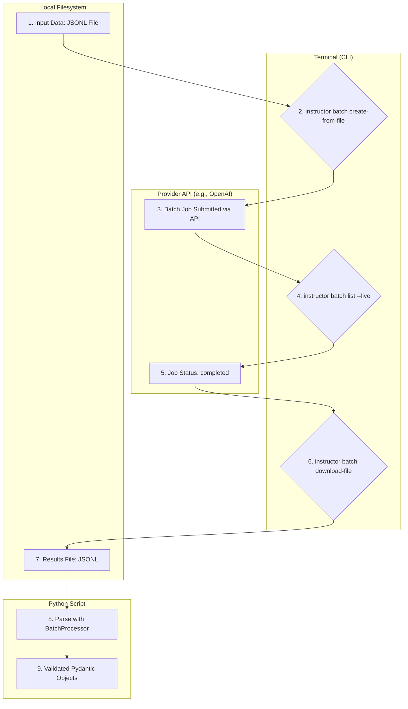

# Command-Line Interface (CLI) and Batch Processing

Instructor provides a powerful command-line interface (CLI) to streamline batch processing tasks with providers like OpenAI and Anthropic. This allows you to manage batch jobs directly from your terminal, from creation to result retrieval.

## 1. Goal

This tutorial will guide you through using the `instructor` CLI to:

- Create and submit batch jobs from local files.
- Monitor the status of your batch jobs in real-time.
- Retrieve, parse, and validate the structured results.

We will define a simple data extraction task, create a batch file, process it using the CLI, and then use the `BatchProcessor` to work with the results.

## 2. Prerequisites

- The `instructor` library installed (`pip install instructor`).
- Your API keys for the desired provider(s) must be set as environment variables (e.g., `OPENAI_API_KEY` or `ANTHROPIC_API_KEY`).

## 3. Architecture

The batch processing workflow involves several stages, from creating the input data to parsing the final results. The `instructor` CLI and its underlying `BatchProcessor` handle the provider-specific details for you.



## 4. Implementation

Let's process a batch of text data to extract user information.

### Step 1: Define the Pydantic Model

First, define the data structure you want to extract. This `User` model will be used later to parse the results.

```python
# models.py
from pydantic import BaseModel

class User(BaseModel):
    name: str
    age: int
```

### Step 2: Create the Batch Input File

The `instructor` batch CLI expects a JSONL file where each line is a request object. For OpenAI, the format requires a `custom_id`, a `method` (always `POST`), a `url` (always `/v1/chat/completions`), and the `body` of the request.

Here's how you can generate this file. Note that the `response_model` is included in the request body, which `instructor` uses to apply the right validation schema.

```python
# create_batch_file.py
import json
from models import User # your pydantic model

# The schema for your Pydantic model
schema = User.model_json_schema()

messages_list = [
    ["What is the name of the user who is 25 years old and named John Doe?"],
    ["My name is Jane Doe and I am 30 years old."]
]

file_path = "batch_input.jsonl"

with open(file_path, "w") as f:
    for i, messages in enumerate(messages_list):
        request = {
            "custom_id": f"request-{i}",
            "method": "POST",
            "url": "/v1/chat/completions",
            "body": {
                "model": "gpt-4o-mini", # Or any other model
                "messages": [{"role": "user", "content": msg} for msg in messages],
                "response_model": {"schema": schema, "name": "User"},
                "max_tokens": 1000,
                "temperature": 0.1,
            },
        }
        f.write(json.dumps(request) + "\n")

print(f"Batch input file created at {file_path}")
```

Run this script to generate `batch_input.jsonl`:
```bash
python create_batch_file.py
```

### Step 3: Create and Monitor the Batch Job

With the input file ready, use the CLI to create the batch job. Specify the file path and the model you want to use. The model parameter should be in the format `provider/model-name`.

```bash
# For OpenAI
instructor batch create-from-file \
  --file-path batch_input.jsonl \
  --model "openai/gpt-4o-mini"

# For Anthropic (if your file is formatted for it)
# instructor batch create-from-file \
#   --file-path batch_input_anthropic.jsonl \
#   --model "anthropic/claude-3-sonnet"
```

After submission, you can monitor the status of all your jobs. Use the `--live` flag to poll for real-time updates.

```bash
instructor batch list --provider openai --live
```

This will display a table of your recent batch jobs and their statuses, refreshing every 10 seconds.

### Step 4: Download and Parse the Results

Once the job status is `completed`, you can download the results file.

```bash
instructor batch download-file \
  --batch-id "batch_*************" \
  --download-file-path "batch_results.jsonl" \
  --provider "openai"
```

Now, you have a `batch_results.jsonl` file containing the raw output. To parse and validate these results into your `User` Pydantic models, use the `BatchProcessor`.

```python
# process_results.py
import json
from instructor.batch import BatchProcessor
from models import User # your pydantic model

# Initialize the processor with the same model and response_model
processor = BatchProcessor(
    model="openai/gpt-4o-mini", 
    response_model=User
)

# Read the raw results content
with open("batch_results.jsonl", "r") as f:
    results_content = f.read()

# Parse the results into BatchSuccess or BatchError objects
parsed_results = processor.parse_results(results_content)

for result in parsed_results:
    if result.is_success():
        print(f"Success (ID: {result.custom_id}): {result.result}")
    else:
        print(f"Error (ID: {result.custom_id}): {result.error_message}")

# Expected Output:
# Success (ID: request-0): name='John Doe' age=25
# Success (ID: request-1): name='Jane Doe' age=30
```

This script reads the downloaded file, uses `BatchProcessor.parse_results` to validate each line against the `User` model, and separates successful results from any potential errors.

## 5. Other CLI Commands

The `instructor` CLI also provides commands for managing your jobs:

- **Cancel a Job**: If a job is in progress, you can cancel it.
  ```bash
  instructor batch cancel --batch-id "batch_*************" --provider openai
  ```

- **Delete a Job**: Once a job is completed or cancelled, you can delete it (OpenAI only).
  ```bash
  instructor batch delete --batch-id "batch_*************" --provider openai
  ```

This unified CLI and `BatchProcessor` system provides a robust framework for managing asynchronous batch processing workloads across different providers, ensuring you always get structured, validated data back.
