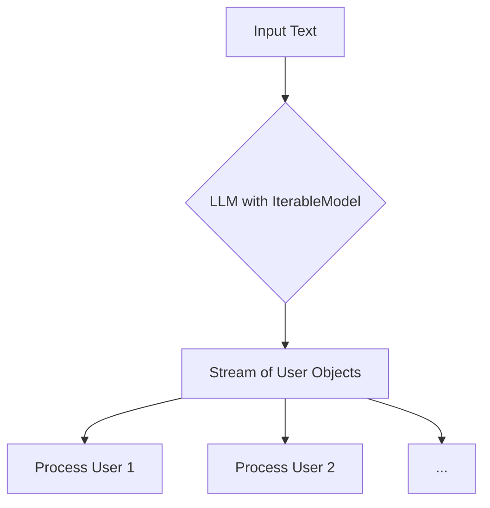

# Handling Multiple Outputs with IterableModel

When you need to extract a list of structured objects from a single prompt, `IterableModel` is the perfect tool. It allows you to create a dynamic model that can parse and stream a list of Pydantic objects from the language model's response, one by one, as they become available.

This is particularly useful when you expect a variable number of outputs and want to process them as soon as they are generated, rather than waiting for the entire list to be completed.

## 1. Goal

In this tutorial, you will learn how to use `IterableModel` to stream a list of Pydantic objects from a language model. We will define a `User` model and then extract multiple user profiles from a single piece of text.

## 2. Prerequisites

- Python 3.9+
- An OpenAI API key
- `instructor` and `openai` libraries installed

## 3. Architecture

Let's visualize the data flow. We send a prompt to the LLM, and instead of getting a single JSON object, we stream back a sequence of `User` objects.



## 4. Step 1: Define Your Data Model

First, let's define the Pydantic model for the object we want to extract. For this example, we'll create a simple `User` model.

```python
from pydantic import BaseModel, Field

class User(BaseModel):
    name: str = Field(description="The name of the person")
    age: int = Field(description="The age of the person")
```

This `User` model will serve as the template for each object we extract from the text.

## 5. Step 2: Create an IterableModel

The magic happens with `IterableModel`. It takes your base model (`User`) and dynamically creates a new Pydantic model capable of handling a list of those objects.

```python
from instructor import IterableModel

# Create a model that can handle lists of Users
MultiUser = IterableModel(User)
```

Behind the scenes, `IterableModel(User)` generates a class that looks something like this:

```python
# This is a conceptual representation
class IterableUser(OpenAISchema, IterableBase):
    tasks: list[User]

    # ... methods for streaming ...
```

This new `MultiUser` model is now ready to be used with `instructor`.

## 6. Step 3: Stream and Process the Results

Now, let's use our `MultiUser` model to extract user data from a text prompt. We'll patch an OpenAI client with `instructor`, make a streaming request, and iterate through the results.

```python
import instructor
from openai import OpenAI
from pydantic import BaseModel, Field
from instructor import IterableModel

# 1. Define the base model
class User(BaseModel):
    name: str = Field(description="The name of the person")
    age: int = Field(description="The age of the person")

# 2. Create the IterableModel
MultiUser = IterableModel(User)

# 3. Patch the OpenAI client
client = instructor.patch(OpenAI())

# 4. Make the streaming call
response = client.chat.completions.create(
    model="gpt-4-turbo",
    response_model=MultiUser,
    stream=True,
    messages=[
        {
            "role": "user",
            "content": "Extract the two users: John is 30 and Jane is 25.",
        },
    ],
)

# 5. Iterate and process each user object
for user in response:
    print("Extracted User:")
    print(user.model_dump_json(indent=2))
    # You could save each user to a database, send an email, etc.
```

### Expected Output

As the model processes the request, it will yield `User` objects one by one. You will see the output printed to the console incrementally:

```json
Extracted User:
{
  "name": "John",
  "age": 30
}
Extracted User:
{
  "name": "Jane",
  "age": 25
}
```

## 7. Conclusion

You have successfully used `IterableModel` to stream multiple structured outputs from a single API call. This approach is highly efficient for processing lists of items, as you can act on each item as it arrives without waiting for the full response.

This pattern is incredibly powerful for tasks like:

- Extracting all action items from a meeting transcript.
- Parsing a list of ingredients from a recipe.
- Segmenting a complex document into multiple structured parts.
