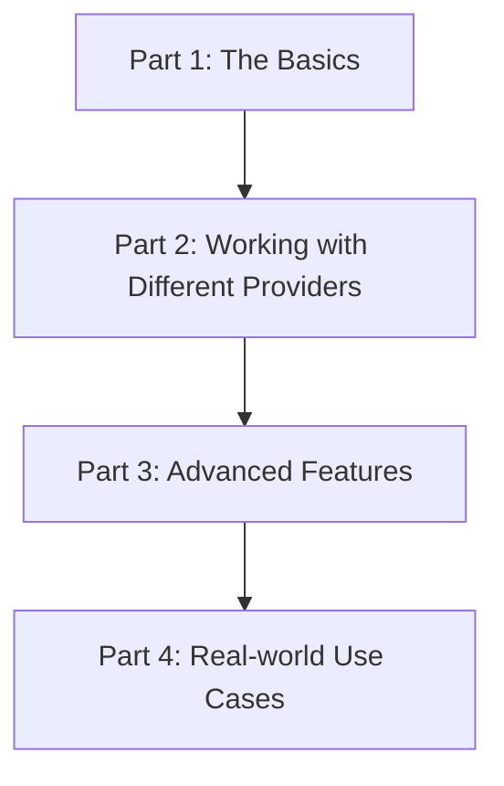

_**This is a plan for a tutorial series on the `instructor` library. It is not the tutorial itself.**_

# Tutorial Series Plan: Mastering `instructor`

This document outlines a plan for a series of tutorials on how to use the `instructor` library. The goal is to create a comprehensive guide for developers, starting from the basics and progressing to more advanced topics.

## Target Audience

This tutorial series is aimed at developers who are familiar with Python and have some experience with language models. No prior experience with `instructor` is required.

## Tutorial Series Structure

### Part 1: The Basics

*   **Goal:** Introduce the core concepts of `instructor` and demonstrate how to get structured outputs from OpenAI's models.
*   **Concepts:**
    *   What is `instructor`?
    *   Why use `instructor`?
    *   Basic usage with `openai`
    *   Defining a response model with `pydantic`
*   **Example:** A simple script that extracts a user's name and age from a sentence.

### Part 2: Working with Different Providers

*   **Goal:** Show how to use `instructor` with various language model providers.
*   **Providers:**
    *   Anthropic
    *   Google Gemini
    *   Mistral
    *   Other providers (as time permits)
*   **Concepts:**
    *   Provider-specific clients
    *   Handling different API responses
*   **Example:** A script that can switch between different providers to perform the same task.

### Part 3: Advanced Features

*   **Goal:** Explore the advanced features of `instructor`.
*   **Features:**
    *   Validation
    *   Retries and error handling
    *   Streaming
    *   Distillation
*   **Example:** A script that uses validation to ensure the output meets certain criteria and retries on failure.

### Part 4: Real-world Use Cases

*   **Goal:** Demonstrate how to use `instructor` in real-world applications.
*   **Use Cases:**
    *   Information extraction from text
    *   Building a simple chatbot
    *   Function calling
*   **Example:** A complete project that showcases one of the use cases.

## Next Steps

The next step is to start writing the first tutorial in the series, "Part 1: The Basics." This will involve creating a new file, `tutorial.md`, and writing the content for the first tutorial.
