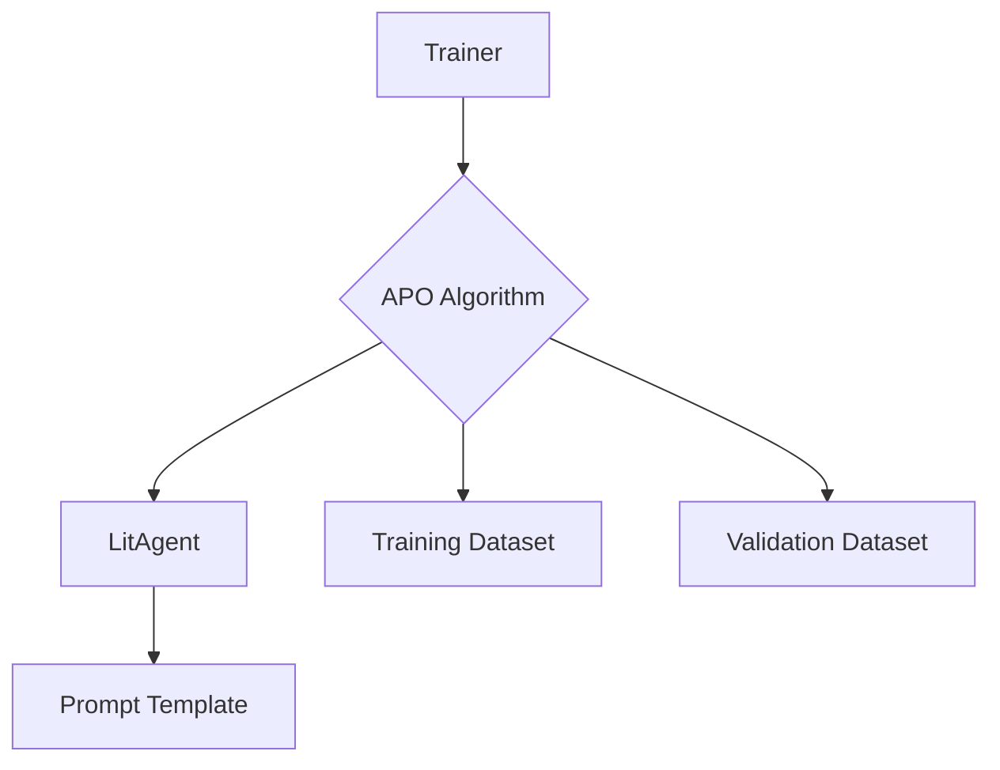

# Optimizing an Agent with Lit-Agent and APO

This tutorial demonstrates how to use the Automatic Prompt Optimization (APO) algorithm to optimize a `LitAgent`'s prompt.

## 1. Goal

The goal of this tutorial is to show how to use the `agentlightning` library to automatically optimize a prompt template for a given task. We will define a simple agent, a task, and then use the `APO` algorithm to find the best prompt for our agent.

## 2. Prerequisites

Make sure you have `agentlightning` installed. You can install it with the `apo` extras:

```bash
pip install "agentlightning[apo]"
```

## 3. Architecture

The main components we will be using are:

*   **`LitAgent`**: A simple agent that uses a prompt to perform a task.
*   **`APO`**: The Automatic Prompt Optimization algorithm that iteratively refines the prompt.
*   **`Trainer`**: The orchestrator that manages the optimization process.
*   **Datasets**: We will use simple in-memory datasets for training and validation.

Here is a diagram of how these components interact:



## 4. Implementation

Let's walk through the steps to set up and run the optimization.

### Step 1: Define the Agent

We'll create a simple agent using the `@rollout` decorator. This agent will take a task and a prompt template, format the prompt with the task input, and then (in a real-world scenario) use an LLM to get a response. For this example, we'll just return the formatted prompt.

```python
from agentlightning.litagent.decorator import rollout
from agentlightning.types import Task, PromptTemplate

@rollout
def my_agent(task: Task, prompt_template: PromptTemplate):
    # In a real agent, you would use an LLM here.
    # For simplicity, we just return the formatted prompt.
    return prompt_template.format(input=task.input)

```

### Step 2: Create Datasets and the Initial Prompt

We need a training and a validation dataset. These datasets will be used by the `APO` algorithm to evaluate the performance of different prompts. We also need to define our initial prompt template.

```python
from agentlightning.types import Task, PromptTemplate

train_dataset = [Task(input="Tell me a joke."), Task(input="What is the capital of France?")]
val_dataset = [Task(input="Summarize the following text: ...")]

initial_prompt = PromptTemplate("You are a helpful assistant. {input}")
```

### Step 3: Configure the APO Algorithm and Trainer

Now, we'll instantiate the `APO` algorithm and the `Trainer`. The `APO` algorithm requires an `AsyncOpenAI` client to work, as it uses an LLM to generate prompt variations.

```python
import os
from openai import AsyncOpenAI
from agentlightning.algorithm.apo import APO
from agentlightning.trainer import Trainer
from agentlightning.types import NamedResources

# This is required for the APO algorithm
client = AsyncOpenAI(api_key=os.environ.get("OPENAI_API_KEY"))

apo_algorithm = APO(client)

# The initial prompt is passed as a resource
initial_resources = NamedResources(prompt=initial_prompt)

trainer = Trainer(
    algorithm=apo_algorithm,
    initial_resources=initial_resources,
    n_runners=1, # Number of parallel agents
)
```

### Step 4: Run the Optimization

Finally, we call `trainer.fit()` to start the optimization process. The trainer will use the `APO` algorithm to iteratively test and refine the initial prompt using the provided datasets.

```python
trainer.fit(my_agent, train_dataset=train_dataset, val_dataset=val_dataset)
```

After the process completes, you can get the best prompt found by the algorithm:

```python
best_prompt = apo_algorithm.get_best_prompt()
print(f"Best prompt found: {best_prompt.template}")
```

## 5. Complete Code

Here is the complete, runnable code for this example. Make sure to set your `OPENAI_API_KEY` environment variable before running.

```python
import os
from openai import AsyncOpenAI
from agentlightning.litagent.decorator import rollout
from agentlightning.algorithm.apo import APO
from agentlightning.trainer import Trainer
from agentlightning.types import Task, PromptTemplate, NamedResources

# Step 1: Define the Agent
@rollout
def my_agent(task: Task, prompt_template: PromptTemplate):
    # In a real agent, you would use an LLM here and return a reward.
    # For simplicity, we'll just return a dummy reward.
    return 1.0

# Step 2: Create Datasets and the Initial Prompt
train_dataset = [Task(input="Tell me a joke."), Task(input="What is the capital of France?")]
val_dataset = [Task(input="Summarize the following text: ...")]

initial_prompt = PromptTemplate("You are a helpful assistant. {input}")

# Step 3: Configure the APO Algorithm and Trainer

# This is required for the APO algorithm
client = AsyncOpenAI(api_key=os.environ.get("OPENAI_API_KEY"))

apo_algorithm = APO(
    client,
    beam_rounds=1,
    branch_factor=1,
    beam_width=1,
    gradient_batch_size=1,
    val_batch_size=1
)

# The initial prompt is passed as a resource
initial_resources = NamedResources(prompt=initial_prompt)

trainer = Trainer(
    algorithm=apo_algorithm,
    initial_resources=initial_resources,
    n_runners=1, # Number of parallel agents
)

# Step 4: Run the Optimization
trainer.fit(my_agent, train_dataset=train_dataset, val_dataset=val_dataset)

# After the process completes, you can get the best prompt found by the algorithm:
best_prompt = apo_algorithm.get_best_prompt()
print(f"Best prompt found: {best_prompt.template}")

```