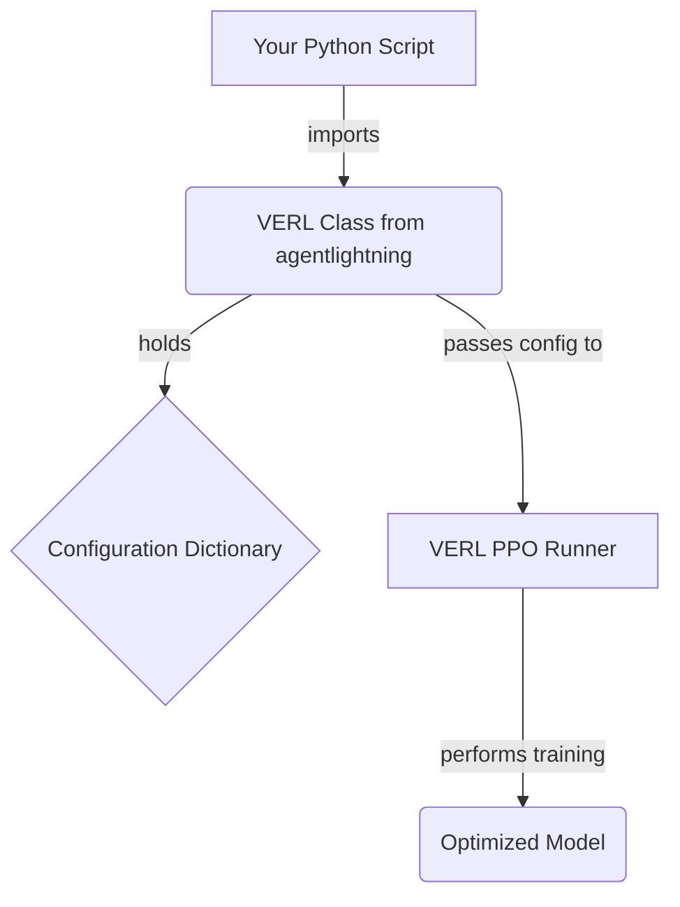

# Advanced Optimization with VERL

This tutorial guides you through the advanced optimization techniques available with the VERL algorithm in `agentlightning`. VERL (Value-based Reinforcement Learning) provides a powerful implementation of PPO (Proximal Policy Optimization) that can be fine-tuned for specific needs.

## 1. Goal

The goal of this tutorial is to learn how to customize the behavior of the VERL algorithm by modifying its configuration. This allows for fine-grained control over the training process, including aspects like algorithm variants, data handling, and model parameters.

## 2. Prerequisites

- You have `agentlightning` installed. The package name is `agentlightning`.
- You have a training and validation dataset ready.

## 3. Architecture

The `VERL` algorithm class in `agentlightning` acts as an interface to the underlying VERL engine. You provide a Python dictionary to configure the PPO runner, which `agentlightning` then merges with a base configuration.



## 4. Implementation

Advanced optimization is achieved by passing a detailed configuration dictionary to the `VERL` class constructor. This dictionary overrides the default settings of the VERL engine.

Let's look at a comprehensive example.

```python
from agentlightning.algorithm.verl import VERL
from agentlightning.trainer import Trainer

# Assume my_train_dataset and my_val_dataset are loaded
# from agentlightning.types import Dataset, Message
# my_train_dataset = Dataset([{"messages": [Message(role="user", content="Hello")]}])

algorithm = VERL(
    config={
        # Algorithm-specific tweaks
        "algorithm": {
            "adv_estimator": "grpo",  # Use GRPO for advantage estimation
            "use_kl_in_reward": False, # Do not use KL divergence in reward
        },
        # Data handling parameters
        "data": {
            "train_batch_size": 32,
            "max_prompt_length": 4096,
            "max_response_length": 2048,
        },
        # Actor, reference model, and rollout settings
        "actor_rollout_ref": {
            "rollout": {
                "tensor_model_parallel_size": 1,
                "n": 4,
                "name": "vllm",
                "gpu_memory_utilization": 0.6,
            },
            "actor": {
                "ppo_mini_batch_size": 32,
                "optim": {"lr": 1e-6}, # Set a custom learning rate
                "use_kl_loss": False,
                "clip_ratio_low": 0.2,
                "clip_ratio_high": 0.3,
            },
            "ref": {
                "log_prob_micro_batch_size_per_gpu": 8,
            },
            "model": {
                "path": "Qwen/Qwen2.5-1.5B-Instruct",
                "use_remove_padding": True,
                "enable_gradient_checkpointing": True,
            },
        },
        # General trainer settings
        "trainer": {
            "n_gpus_per_node": 1,
            "project_name": "AgentLightning",
            "experiment_name": "my_advanced_run",
            "total_epochs": 2,
        },
    }
)

# Assuming 'trainer' is an instance of agentlightning.Trainer
# trainer = Trainer(...)
# trainer.fit(algorithm, train_dataset=my_train_dataset)

print("VERL algorithm configured for advanced optimization.")

```

### Key Configuration Parameters

-   `algorithm.adv_estimator`: Changes the advantage estimator. The example sets it to `grpo`.
-   `data.train_batch_size`: Controls the batch size for training.
-   `actor_rollout_ref.actor.optim.lr`: Sets the learning rate for the actor's optimizer.
-   `actor_rollout_ref.model.path`: Specifies the base model to be fine-tuned.
-   `trainer.total_epochs`: Defines the number of training epochs.

> **Warning**: As noted in the source, advanced customisation beyond this configuration currently requires modifying the VERL source code directly. Native hooks for overriding training behavior may be added in a future release.

By tweaking these parameters, you can significantly influence the training dynamics and final performance of your model.