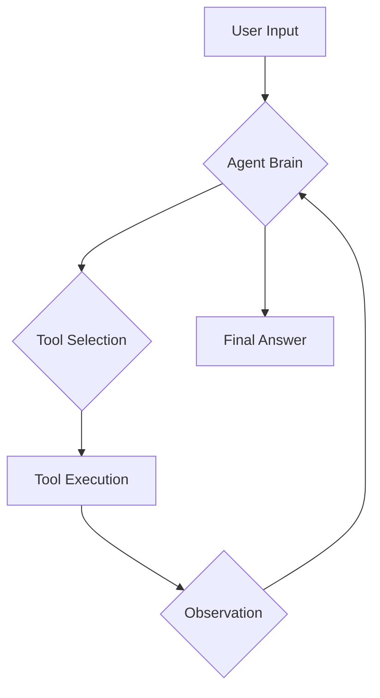

# 01 Quickstart

_**Note to internal users:** This tutorial is generated by an AI agent._

# Quickstart: Run Your First AI Agent

Welcome to **Deep Agents**! This tutorial will guide you through the initial steps to get an AI agent up and running. You will learn how to install the `deepagents` library, set up your environment, and interact with a pre-built agent in a sample environment. This hands-on approach is designed to help you see the agent in action immediately.

## What are Deep Agents?

As mentioned in the `README.md`, `deepagents` is a powerful, open-source framework for building and deploying autonomous AI agents. It provides a simple yet extensible agent harness that includes features like planning, computer access, and sub-agent delegation. This allows agents to tackle complex, long-horizon tasks that may involve multiple tool calls.

The framework is designed with modularity in mind, allowing you to customize tools, prompts, and even the underlying models. It also integrates with `LangGraph` for features like streaming, human-in-the-loop workflows, and memory.

## Installation

Getting started with Deep Agents is as simple as installing a Python package. The recommended way to interact with the agents is through the `deepagents-cli`, which provides a user-friendly command-line interface.

You can install the CLI using either `pip` or `uv`. We recommend using `uv` for a faster and more reliable installation experience.

### Using uv (Recommended)

First, create a virtual environment:

```bash
uv venv
```

Then, install the `deepagents-cli` package:

```bash
uv pip install deepagents-cli
```

### Using pip

If you prefer using `pip`, you can install the package with the following command:

```bash
pip install deepagents-cli
```

## Running the Agent

Once the installation is complete, you can run the agent directly from your terminal:

```bash
deepagents
```

This will start the default agent configuration. You can interact with the agent by typing your requests in natural language. For more advanced options and configurations, you can use the `--help` flag:

```bash
deepagents --help
```

This will display a list of available commands and options, such as using a specific agent configuration or auto-approving tool usage.

## Agent Workflow

The Deep Agents framework follows a structured workflow to process your requests. The following diagram illustrates the key stages of this workflow:



As you can see, the agent takes your input, selects the appropriate tool, executes it, and then uses the observation to continue the process until it can provide a final answer.

## Your First Interaction

Now that you have the agent running, let's try a simple interaction. Ask the agent to list the files in the current directory:

```bash
ls -F
```

The agent will use its built-in `ls` tool to execute the command and display the output. This is a simple example, but it demonstrates the agent's ability to access and interact with its environment.

In the next tutorial, you will learn how to build a custom agent with its own unique set of tools and instructions. For now, feel free to experiment with the pre-built agent and explore its capabilities.
