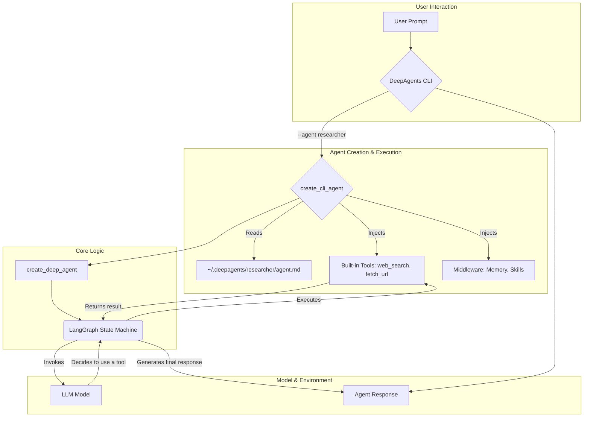

# 02 Create Agent

'''
# Build a Custom Agent

Welcome to the second tutorial in our series. In the [previous tutorial](01_quickstart.md), you learned how to run a pre-configured AI agent. Now, we'll dive deeper and show you how to build a custom agent from scratch. You'll learn how to define its goals, equip it with tools, and understand the basic logic that drives its behavior.

## The Anatomy of an Agent

At its core, a DeepAgent is composed of three main components:

1.  **Goals and Personality**: A high-level description of the agent's purpose, how it should behave, and any constraints it must follow. This is defined in a simple Markdown file.
2.  **Actions (Tools)**: A set of capabilities the agent can use to interact with its environment, such as searching the web, reading files, or executing code.
3.  **Orchestration Logic**: The underlying engine that interprets the user's request, selects the appropriate tool, and processes the output until the task is complete.

Let's explore how these pieces come together.

## 1. Defining Agent Goals with `agent.md`

The identity of your agent is defined in a simple Markdown file named `agent.md`. When you run an agent for the first time using the `--agent <agent_name>` flag, the DeepAgents CLI automatically creates a new directory at `~/.deepagents/<agent_name>/` and populates it with a default `agent.md` file.

This file contains the **system prompt**, which is the master set of instructions that the AI model follows. It sets the agent's persona, its capabilities, and its limitations.

### Default Agent Configuration

The default instructions are generated by the `get_default_coding_instructions()` function, which you can see referenced in `libs/deepagents-cli/deepagents_cli/agent.py`. This provides a solid foundation for a general-purpose coding assistant.

When the agent runs, these instructions are combined with additional context about the environment (like the working directory) by the `get_system_prompt` function. This gives the agent the situational awareness it needs to perform tasks.

### Customizing the Agent

Let's create a new agent called `researcher`. You don't need to run a command to do this; the directory is created automatically the first time you use the agent.

To customize it, you would create and edit the file `~/.deepagents/researcher/agent.md` with the following content:

```markdown
# Role: Web Research Assistant

Your goal is to be a world-class web researcher. You are methodical, analytical, and an expert at synthesizing information from multiple sources.

## Behavior

- When asked a question, first, formulate a plan to find the answer.
- Use the `web_search` tool to find relevant articles, documentation, and data.
- Read the content of the most promising URLs using the `fetch_url` tool.
- Synthesize your findings into a concise, well-structured report.
- Always cite your sources using the page title and URL.
- Do not perform tasks outside of research, such as writing code or modifying files.
```

With these instructions, the agent now has a clear and distinct personality and goal, different from the default coding agent.

## 2. Equipping the Agent with Tools

Tools are the functions that an agent can call to perform actions. The DeepAgents CLI comes with a set of built-in tools that are automatically available to your agent:

-   `web_search`: Searches the web using the Tavily API.
-   `fetch_url`: Fetches the content of a URL and converts it to markdown.
-   `http_request`: Makes HTTP requests to APIs.

These tools are passed to the agent when it's created in `libs/deepagents-cli/deepagents_cli/main.py`:

```python
# libs/deepagents-cli/deepagents_cli/main.py (Lines 347-350)
tools = [http_request, fetch_url]
if settings.has_tavily:
    tools.append(web_search)
```

While the agent has access to these tools, it's the `agent.md` file that guides *how* and *when* to use them. For our `researcher` agent, the prompt strongly encourages it to use `web_search` and `fetch_url`.

## 3. The Orchestration Logic

The magic that connects the goals (`agent.md`) and the tools is the orchestration logic. The core of this logic resides in the `create_cli_agent` function found in `libs/deepagents-cli/deepagents_cli/agent.py`.

This function is a high-level factory that assembles all the necessary components:

1.  **Model**: The underlying large language model (e.g., from Anthropic, OpenAI).
2.  **System Prompt**: The instructions from your `agent.md`.
3.  **Tools**: The actions the agent can perform.
4.  **Middleware**: A powerful system for adding features like memory, skills, and human-in-the-loop approvals.
5.  **Backend**: The environment where the agent operates (e.g., local filesystem or a remote sandbox).

This is all orchestrated by the `create_deep_agent` function from the `deepagents` library, which constructs a LangGraph state machine to manage the agent's execution loop.

### Architecture Diagram

Here’s a diagram illustrating how these components fit together:



## 4. Running Your Custom Agent

To run our new `researcher` agent, you would use the `--agent` flag from your terminal. Assuming you've already created the `~/.deepagents/researcher/agent.md` file, the CLI will automatically load it.

```bash
# Ensure you have your TAVILY_API_KEY set for web search
export TAVILY_API_KEY="your_tavily_api_key"

# Run the researcher agent
deepagents --agent researcher
```

Now, when you interact with the agent, its responses will be guided by the instructions you provided. It will be focused on research and will use the web search tools to answer your questions.

**Example Interaction:**

> **You:** What are the latest trends in renewable energy?

> **Agent (thinking):** I need to use the `web_search` tool to find recent articles on this topic. I'll then use `fetch_url` to read the most relevant ones and synthesize a summary.

## Conclusion

Congratulations! You've learned how to create a custom agent by defining its goals in an `agent.md` file. You now understand how the agent's core logic, tools, and identity come together to create a specialized AI assistant.

In the next tutorial, [**Power Your Agent with a Deep Learning Model**](03_integrate_model.md), we will explore how to integrate and use custom deep learning models within your agent's skillset.
'''
