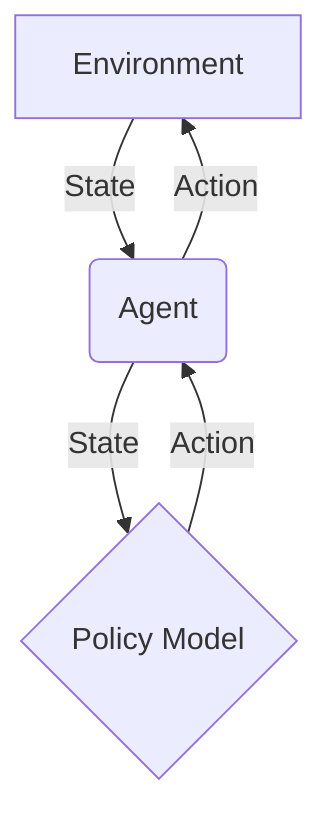

# 03 Integrate Model

'''# Power Your Agent with a Deep Learning Model

Go beyond simple rules by integrating your own neural network. This tutorial covers how to connect a custom policy model (e.g., from PyTorch or TensorFlow) to drive your agent's decision-making process.

## Architecture Overview

Integrating a deep learning model allows your agent to learn complex behaviors from data, rather than relying on hard-coded rules. The model acts as the agent's "brain," determining the best course of action based on the current state of the environment.

Here's a high-level look at the architecture:



- **Environment:** The world the agent interacts with. It provides the agent with observations (the state) and changes based on the agent's actions.
- **Agent:** The entity that perceives the environment and decides what to do next. It uses the policy model to make decisions.
- **Policy Model:** A neural network that takes the environment's state as input and outputs a distribution of probabilities over the possible actions the agent can take.

## Key Concepts

### Policy Model

The core of our intelligent agent is the policy model. This model learns a "policy," which is a strategy for choosing actions given the current state. For example, in a game, the policy would tell the agent whether to move left, right, or jump based on the positions of enemies and obstacles.

### State Representation

To feed the environment's state into our model, we need to convert it into a numerical format, typically a tensor. This process, known as feature engineering, is crucial for the model's performance. A good state representation captures all the relevant information the agent needs to make a decision.

### Action Space

The action space is the set of all possible actions the agent can perform. For a simple game, this might be `[move_left, move_right, jump]`. The output of our policy model will correspond to this action space, providing a probability for each action.

## Implementation Steps

Let's walk through how to integrate a simple policy model into a Deep Agent.

### Step 1: Define the Backend Protocol

The `BackendProtocol` defines the interface for how the agent interacts with its environment. This includes reading the state and executing actions. For our custom agent, we will use the `SandboxBackendProtocol` which allows for command execution in an isolated environment.

The `deepagents` library provides a protocol for this in `libs/deepagents/deepagents/backends/protocol.py`:

```python
class SandboxBackendProtocol(BackendProtocol):
    """Protocol for sandboxed backends with isolated runtime.

    Sandboxed backends run in isolated environments (e.g., separate processes,
    containers) and communicate via defined interfaces.
    """

    def execute(
        self,
        command: str,
    ) -> ExecuteResponse:
        """Execute a command in the process.

        Simplified interface optimized for LLM consumption.

        Args:
            command: Full shell command string to execute.

        Returns:
            ExecuteResponse with combined output, exit code, optional signal, and truncation flag.
        """
```

### Step 2: Create a Custom Agent

Next, we'll create a custom agent that uses a policy model to decide on actions. This agent will read the state from the environment, use the model to select an action, and then execute that action.

While the library does not provide a direct implementation for a policy-driven agent, you can extend the existing agent framework. In `libs/deepagents-cli/deepagents_cli/agent.py`, you can see how an agent is constructed. You would create a similar class that loads your model and uses it in the action-selection loop.

### Step 3: Integrate the Model

With our agent and model in place, the final step is to bring them together. The agent will read the state, pass it to the model, and the model will return the action to take. Since there is no direct example, a conceptual implementation would look something like this:

```python
class PolicyAgent:
    def __init__(self, model_path):
        # self.model = torch.load(model_path)
        pass

    def act(self, state):
        # state_tensor = self.preprocess(state)
        # action_probs = self.model(state_tensor)
        # action = self.select_action(action_probs)
        # return action
        pass
```

## Example: Running the Agent

To run your agent, you would use the `deepagents-cli`. Assuming you have an environment and your custom agent ready, you could execute it with a command like:

```bash
# This is a conceptual example
# deepagents-cli run --agent your_custom_agent.py --env your_env
```

This would start the simulation, and your agent, powered by its deep learning model, would begin interacting with the environment.

## Conclusion

By integrating a deep learning model, you can create agents that are far more capable and adaptable than rule-based systems. This tutorial has provided a high-level overview of the process. The next steps would be to train your policy model using reinforcement learning techniques to optimize its decision-making capabilities.
'''
