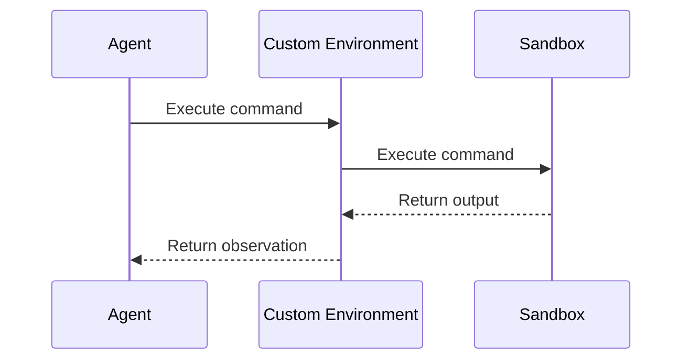

# 04 Design Environment

'''
# Design a Custom Environment

Create a unique world for your agent to operate in. Learn to define a custom environment with its own state, rules, and reward system to test your agent against specific challenges.

## Introduction

A custom environment is a powerful tool for testing and training your AI agents. It allows you to create a simulated world with its own set of rules, objects, and challenges. This is particularly useful when you want to test your agent's ability to handle specific scenarios that may not be available in pre-existing environments.

In the DeepAgents framework, a custom environment is essentially a sandboxed execution environment where your agent can perform actions and receive feedback. This sandbox can be a local process, a Docker container, or a cloud-based virtual machine. The key is that it provides a consistent and reproducible environment for your agent to operate in.

## Core Concepts

The core of the custom environment system is the `SandboxBackendProtocol`, which defines a unified interface for interacting with different sandbox providers. This protocol is located in `libs/deepagents/deepagents/backends/protocol.py`.

### Sandbox Providers

The DeepAgents CLI supports several sandbox providers, each with its own strengths and weaknesses:

*   **Modal**: A serverless platform that allows you to run code in the cloud without managing infrastructure. Modal is a great choice for quickly spinning up a temporary environment for a single task.
*   **Runloop**: A developer platform that provides persistent, cloud-based development environments. Runloop is ideal for longer-running tasks and for collaborating with other developers.
*   **Daytona**: A tool for creating and managing development environments. Daytona is a good option if you need more control over the environment's configuration.

The logic for creating and managing these sandboxes can be found in `libs/deepagents-cli/deepagents_cli/integrations/sandbox_factory.py`.

## Architecture

The following diagram illustrates the relationship between the agent, the custom environment, and the sandbox:



As you can see, the agent interacts with the custom environment, which in turn interacts with the sandbox. This separation of concerns allows you to easily swap out different sandbox providers without changing your agent's code.

## Step-by-Step Guide

Now, let's walk through the process of creating and using a custom environment.

### 1. Choose a Sandbox Provider

The first step is to choose a sandbox provider. For this tutorial, we'll use Modal, as it's the easiest to get started with. You'll need to have the Modal client installed and configured on your local machine. Please refer to the Modal documentation for instructions on how to do this.

### 2. Create a Setup Script

Next, you'll need to create a setup script that will be executed in the sandbox when it starts up. This script can be used to install any necessary dependencies, create files, or configure the environment in any other way.

Here's an example of a simple setup script that creates a file named `hello.txt` in the sandbox's working directory:

```bash
#!/bin/bash

echo "Hello, from the custom environment!" > /workspace/hello.txt
```

Save this script as `setup.sh`.

### 3. Launch the Sandbox

Now you're ready to launch the sandbox. You can do this using the `deepagents-cli` command-line tool:

```bash
deepagents-cli sandbox --provider modal --setup-script-path setup.sh
```

This will create a new Modal sandbox and execute the `setup.sh` script inside of it. You should see output similar to the following:

```text
[yellow]Starting Modal sandbox...[/yellow]
[green]✓ Modal sandbox ready: sb-1234567890[/green]
[dim]Running setup script: setup.sh...[/dim]
[green]✓ Setup complete[/green]
```

### 4. Interact with the Environment

Once the sandbox is running, you can interact with it using the `SandboxBackendProtocol`. Here's an example of how you can use the `read` method to read the contents of the `hello.txt` file that we created in the setup script:

```python
from deepagents_cli.integrations.sandbox_factory import create_sandbox

with create_sandbox("modal", sandbox_id="sb-1234567890") as sandbox:
    content = sandbox.read("/workspace/hello.txt")
    print(content)
```

This will print the following output:

```text
     1	Hello, from the custom environment!
```

## Conclusion

In this tutorial, you've learned how to create and use a custom environment in the DeepAgents framework. You've seen how to choose a sandbox provider, create a setup script, launch the sandbox, and interact with it using the `SandboxBackendProtocol`. Now it's your turn to get creative and design your own custom environments to test your agents in new and exciting ways!
'''
