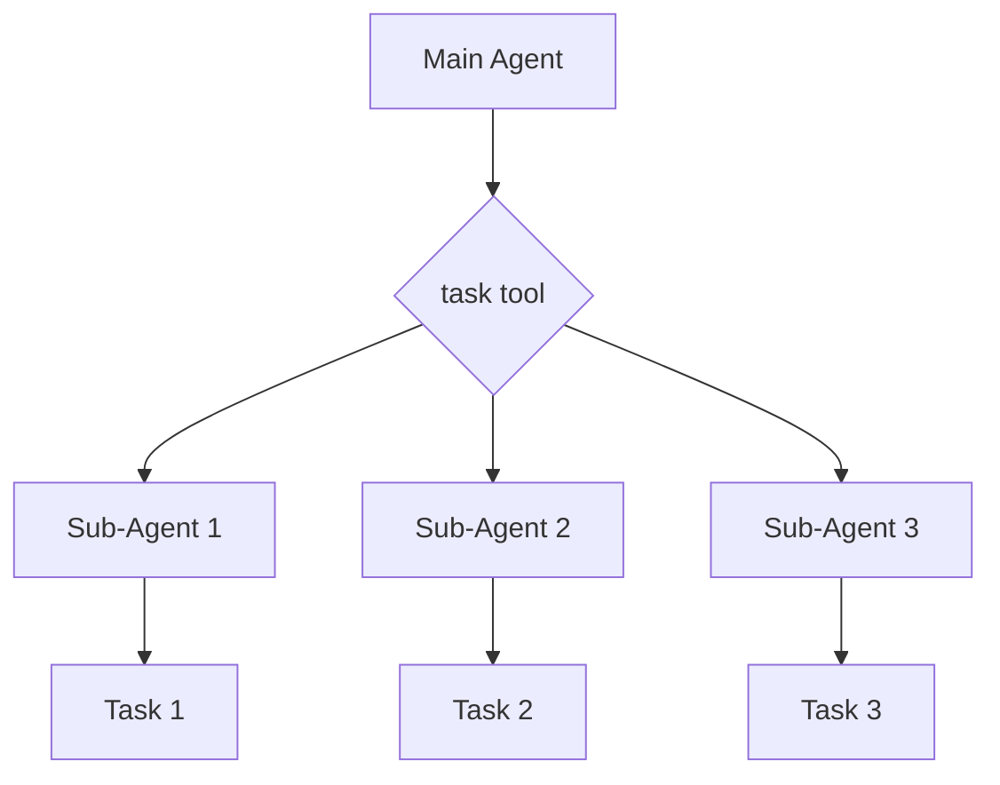

# 05 Multi Agent Simulation

'''# Orchestrate a Multi-Agent Simulation

Welcome to the next level of agent design! In this tutorial, you'll learn how to orchestrate a multi-agent simulation using the `deepagents` library. We'll move beyond a single agent and explore how to manage multiple agents that can interact with each other in a shared environment. This is a powerful paradigm that allows you to build more complex and sophisticated AI systems.

## Why Use Multiple Agents?

A single agent can be powerful, but there are many scenarios where a team of agents is more effective. Here are a few reasons why you might want to use a multi-agent simulation:

- **Parallelism**: Multiple agents can work on different tasks simultaneously, which can significantly speed up the overall process.
- **Specialized Skills**: You can create agents with different skills and expertise. For example, you could have one agent that is an expert in data analysis, another that is an expert in writing, and a third that is an expert in web research.
- **Resilience**: If one agent fails, the others can continue to work. This makes your system more robust and less prone to failure.
- **Emergent Behavior**: When multiple agents interact with each other, they can produce emergent behavior that is not explicitly programmed into any single agent. This can lead to creative and unexpected solutions to complex problems.

## The `SubAgentMiddleware`

The key to orchestrating a multi-agent simulation in `deepagents` is the `SubAgentMiddleware`. This middleware allows you to create and manage a team of sub-agents that can be controlled by a main agent. The main agent can delegate tasks to the sub-agents, and the sub-agents can work on those tasks in parallel.

The `SubAgentMiddleware` is defined in `libs/deepagents/deepagents/middleware/subagents.py`. It provides a `task` tool that the main agent can use to invoke the sub-agents.

## Architecture of a Multi-Agent Simulation

A multi-agent simulation in `deepagents` typically consists of a main agent and one or more sub-agents. The main agent is responsible for orchestrating the simulation, while the sub-agents are responsible for carrying out specific tasks.

Here is a diagram that illustrates the architecture of a multi-agent simulation:



As you can see, the main agent uses the `task` tool to delegate tasks to the sub-agents. The sub-agents then work on those tasks in parallel and return the results to the main agent.

## Creating a Multi-Agent Simulation

Now that you understand the architecture of a multi-agent simulation, let's see how to create one in `deepagents`. The following code example shows how to create a main agent with two sub-agents: a "researcher" and a "writer".

```python
from deepagents.graph import create_deep_agent
from deepagents.middleware.subagents import SubAgentMiddleware, SubAgent

# Define the sub-agents
subagents = [
    SubAgent(
        name="researcher",
        description="This agent is an expert in web research. Use it to find information on any topic.",
        system_prompt="You are a research assistant. Your job is to find the most relevant and up-to-date information on the given topic.",
        tools=[],
    ),
    SubAgent(
        name="writer",
        description="This agent is an expert in writing. Use it to write articles, reports, and other documents.",
        system_prompt="You are a professional writer. Your job is to write clear, concise, and engaging content on the given topic.",
        tools=[],
    ),
]

# Create the main agent
agent = create_deep_agent(
    model="claude-sonnet-4-5-20250929",
    middleware=[
        SubAgentMiddleware(
            default_model="claude-sonnet-4-5-20250929",
            subagents=subagents,
        )
    ],
)
```

In this example, we first define two sub-agents: a "researcher" and a "writer". Each sub-agent is an instance of the `SubAgent` class, initialized with the following parameters:

- `name`: The name of the sub-agent.
- `description`: A description of the sub-agent that the main agent can use to decide which sub-agent to use for a particular task.
- `system_prompt`: The system prompt for the sub-agent.
- `tools`: The tools that the sub-agent has access to.

We then create the main agent using the `create_deep_agent` function. We pass the `SubAgentMiddleware` to the `middleware` parameter to enable the multi-agent simulation.

## Delegating Tasks to Sub-Agents

Once you have created a multi-agent simulation, you can use the `task` tool to delegate tasks to the sub-agents. The `task` tool takes two arguments:

- `subagent_type`: The name of the sub-agent to use.
- `description`: A description of the task to be performed.

Here is an example of how to use the `task` tool in a `curl` command:

```bash
curl -X POST http://localhost:8000/invoke \
-H "Content-Type: application/json" \
-d '{
  "input": "Write a blog post about the benefits of multi-agent simulations.",
  "tool_choice": {
    "type": "tool",
    "name": "task",
    "args": {
      "subagent_type": "writer",
      "description": "Write a blog post about the benefits of multi-agent simulations. The blog post should be at least 500 words long and should include a title, an introduction, a body, and a conclusion."
    }
  }
}'
```

In this example, we are using the `task` tool to delegate the task of writing a blog post to the "writer" sub-agent. The "writer" sub-agent will then write the blog post and return the result to the main agent.

## Conclusion

In this tutorial, you have learned how to orchestrate a multi-agent simulation in `deepagents`. You have seen how to create a main agent with multiple sub-agents, and how to delegate tasks to the sub-agents using the `task` tool. You have also learned about the benefits of using a multi-agent simulation, such as parallelism, specialized skills, and resilience.

Now that you have a good understanding of how to use the `SubAgentMiddleware`, you can start building your own complex and sophisticated AI systems with `deepagents`!
'''
