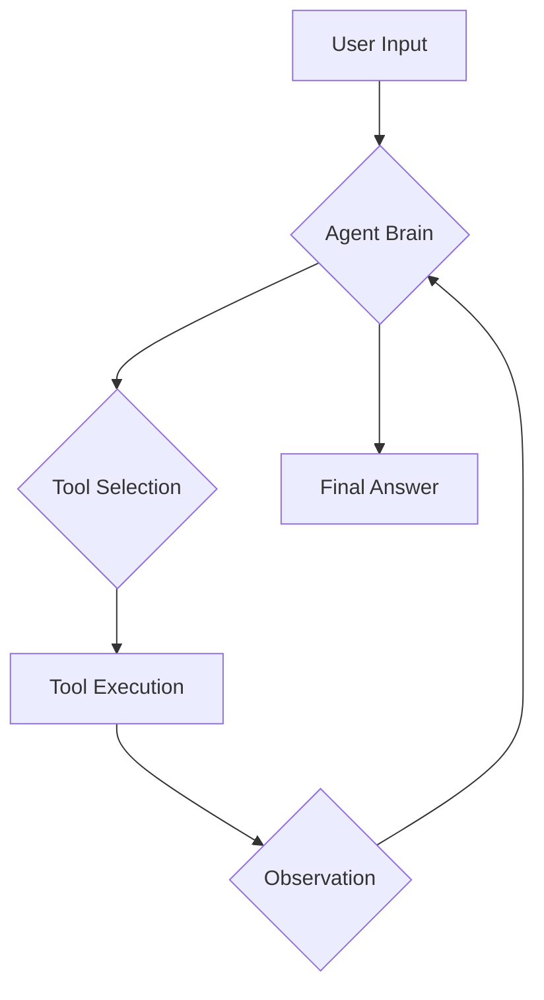
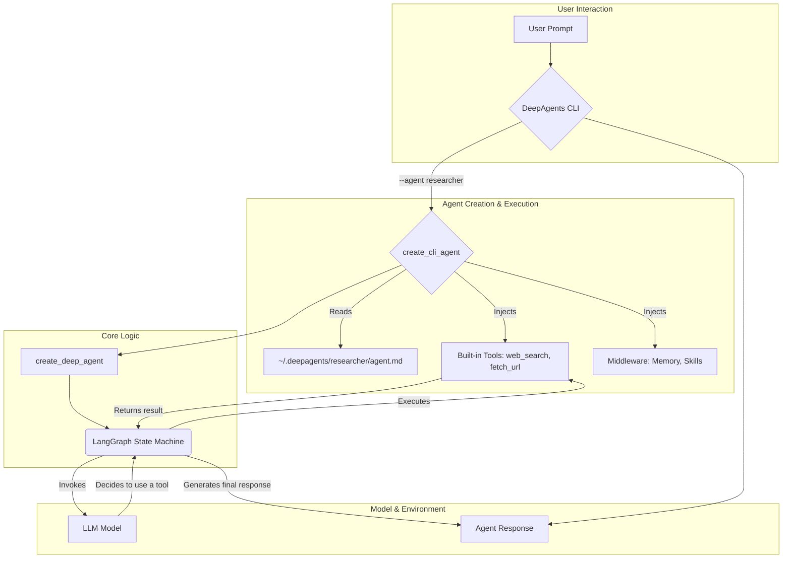
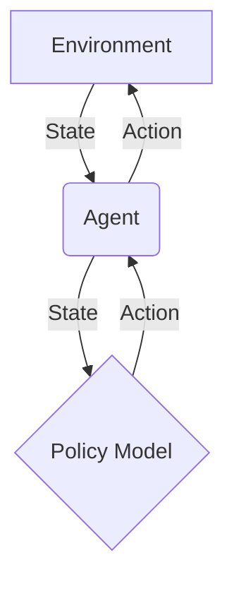
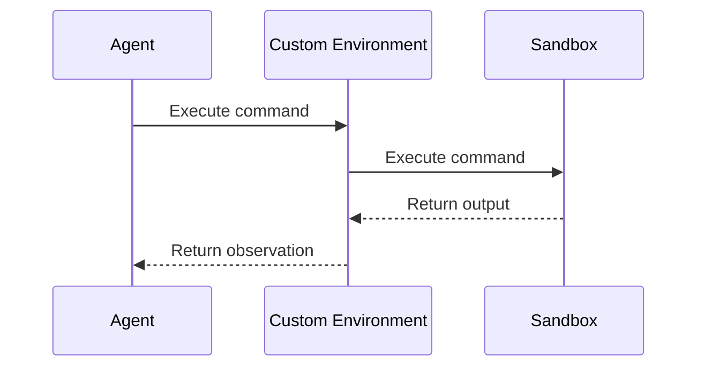
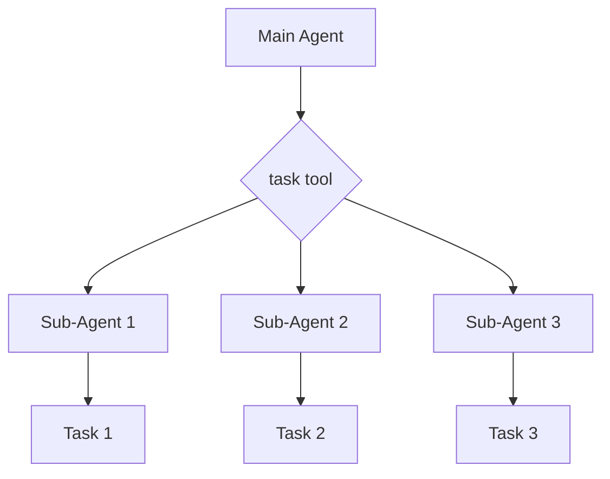

# Tutorials Wiki

> Compact, single-page view of all tutorials. Use the TOC below to jump around.

## Table of Contents
- [01 Quickstart](#01_quickstart)
- [02 Create Agent](#02_create_agent)
- [03 Integrate Model](#03_integrate_model)
- [04 Design Environment](#04_design_environment)
- [05 Multi Agent Simulation](#05_multi_agent_simulation)

<a id="tutorials_wiki"></a>
---
<a id="01_quickstart"></a>
# 01 Quickstart

_**Note to internal users:** This tutorial is generated by an AI agent._

# Quickstart: Run Your First AI Agent

Welcome to **Deep Agents**! This tutorial will guide you through the initial steps to get an AI agent up and running. You will learn how to install the `deepagents` library, set up your environment, and interact with a pre-built agent in a sample environment. This hands-on approach is designed to help you see the agent in action immediately.

## What are Deep Agents?

As mentioned in the `README.md`, `deepagents` is a powerful, open-source framework for building and deploying autonomous AI agents. It provides a simple yet extensible agent harness that includes features like planning, computer access, and sub-agent delegation. This allows agents to tackle complex, long-horizon tasks that may involve multiple tool calls.

The framework is designed with modularity in mind, allowing you to customize tools, prompts, and even the underlying models. It also integrates with `LangGraph` for features like streaming, human-in-the-loop workflows, and memory.

## Installation

Getting started with Deep Agents is as simple as installing a Python package. The recommended way to interact with the agents is through the `deepagents-cli`, which provides a user-friendly command-line interface.

You can install the CLI using either `pip` or `uv`. We recommend using `uv` for a faster and more reliable installation experience.

### Using uv (Recommended)

First, create a virtual environment:

```bash
uv venv
```

Then, install the `deepagents-cli` package:

```bash
uv pip install deepagents-cli
```

### Using pip

If you prefer using `pip`, you can install the package with the following command:

```bash
pip install deepagents-cli
```

## Running the Agent

Once the installation is complete, you can run the agent directly from your terminal:

```bash
deepagents
```

This will start the default agent configuration. You can interact with the agent by typing your requests in natural language. For more advanced options and configurations, you can use the `--help` flag:

```bash
deepagents --help
```

This will display a list of available commands and options, such as using a specific agent configuration or auto-approving tool usage.

## Agent Workflow

The Deep Agents framework follows a structured workflow to process your requests. The following diagram illustrates the key stages of this workflow:



As you can see, the agent takes your input, selects the appropriate tool, executes it, and then uses the observation to continue the process until it can provide a final answer.

## Your First Interaction

Now that you have the agent running, let's try a simple interaction. Ask the agent to list the files in the current directory:

```bash
ls -F
```

The agent will use its built-in `ls` tool to execute the command and display the output. This is a simple example, but it demonstrates the agent's ability to access and interact with its environment.

In the next tutorial, you will learn how to build a custom agent with its own unique set of tools and instructions. For now, feel free to experiment with the pre-built agent and explore its capabilities.

[↩ Back to top](#tutorials_wiki)

---
<a id="02_create_agent"></a>
# 02 Create Agent

'''
# Build a Custom Agent

Welcome to the second tutorial in our series. In the [previous tutorial](01_quickstart.md), you learned how to run a pre-configured AI agent. Now, we'll dive deeper and show you how to build a custom agent from scratch. You'll learn how to define its goals, equip it with tools, and understand the basic logic that drives its behavior.

## The Anatomy of an Agent

At its core, a DeepAgent is composed of three main components:

1.  **Goals and Personality**: A high-level description of the agent's purpose, how it should behave, and any constraints it must follow. This is defined in a simple Markdown file.
2.  **Actions (Tools)**: A set of capabilities the agent can use to interact with its environment, such as searching the web, reading files, or executing code.
3.  **Orchestration Logic**: The underlying engine that interprets the user's request, selects the appropriate tool, and processes the output until the task is complete.

Let's explore how these pieces come together.

## 1. Defining Agent Goals with `agent.md`

The identity of your agent is defined in a simple Markdown file named `agent.md`. When you run an agent for the first time using the `--agent <agent_name>` flag, the DeepAgents CLI automatically creates a new directory at `~/.deepagents/<agent_name>/` and populates it with a default `agent.md` file.

This file contains the **system prompt**, which is the master set of instructions that the AI model follows. It sets the agent's persona, its capabilities, and its limitations.

### Default Agent Configuration

The default instructions are generated by the `get_default_coding_instructions()` function, which you can see referenced in `libs/deepagents-cli/deepagents_cli/agent.py`. This provides a solid foundation for a general-purpose coding assistant.

When the agent runs, these instructions are combined with additional context about the environment (like the working directory) by the `get_system_prompt` function. This gives the agent the situational awareness it needs to perform tasks.

### Customizing the Agent

Let's create a new agent called `researcher`. You don't need to run a command to do this; the directory is created automatically the first time you use the agent.

To customize it, you would create and edit the file `~/.deepagents/researcher/agent.md` with the following content:

```markdown
# Role: Web Research Assistant

Your goal is to be a world-class web researcher. You are methodical, analytical, and an expert at synthesizing information from multiple sources.

## Behavior

- When asked a question, first, formulate a plan to find the answer.
- Use the `web_search` tool to find relevant articles, documentation, and data.
- Read the content of the most promising URLs using the `fetch_url` tool.
- Synthesize your findings into a concise, well-structured report.
- Always cite your sources using the page title and URL.
- Do not perform tasks outside of research, such as writing code or modifying files.
```

With these instructions, the agent now has a clear and distinct personality and goal, different from the default coding agent.

## 2. Equipping the Agent with Tools

Tools are the functions that an agent can call to perform actions. The DeepAgents CLI comes with a set of built-in tools that are automatically available to your agent:

-   `web_search`: Searches the web using the Tavily API.
-   `fetch_url`: Fetches the content of a URL and converts it to markdown.
-   `http_request`: Makes HTTP requests to APIs.

These tools are passed to the agent when it's created in `libs/deepagents-cli/deepagents_cli/main.py`:

```python
# libs/deepagents-cli/deepagents_cli/main.py (Lines 347-350)
tools = [http_request, fetch_url]
if settings.has_tavily:
    tools.append(web_search)
```

While the agent has access to these tools, it's the `agent.md` file that guides *how* and *when* to use them. For our `researcher` agent, the prompt strongly encourages it to use `web_search` and `fetch_url`.

## 3. The Orchestration Logic

The magic that connects the goals (`agent.md`) and the tools is the orchestration logic. The core of this logic resides in the `create_cli_agent` function found in `libs/deepagents-cli/deepagents_cli/agent.py`.

This function is a high-level factory that assembles all the necessary components:

1.  **Model**: The underlying large language model (e.g., from Anthropic, OpenAI).
2.  **System Prompt**: The instructions from your `agent.md`.
3.  **Tools**: The actions the agent can perform.
4.  **Middleware**: A powerful system for adding features like memory, skills, and human-in-the-loop approvals.
5.  **Backend**: The environment where the agent operates (e.g., local filesystem or a remote sandbox).

This is all orchestrated by the `create_deep_agent` function from the `deepagents` library, which constructs a LangGraph state machine to manage the agent's execution loop.

### Architecture Diagram

Here’s a diagram illustrating how these components fit together:



## 4. Running Your Custom Agent

To run our new `researcher` agent, you would use the `--agent` flag from your terminal. Assuming you've already created the `~/.deepagents/researcher/agent.md` file, the CLI will automatically load it.

```bash
# Ensure you have your TAVILY_API_KEY set for web search
export TAVILY_API_KEY="your_tavily_api_key"

# Run the researcher agent
deepagents --agent researcher
```

Now, when you interact with the agent, its responses will be guided by the instructions you provided. It will be focused on research and will use the web search tools to answer your questions.

**Example Interaction:**

> **You:** What are the latest trends in renewable energy?

> **Agent (thinking):** I need to use the `web_search` tool to find recent articles on this topic. I'll then use `fetch_url` to read the most relevant ones and synthesize a summary.

## Conclusion

Congratulations! You've learned how to create a custom agent by defining its goals in an `agent.md` file. You now understand how the agent's core logic, tools, and identity come together to create a specialized AI assistant.

In the next tutorial, [**Power Your Agent with a Deep Learning Model**](03_integrate_model.md), we will explore how to integrate and use custom deep learning models within your agent's skillset.
'''

[↩ Back to top](#tutorials_wiki)

---
<a id="03_integrate_model"></a>
# 03 Integrate Model

'''# Power Your Agent with a Deep Learning Model

Go beyond simple rules by integrating your own neural network. This tutorial covers how to connect a custom policy model (e.g., from PyTorch or TensorFlow) to drive your agent's decision-making process.

## Architecture Overview

Integrating a deep learning model allows your agent to learn complex behaviors from data, rather than relying on hard-coded rules. The model acts as the agent's "brain," determining the best course of action based on the current state of the environment.

Here's a high-level look at the architecture:



- **Environment:** The world the agent interacts with. It provides the agent with observations (the state) and changes based on the agent's actions.
- **Agent:** The entity that perceives the environment and decides what to do next. It uses the policy model to make decisions.
- **Policy Model:** A neural network that takes the environment's state as input and outputs a distribution of probabilities over the possible actions the agent can take.

## Key Concepts

### Policy Model

The core of our intelligent agent is the policy model. This model learns a "policy," which is a strategy for choosing actions given the current state. For example, in a game, the policy would tell the agent whether to move left, right, or jump based on the positions of enemies and obstacles.

### State Representation

To feed the environment's state into our model, we need to convert it into a numerical format, typically a tensor. This process, known as feature engineering, is crucial for the model's performance. A good state representation captures all the relevant information the agent needs to make a decision.

### Action Space

The action space is the set of all possible actions the agent can perform. For a simple game, this might be `[move_left, move_right, jump]`. The output of our policy model will correspond to this action space, providing a probability for each action.

## Implementation Steps

Let's walk through how to integrate a simple policy model into a Deep Agent.

### Step 1: Define the Backend Protocol

The `BackendProtocol` defines the interface for how the agent interacts with its environment. This includes reading the state and executing actions. For our custom agent, we will use the `SandboxBackendProtocol` which allows for command execution in an isolated environment.

The `deepagents` library provides a protocol for this in `libs/deepagents/deepagents/backends/protocol.py`:

```python
class SandboxBackendProtocol(BackendProtocol):
    """Protocol for sandboxed backends with isolated runtime.

    Sandboxed backends run in isolated environments (e.g., separate processes,
    containers) and communicate via defined interfaces.
    """

    def execute(
        self,
        command: str,
    ) -> ExecuteResponse:
        """Execute a command in the process.

        Simplified interface optimized for LLM consumption.

        Args:
            command: Full shell command string to execute.

        Returns:
            ExecuteResponse with combined output, exit code, optional signal, and truncation flag.
        """
```

### Step 2: Create a Custom Agent

Next, we'll create a custom agent that uses a policy model to decide on actions. This agent will read the state from the environment, use the model to select an action, and then execute that action.

While the library does not provide a direct implementation for a policy-driven agent, you can extend the existing agent framework. In `libs/deepagents-cli/deepagents_cli/agent.py`, you can see how an agent is constructed. You would create a similar class that loads your model and uses it in the action-selection loop.

### Step 3: Integrate the Model

With our agent and model in place, the final step is to bring them together. The agent will read the state, pass it to the model, and the model will return the action to take. Since there is no direct example, a conceptual implementation would look something like this:

```python
class PolicyAgent:
    def __init__(self, model_path):
        # self.model = torch.load(model_path)
        pass

    def act(self, state):
        # state_tensor = self.preprocess(state)
        # action_probs = self.model(state_tensor)
        # action = self.select_action(action_probs)
        # return action
        pass
```

## Example: Running the Agent

To run your agent, you would use the `deepagents-cli`. Assuming you have an environment and your custom agent ready, you could execute it with a command like:

```bash
# This is a conceptual example
# deepagents-cli run --agent your_custom_agent.py --env your_env
```

This would start the simulation, and your agent, powered by its deep learning model, would begin interacting with the environment.

## Conclusion

By integrating a deep learning model, you can create agents that are far more capable and adaptable than rule-based systems. This tutorial has provided a high-level overview of the process. The next steps would be to train your policy model using reinforcement learning techniques to optimize its decision-making capabilities.
'''

[↩ Back to top](#tutorials_wiki)

---
<a id="04_design_environment"></a>
# 04 Design Environment

'''
# Design a Custom Environment

Create a unique world for your agent to operate in. Learn to define a custom environment with its own state, rules, and reward system to test your agent against specific challenges.

## Introduction

A custom environment is a powerful tool for testing and training your AI agents. It allows you to create a simulated world with its own set of rules, objects, and challenges. This is particularly useful when you want to test your agent's ability to handle specific scenarios that may not be available in pre-existing environments.

In the DeepAgents framework, a custom environment is essentially a sandboxed execution environment where your agent can perform actions and receive feedback. This sandbox can be a local process, a Docker container, or a cloud-based virtual machine. The key is that it provides a consistent and reproducible environment for your agent to operate in.

## Core Concepts

The core of the custom environment system is the `SandboxBackendProtocol`, which defines a unified interface for interacting with different sandbox providers. This protocol is located in `libs/deepagents/deepagents/backends/protocol.py`.

### Sandbox Providers

The DeepAgents CLI supports several sandbox providers, each with its own strengths and weaknesses:

*   **Modal**: A serverless platform that allows you to run code in the cloud without managing infrastructure. Modal is a great choice for quickly spinning up a temporary environment for a single task.
*   **Runloop**: A developer platform that provides persistent, cloud-based development environments. Runloop is ideal for longer-running tasks and for collaborating with other developers.
*   **Daytona**: A tool for creating and managing development environments. Daytona is a good option if you need more control over the environment's configuration.

The logic for creating and managing these sandboxes can be found in `libs/deepagents-cli/deepagents_cli/integrations/sandbox_factory.py`.

## Architecture

The following diagram illustrates the relationship between the agent, the custom environment, and the sandbox:



As you can see, the agent interacts with the custom environment, which in turn interacts with the sandbox. This separation of concerns allows you to easily swap out different sandbox providers without changing your agent's code.

## Step-by-Step Guide

Now, let's walk through the process of creating and using a custom environment.

### 1. Choose a Sandbox Provider

The first step is to choose a sandbox provider. For this tutorial, we'll use Modal, as it's the easiest to get started with. You'll need to have the Modal client installed and configured on your local machine. Please refer to the Modal documentation for instructions on how to do this.

### 2. Create a Setup Script

Next, you'll need to create a setup script that will be executed in the sandbox when it starts up. This script can be used to install any necessary dependencies, create files, or configure the environment in any other way.

Here's an example of a simple setup script that creates a file named `hello.txt` in the sandbox's working directory:

```bash
#!/bin/bash

echo "Hello, from the custom environment!" > /workspace/hello.txt
```

Save this script as `setup.sh`.

### 3. Launch the Sandbox

Now you're ready to launch the sandbox. You can do this using the `deepagents-cli` command-line tool:

```bash
deepagents-cli sandbox --provider modal --setup-script-path setup.sh
```

This will create a new Modal sandbox and execute the `setup.sh` script inside of it. You should see output similar to the following:

```text
[yellow]Starting Modal sandbox...[/yellow]
[green]✓ Modal sandbox ready: sb-1234567890[/green]
[dim]Running setup script: setup.sh...[/dim]
[green]✓ Setup complete[/green]
```

### 4. Interact with the Environment

Once the sandbox is running, you can interact with it using the `SandboxBackendProtocol`. Here's an example of how you can use the `read` method to read the contents of the `hello.txt` file that we created in the setup script:

```python
from deepagents_cli.integrations.sandbox_factory import create_sandbox

with create_sandbox("modal", sandbox_id="sb-1234567890") as sandbox:
    content = sandbox.read("/workspace/hello.txt")
    print(content)
```

This will print the following output:

```text
     1	Hello, from the custom environment!
```

## Conclusion

In this tutorial, you've learned how to create and use a custom environment in the DeepAgents framework. You've seen how to choose a sandbox provider, create a setup script, launch the sandbox, and interact with it using the `SandboxBackendProtocol`. Now it's your turn to get creative and design your own custom environments to test your agents in new and exciting ways!
'''

[↩ Back to top](#tutorials_wiki)

---
<a id="05_multi_agent_simulation"></a>
# 05 Multi Agent Simulation

'''# Orchestrate a Multi-Agent Simulation

Welcome to the next level of agent design! In this tutorial, you'll learn how to orchestrate a multi-agent simulation using the `deepagents` library. We'll move beyond a single agent and explore how to manage multiple agents that can interact with each other in a shared environment. This is a powerful paradigm that allows you to build more complex and sophisticated AI systems.

## Why Use Multiple Agents?

A single agent can be powerful, but there are many scenarios where a team of agents is more effective. Here are a few reasons why you might want to use a multi-agent simulation:

- **Parallelism**: Multiple agents can work on different tasks simultaneously, which can significantly speed up the overall process.
- **Specialized Skills**: You can create agents with different skills and expertise. For example, you could have one agent that is an expert in data analysis, another that is an expert in writing, and a third that is an expert in web research.
- **Resilience**: If one agent fails, the others can continue to work. This makes your system more robust and less prone to failure.
- **Emergent Behavior**: When multiple agents interact with each other, they can produce emergent behavior that is not explicitly programmed into any single agent. This can lead to creative and unexpected solutions to complex problems.

## The `SubAgentMiddleware`

The key to orchestrating a multi-agent simulation in `deepagents` is the `SubAgentMiddleware`. This middleware allows you to create and manage a team of sub-agents that can be controlled by a main agent. The main agent can delegate tasks to the sub-agents, and the sub-agents can work on those tasks in parallel.

The `SubAgentMiddleware` is defined in `libs/deepagents/deepagents/middleware/subagents.py`. It provides a `task` tool that the main agent can use to invoke the sub-agents.

## Architecture of a Multi-Agent Simulation

A multi-agent simulation in `deepagents` typically consists of a main agent and one or more sub-agents. The main agent is responsible for orchestrating the simulation, while the sub-agents are responsible for carrying out specific tasks.

Here is a diagram that illustrates the architecture of a multi-agent simulation:



As you can see, the main agent uses the `task` tool to delegate tasks to the sub-agents. The sub-agents then work on those tasks in parallel and return the results to the main agent.

## Creating a Multi-Agent Simulation

Now that you understand the architecture of a multi-agent simulation, let's see how to create one in `deepagents`. The following code example shows how to create a main agent with two sub-agents: a "researcher" and a "writer".

```python
from deepagents.graph import create_deep_agent
from deepagents.middleware.subagents import SubAgentMiddleware, SubAgent

# Define the sub-agents
subagents = [
    SubAgent(
        name="researcher",
        description="This agent is an expert in web research. Use it to find information on any topic.",
        system_prompt="You are a research assistant. Your job is to find the most relevant and up-to-date information on the given topic.",
        tools=[],
    ),
    SubAgent(
        name="writer",
        description="This agent is an expert in writing. Use it to write articles, reports, and other documents.",
        system_prompt="You are a professional writer. Your job is to write clear, concise, and engaging content on the given topic.",
        tools=[],
    ),
]

# Create the main agent
agent = create_deep_agent(
    model="claude-sonnet-4-5-20250929",
    middleware=[
        SubAgentMiddleware(
            default_model="claude-sonnet-4-5-20250929",
            subagents=subagents,
        )
    ],
)
```

In this example, we first define two sub-agents: a "researcher" and a "writer". Each sub-agent is an instance of the `SubAgent` class, initialized with the following parameters:

- `name`: The name of the sub-agent.
- `description`: A description of the sub-agent that the main agent can use to decide which sub-agent to use for a particular task.
- `system_prompt`: The system prompt for the sub-agent.
- `tools`: The tools that the sub-agent has access to.

We then create the main agent using the `create_deep_agent` function. We pass the `SubAgentMiddleware` to the `middleware` parameter to enable the multi-agent simulation.

## Delegating Tasks to Sub-Agents

Once you have created a multi-agent simulation, you can use the `task` tool to delegate tasks to the sub-agents. The `task` tool takes two arguments:

- `subagent_type`: The name of the sub-agent to use.
- `description`: A description of the task to be performed.

Here is an example of how to use the `task` tool in a `curl` command:

```bash
curl -X POST http://localhost:8000/invoke \
-H "Content-Type: application/json" \
-d '{
  "input": "Write a blog post about the benefits of multi-agent simulations.",
  "tool_choice": {
    "type": "tool",
    "name": "task",
    "args": {
      "subagent_type": "writer",
      "description": "Write a blog post about the benefits of multi-agent simulations. The blog post should be at least 500 words long and should include a title, an introduction, a body, and a conclusion."
    }
  }
}'
```

In this example, we are using the `task` tool to delegate the task of writing a blog post to the "writer" sub-agent. The "writer" sub-agent will then write the blog post and return the result to the main agent.

## Conclusion

In this tutorial, you have learned how to orchestrate a multi-agent simulation in `deepagents`. You have seen how to create a main agent with multiple sub-agents, and how to delegate tasks to the sub-agents using the `task` tool. You have also learned about the benefits of using a multi-agent simulation, such as parallelism, specialized skills, and resilience.

Now that you have a good understanding of how to use the `SubAgentMiddleware`, you can start building your own complex and sophisticated AI systems with `deepagents`!
'''

[↩ Back to top](#tutorials_wiki)
