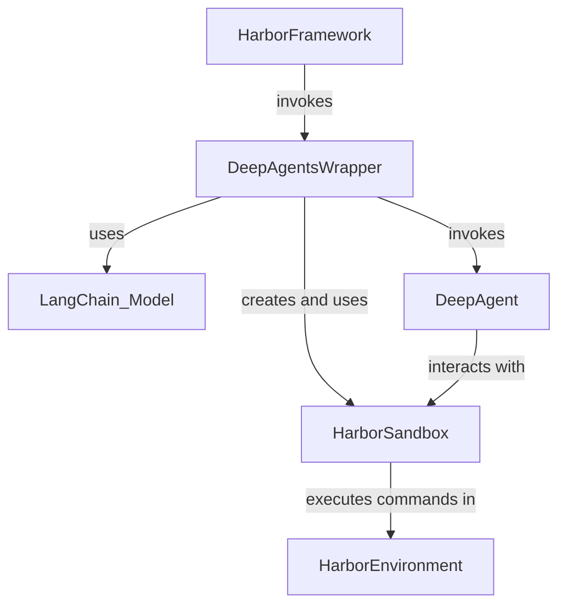

'''
# DeepAgents Harbor Integration Documentation

## Overview
This component serves as an adapter to enable `deepagents` to operate within the `harbor` agent evaluation framework. It provides the necessary "glue" to connect a generic DeepAgent to Harbor's specific environment and task execution lifecycle. The core of this integration is the `DeepAgentsWrapper`, which acts as the Harbor agent, and the `HarborSandbox`, which provides the agent with a way to interact with the sandboxed Harbor environment using shell commands.

## Entry Points
The primary entry point for this component is `deepagents_harbor.deepagents_wrapper.DeepAgentsWrapper`. When the Harbor framework runs a task with this agent, it instantiates this class and calls its `run` method.

1.  **`DeepAgentsWrapper(..)`**: The agent is initialized with model parameters and logging configurations.
2.  **`DeepAgentsWrapper.run(instruction, environment, context)`**: This is the main execution method. It receives the task instruction and the Harbor environment.
    - It creates a `HarborSandbox` instance, wrapping the provided `environment`.
    - It dynamically constructs a system prompt containing the current working directory and file listing.
    - It initializes the `deep_agent` using either `create_cli_agent` or `create_deep_agent`.
    - It invokes the agent with the instruction and saves the resulting interaction history as a trajectory file.

A developer new to this code should start by examining the `run` method in `deepagents_wrapper.py` to understand the main orchestration logic.

## Key Concepts
- **`DeepAgentsWrapper`**: A class that implements the `harbor.agents.base.BaseAgent` interface. Its main responsibility is to receive tasks from Harbor, manage the `deepagent` lifecycle, and record the results.

- **`HarborSandbox`**: A class that implements the `deepagents.backends.protocol.SandboxBackendProtocol`. It acts as a bridge between the DeepAgent and the Harbor environment. Instead of performing file system operations directly, it translates them into shell commands (like `ls`, `grep`, `awk`) that are executed in the Harbor environment. All its operations are asynchronous.

- **Trajectory**: A structured JSON log (`trajectory.json`) that records the entire interaction between the user, the agent, and the tools. It follows the "Agent Trajectory Interchange Format" (ATIF) and is the primary output for evaluation.

## Dependencies & Relationships
- **Upstream**: This component is called by the main `harbor` evaluation framework. Harbor provides the `BaseEnvironment` (e.g., a Docker container) and the `instruction` for the agent to execute.
- **Internal**: `DeepAgentsWrapper` creates and uses an instance of `HarborSandbox`.
- **Downstream**: `HarborSandbox` uses the `exec` method of a `harbor.environments.base.BaseEnvironment` to run shell commands.
- **External Libraries**: 
    - `deepagents`: The core framework for the autonomous agent.
    - `langchain`: Used for initializing the chat model (`init_chat_model`) and for its message types (`AIMessage`, `ToolMessage`).
    - `langsmith`: Optionally used for tracing and experiment tracking if `LANGSMITH_EXPERIMENT` is set.



## Patterns & Conventions

- **Async-first Operations**: All environment interactions within `HarborSandbox` are implemented as asynchronous methods (e.g., `aread`, `awrite`, `aexecute`). The corresponding synchronous methods are deliberately not implemented and will raise a `NotImplementedError`.

- **Shell Command Abstraction**: All file system and environment interactions are performed by executing shell commands within the Harbor environment. This makes the agent independent of the underlying environment's implementation details. For example, reading a file is done via `awk`, and searching is done via `grep`.

- **Base64 Encoding for Safety**: When writing or editing files, the content is passed as a Base64-encoded string to the shell script. This is a crucial security and reliability pattern that avoids issues with special characters, quotes, and potential shell injection vulnerabilities.

- **Dynamic System Prompts**: The system prompt is not static. Before the agent starts, the `DeepAgentsWrapper` queries the environment for the current directory and file listing and injects this information into the system prompt. This gives the agent immediate context, reducing the need for initial redundant `ls` or `pwd` commands.

## Code Examples

### 1. Reading a File with `awk`
This snippet from `HarborSandbox.aread` shows how a file is read by executing a shell command that uses `awk` to add line numbers and handle pagination.

```python
# From libs/harbor/deepagents_harbor/backend.py
async def aread(
    self,
    file_path: str,
    offset: int = 0,
    limit: int = 2000,
) -> str:
    '''Read file content with line numbers using shell commands.'''
    safe_path = shlex.quote(file_path)

    cmd = f'''
if [ ! -f {safe_path} ]; then
    echo "Error: File not found"
    exit 1
fi
# Use awk to add line numbers and handle offset/limit
awk -v offset={offset} -v limit={limit} \'-v\', '''
    NR > offset && NR <= offset + limit {{
        printf "%6d\t%s\n", NR, $0
    }}
    NR > offset + limit {{ exit }}
''' ''', f'{safe_path}'''
'''
    result = await self.aexecute(cmd)
    # ... (error handling) ...
    return result.output.rstrip()
```
**Why this matters:** This demonstrates the core pattern of the `HarborSandbox`: it translates a familiar developer action (reading a file) into a robust, safe shell command. Using `awk` is a clever way to add line numbering and pagination without needing complex logic in the Python code. It keeps the Python wrapper thin and pushes the execution details into the sandboxed environment.

### 2. Safely Editing a File with Base64 and `perl`
This snippet from `HarborSandbox.aedit` shows how a string replacement operation is handled securely.

```python
# From libs/harbor/deepagents_harbor/backend.py
async def aedit(
    self,
    file_path: str,
    old_string: str,
    new_string: str,
    replace_all: bool = False,
) -> EditResult:
    # Encode strings as base64 to avoid escaping issues
    old_b64 = base64.b64encode(old_string.encode("utf-8")).decode("ascii")
    new_b64 = base64.b64encode(new_string.encode("utf-8")).decode("ascii")
    safe_path = shlex.quote(file_path)
    # ...
    # Use perl for reliable string replacement (handles special chars)
    cmd = f'''
# ...
if [ "{replace_all_str}" = "true" ]; then
    perl -i -pe 's/\Q'"$old"'\E/'"$new"'/g' {safe_path}
else
    perl -i -pe 's/\Q'"$old"'\E/'"$new"'/' {safe_path}
fi
# ...
'''
    #...
```
**Why this matters:** This is a key example of a defensive programming pattern. Directly embedding `old_string` and `new_string` into the `perl` command is risky. By encoding them to Base64 in Python and decoding them back inside the shell script, the implementation prevents shell injection and ensures that special characters in the strings don't break the command.

### 3. Dynamic System Prompt Creation
This snippet from `DeepAgentsWrapper._get_formatted_system_prompt` shows how the agent gets its initial context before starting a task.

```python
# From libs/harbor/deepagents_harbor/deepagents_wrapper.py
async def _get_formatted_system_prompt(self, backend: HarborSandbox) -> str:
    # Get directory information from backend
    ls_info = await backend.als_info(".")
    current_dir = (await backend.aexecute("pwd")).output

    # ... (logic to format file list) ...

    # Format the system prompt with context
    formatted_prompt = SYSTEM_MESSAGE.format(
        current_directory=current_dir.strip() if current_dir else "/app",
        file_listing_header=file_listing_header,
        file_listing=file_listing,
    )

    return formatted_prompt
```
**Why this matters:** This highlights the agent's proactive approach to context gathering. By providing the file listing and working directory upfront, the agent is less likely to waste its first few turns on basic reconnaissance commands. This is an optimization that can improve both the speed and accuracy of task completion.

## Tutorial Hints

-   **Prerequisites**: To understand this code, a developer needs a basic understanding of `asyncio` in Python, the general architecture of agentic systems (LLM + tools), and familiarity with shell commands like `ls`, `grep`, and `awk`.

-   **Common Questions**:
    -   *Why are all the `HarborSandbox` methods async?* Because Harbor environments are inherently asynchronous, and all interactions with them (like executing a command) are non-blocking I/O operations.
    -   *Why doesn't the agent just use Python's `os` module to interact with files?* The agent code runs on the host machine, not inside the sandboxed Harbor environment (e.g., a Docker container). The only way to interact with the environment is through the `environment.exec` method provided by Harbor, which executes a shell command.
    -   *What is `trajectory.json` for?* It's the primary artifact for evaluating the agent's performance. It provides a step-by-step replay of the entire task, which can be used for debugging, analysis, and scoring.

-   **Pitfalls & Gotchas**:
    -   **Forgetting `await`**: Since all `HarborSandbox` methods are async, forgetting to use `await` when calling them is a common mistake that will lead to runtime errors.
    -   **Shell Command Quoting**: When adding new commands to `HarborSandbox`, it is critical to use `shlex.quote` on any file paths or user-provided strings to prevent errors and security issues.
    -   **Synchronous Methods**: Do not try to implement the synchronous methods (`read`, `write`, etc.) in `HarborSandbox`. The entire stack is designed to be asynchronous, and mixing in blocking calls will cause problems.

'''