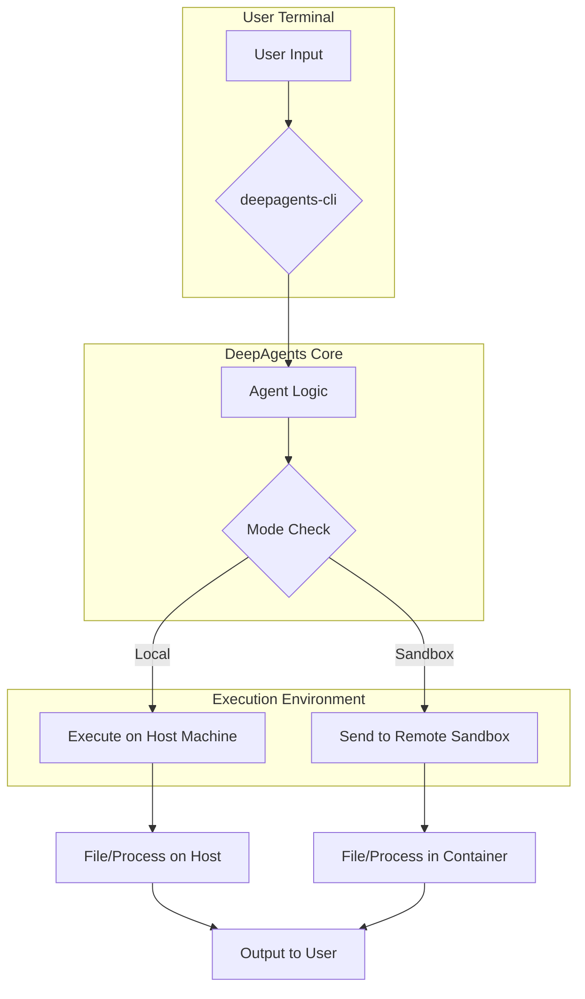

# 01 Quickstart Cli

> **Goal:** Get up and running in minutes. Learn how to install the `deepagents-cli` and use it as a conversational AI coding assistant directly in your terminal for tasks like file manipulation and code execution.

## Introduction

The `deepagents-cli` is a powerful command-line tool that brings a conversational AI coding assistant directly to your terminal. It leverages the `deepagents` library to provide a seamless interface for interacting with an AI that can read and write files, execute code, and learn from your project context. Whether you need to quickly refactor a script, understand a new codebase, or automate a workflow, the DeepAgents CLI is designed to be your go-to partner.

As documented in the knowledge base, the CLI acts as a user-facing application that wraps the core `deepagents` library, managing user sessions and providing a safe environment for code execution through local or remote "sandboxes".

This quickstart guide will walk you through the installation, basic configuration, and essential commands to get you started.

## Installation

Getting the `deepagents-cli` installed is a straightforward process using `pip`. The tool is built for Python 3.11+.

Open your terminal and run the following command:

```bash
pip install "deepagents-cli"
```

This will install the main package along with its essential dependencies, including `rich` for beautiful terminal output and `prompt-toolkit` for the interactive experience.

## Configuration: API Keys

The agent relies on Large Language Models (LLMs) and other third-party services to function. Before you can start, you need to provide API keys for these services.

### Required: OpenAI API Key

The agent uses an OpenAI model (like GPT-4) as its core brain. You must have an `OPENAI_API_KEY` set in your environment.

### Optional: Tavily API Key

For the agent to perform web searches, it uses the Tavily search API. If you want to enable this capability, you'll need a `TAVILY_API_KEY`.

You can set these keys in two ways:

1.  **Environment Variables**:

    ```bash
    export OPENAI_API_KEY="sk-..."
    export TAVILY_API_KEY="tvly-..."
    ```

2.  **.env File**:
    Create a `.env` file in the directory where you plan to run the `deepagents` command and add your keys there:

    ```text
    OPENAI_API_KEY="sk-..."
    TAVILY_API_KEY="tvly-..."
    ```

The CLI will automatically load these variables when it starts.

## Your First Conversation

Once your API keys are configured, you can start your first conversation with the agent. Simply run:

```bash
deepagents
```

You'll be greeted by a welcome message and an interactive prompt. You can now give the agent tasks. Let's try a simple one:

```text
> Write a python script that prints 'Hello, DeepAgents!' to a file named 'hello.py'
```

The agent will propose a plan to accomplish this. It will ask for your approval before executing any commands. Once you approve, it will generate the code and write it to the specified file.

You can then check the contents of the file:

```bash
!cat hello.py
```

> **Tip:** You can execute shell commands directly within the agent prompt by prefixing them with `!`. This is handy for quickly verifying the agent's work.

## How It Works: Local vs. Sandbox

The DeepAgents CLI can execute commands in two modes: **local** and **sandbox**.

*   **Local Mode (Default)**: The agent executes shell commands directly on your machine. This is convenient but requires you to trust the agent, as it has the same permissions as your user account. Use with caution!

*   **Sandbox Mode**: The agent executes commands in a secure, isolated remote environment. This is the safest way to run the agent, especially when dealing with complex or untrusted tasks.

As the knowledge base explains, the CLI uses a `create_sandbox` factory to instantiate a sandbox backend (e.g., Modal, Daytona). This design cleanly separates the execution environment from the core agent logic.

### Architecture Flow

The following diagram illustrates how user input is processed in both local and sandbox modes:



To use a sandbox, you can specify it with the `--sandbox` flag. For example, to use the "modal" sandbox, you would run:

```bash
deepagents --sandbox modal
```

This requires you to have the appropriate sandbox client (e.g., `modal-client`) installed and configured.

## Next Steps

Now that you're familiar with the basics of the `deepagents-cli`, you're ready to explore more advanced topics.

*   **[Building a Custom Agent](./02_building_a_custom_agent.md)**: Learn how to use the `deepagents` Python library to create your own specialized agents with custom tools and capabilities.
*   **[Evaluating with Harbor](./03_evaluating_with_harbor.md)**: Dive into the advanced topic of testing your agent's performance using the Harbor evaluation framework.
