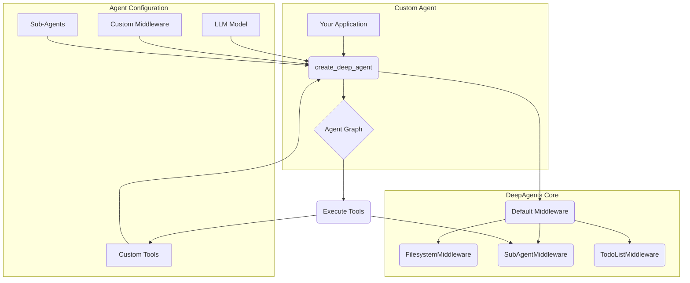

# 02 Building A Custom Agent

'''# Building a Custom Agent with the Python Library

While the `deepagents-cli` provides a powerful interactive experience out of the box, the true potential of the DeepAgents framework is unlocked when you use the core `deepagents` Python library to build your own custom agents. This tutorial will guide you through the process of programmatically creating an agent from scratch, empowering you to tailor its capabilities to your specific needs.

By building a custom agent, you can:

- Integrate your own unique tools.
- Add or customize middleware to modify agent behavior.
- Define specialized sub-agents for complex tasks.
- Have full programmatic control over the agent's lifecycle.

We will walk through the essential components and demonstrate how to assemble them into a functional agent.

## Core Concepts

Before we dive into the code, let's understand the key building blocks of the `deepagents` library.

- **`create_deep_agent`**: This is the main entry point for creating any agent. Located in `libs/deepagents/deepagents/graph.py`, this function assembles the agent, integrating the model, tools, middleware, and sub-agents into a cohesive unit. It simplifies the setup process by providing sensible defaults while offering extensive customization options.

- **`AgentMiddleware`**: Middleware are components that intercept and modify the agent's behavior. The `deepagents` framework uses a middleware-based architecture to provide features like filesystem access (`FilesystemMiddleware`), to-do list management (`TodoListMiddleware`), and sub-agent delegation (`SubAgentMiddleware`). This modular design makes it easy to extend and customize the agent's capabilities.

- **`SubAgent`**: A SubAgent is a specialized agent that can be invoked by the main agent to perform a specific, well-defined task. For example, you could have a `code_reviewer` sub-agent or a `database_query` sub-agent. Sub-agents are defined with their own prompts, tools, and models, allowing for a clear separation of concerns and more robust task execution.

## Architecture of a Custom Agent

When you build a custom agent, you are essentially composing these core components. The `create_deep_agent` function acts as the orchestrator, bringing everything together.

Here’s a high-level view of how these pieces fit together:



This diagram shows how your application calls `create_deep_agent` with your custom configurations. The function then combines your inputs with the default middleware to construct the final, executable agent graph.

## Getting Started: Creating Your First Custom Agent

Now, let's get our hands dirty and build a custom agent. We will create an agent that has a custom tool for greeting users and a specialized sub-agent for performing calculations.

First, you'll need to have the `deepagents` library installed. Then, you can create a Python script (e.g., `my_agent.py`) and follow the steps below.

### Step 1: Define Custom Tools

Tools are simple Python functions decorated with `@tool` from LangChain. Let's create a tool that returns a friendly greeting and another for calculations.

```python
from langchain_core.tools import tool

@tool
def say_hello(name: str) -> str:
    """Responds with a friendly greeting."""
    return f"Hello, {name}! It's a pleasure to meet you."

@tool
def calculator(expression: str) -> str:
    """A simple calculator that evaluates a Python expression."""
    try:
        # Using eval is insecure, but fine for this example.
        # In a real application, you should use a safer evaluation method.
        return str(eval(expression))
    except Exception as e:
        return f"Error: {e}"
```

### Step 2: Create the Agent

Next, we will use the `create_deep_agent` function to assemble our agent. We will provide it with a model, our custom tool, and define a sub-agent for calculations.

The main entry point for this is the `create_deep_agent` function, found in `libs/deepagents/deepagents/graph.py`.

```python
from deepagents.graph import create_deep_agent, get_default_model

# 1. Get the default model
model = get_default_model()

# 2. Define a sub-agent for calculations
calculator_subagent = {
    "name": "calculator_agent",
    "description": "An agent that can perform mathematical calculations.",
    "system_prompt": "You are a calculator. Evaluate the given Python expression and return the result.",
    "tools": [calculator],
}

# 3. Create the main agent
deep_agent = create_deep_agent(
    model=model,
    tools=[say_hello],
    system_prompt="You are a helpful assistant. Use your tools to help the user. Delegate to sub-agents when appropriate.",
    subagents=[calculator_subagent],
)

print("Custom agent created successfully!")
```

In this example, we've configured a main agent that knows how to `say_hello` and can delegate mathematical tasks to the `calculator_agent`.

### Step 3: Interacting with Your Agent

To use this agent, you would typically run its `stream` or `invoke` method. Here is a simplified example of how you might interact with it.

```python
# This is a conceptual example of how you might invoke the agent.
# A complete implementation would require handling asynchronous code
# and managing state, which is beyond the scope of this tutorial.

# Example queries:
queries = [
    "Say hi to Alice",
    "What is 42 * 11?"
]

# Conceptual invocation loop:
# for query in queries:
#     print(f"--- Invoking agent with: '{query}' ---")
#     result = deep_agent.invoke({"messages": [("user", query)]})
#     print(result)
```

When the agent receives the message "What is 42 * 11?", it recognizes that the `calculator_agent` is the right specialist for the job. The `SubAgentMiddleware` delegates the task to the `calculator_agent`, which then uses its `calculator` tool to compute the result and return it.
'''
