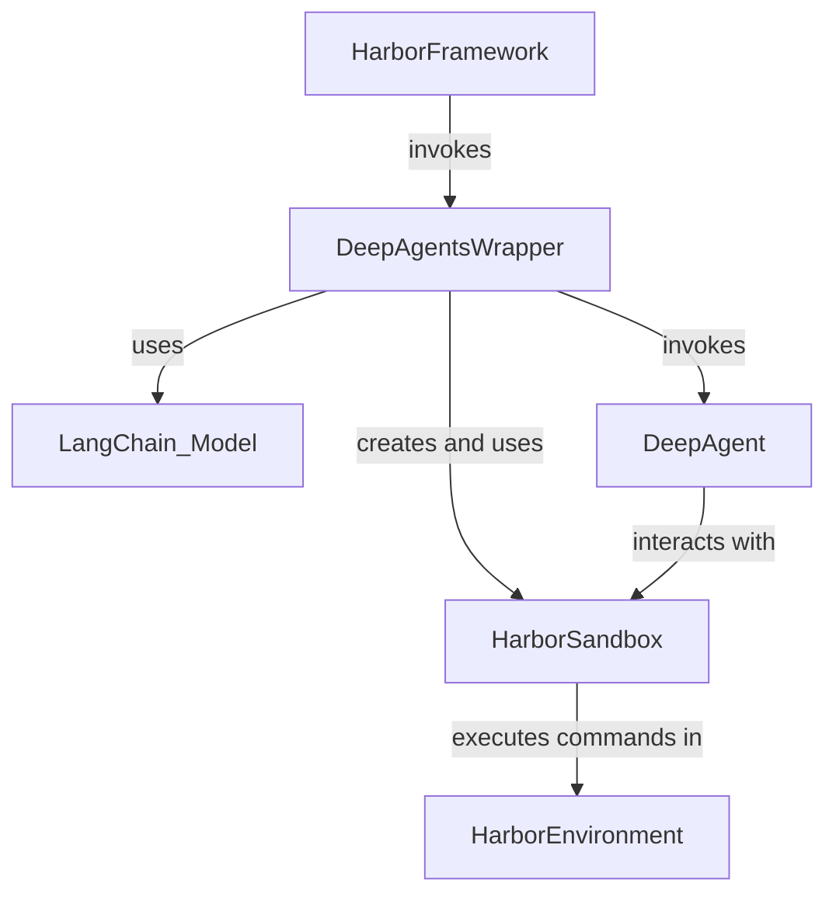

# 03 Evaluating With Harbor

'''
# Advanced: Evaluating Your Agent with the Harbor Framework

Welcome to the advanced guide on evaluating your DeepAgent. Once you have built a custom agent, it is crucial to measure its performance on standardized tasks. This tutorial will walk you through integrating your agent with the `harbor` evaluation framework, a powerful tool for benchmarking AI agents in sandboxed environments.

This guide will cover:

- The architecture of the `deepagents-harbor` integration.
- How the `HarborSandbox` translates agent actions into safe shell commands.
- The role of the `DeepAgentsWrapper` in orchestrating the evaluation.
- How to run an evaluation and what to expect as output.

## Prerequisites

Before you begin, you should be familiar with the concepts covered in our previous tutorial, "[Building a Custom Agent with the Python Library](02_building_a_custom_agent.md)". A basic understanding of `asyncio` in Python and familiarity with shell commands (`ls`, `pwd`, `grep`) will also be beneficial.

## Architecture: Bridging DeepAgents and Harbor

As documented in the knowledge base, the `deepagents-harbor` library acts as a crucial bridge between your agent and the Harbor evaluation environment. Harbor runs tasks in a secure, isolated sandbox (like a Docker container), and our agent needs a way to interact with that sandbox. This is where the two key components of the integration come in: `DeepAgentsWrapper` and `HarborSandbox`.

Here’s a look at how they fit together:



1.  **Harbor Framework**: The evaluation process starts here. Harbor is responsible for setting up the sandboxed environment and providing the agent with a task, or "instruction."
2.  **`DeepAgentsWrapper`**: This class is the official entry point for our agent in the Harbor ecosystem. It implements Harbor's `BaseAgent` interface. Its primary job is to receive the instruction, initialize the DeepAgent, and manage the task lifecycle.
3.  **`HarborSandbox`**: This is the agent's gateway to the outside world. It implements the `SandboxBackendProtocol` that DeepAgents expect, but with a twist. Instead of executing filesystem operations directly, it translates every action into a shell command that is run within the Harbor environment.
4.  **DeepAgent**: This is your custom agent, created using `create_deep_agent`.
5.  **Harbor Environment**: This is the isolated container where the task is executed. The `HarborSandbox` sends commands to this environment.

## The `HarborSandbox`: Safe Interaction via Shell Commands

The `HarborSandbox` is a critical component for security and portability. Your agent's code runs on a host machine, while the task environment is a separate container. The only way to interact with this container is by executing shell commands.

As detailed in the knowledge base, the `HarborSandbox` abstracts this interaction. When your agent wants to read a file, it calls `backend.aread()`. The sandbox then translates this into a carefully crafted shell command.

Let's look at an example from the source code at `libs/harbor/deepagents_harbor/backend.py`, lines 21-41:

```python
# From libs/harbor/deepagents_harbor/backend.py
async def aread(
    self,
    file_path: str,
    offset: int = 0,
    limit: int = 2000,
) -> str:
    '''Read file content with line numbers using shell commands.'''
    safe_path = shlex.quote(file_path)

    cmd = f"""
if [ ! -f {safe_path} ]; then
    echo "Error: File not found"
    exit 1
fi
# Use awk to add line numbers and handle offset/limit
awk -v offset={offset} -v limit={limit} '
    NR > offset && NR <= offset + limit {{{{ 
        printf "%6d\t%s\n", NR, $0
    }}}}
    NR > offset + limit {{{{ exit }}}}
' {safe_path}
"""
    result = await self.aexecute(cmd)
    # ... (error handling) ...
    return result.output.rstrip()
```

Notice a few key patterns:

-   **`async` by Design**: All methods are asynchronous (`aread`, `awrite`, `aexecute`) because interactions with the Harbor environment are non-blocking I/O operations.
-   **Shell Abstraction**: The method uses `awk` to handle file reading, line numbering, and pagination. This pushes the logic into the sandboxed environment, keeping the Python code clean and simple.
-   **Safety First**: `shlex.quote()` is used to escape the file path, preventing shell injection vulnerabilities.

## The `DeepAgentsWrapper`: Orchestrating the Evaluation

The `DeepAgentsWrapper` class in `libs/harbor/deepagents_harbor/deepagents_wrapper.py` orchestrates the entire evaluation run. Its most important method is `run`.

When Harbor starts a task, it calls `DeepAgentsWrapper.run()` with the task instruction. Here's what happens inside:

1.  It instantiates the `HarborSandbox`.
2.  It dynamically creates a system prompt for the agent. As documented in the knowledge base, this is a key optimization. Before the agent even starts, the wrapper queries the environment for the current working directory and a file listing.
3.  It injects this context directly into the system prompt, so the agent immediately knows its surroundings without having to waste cycles on `pwd` and `ls` commands.

Here is the code that prepares the prompt, from `libs/harbor/deepagents_harbor/deepagents_wrapper.py`, lines 133-146:

```python
# From libs/harbor/deepagents_harbor/deepagents_wrapper.py
async def _get_formatted_system_prompt(self, backend: HarborSandbox) -> str:
    # Get directory information from backend
    ls_info = await backend.als_info(".")
    current_dir = (await backend.aexecute("pwd")).output

    # ... (logic to format file list) ...

    # Format the system prompt with context
    formatted_prompt = SYSTEM_MESSAGE.format(
        current_directory=current_dir.strip() if current_dir else "/app",
        file_listing_header=file_listing_header,
        file_listing=file_listing,
    )

    return formatted_prompt
```

4.  Finally, it invokes the DeepAgent with the instruction and the prepared prompt.

## The Output: `trajectory.json`

The primary output of an evaluation run is a file named `trajectory.json`. This file is a complete, step-by-step log of the entire interaction, including:

-   The initial instruction.
-   Every thought process and action taken by the agent.
-   The full output from every tool execution.
-   The final answer provided by the agent.

This structured log, which follows the "Agent Trajectory Interchange Format" (ATIF), is essential for scoring the agent's performance and for debugging its behavior.

## Example: Running an Evaluation

Running an evaluation typically involves using the `harbor` command-line tool. While the exact command may vary based on your setup, it will look something like this:

```bash
# This is a representative example
harbor run \
  --agent deepagents_harbor.DeepAgentsWrapper \
  --eval-llm-name "gpt-4-turbo" \
  --task "swe-bench-lite/apply-patch-1234.yaml" \
  --output-dir "./outputs/run-1234"
```

This command tells Harbor to:

1.  Use our `DeepAgentsWrapper` as the agent.
2.  Configure it with the `gpt-4-turbo` model.
3.  Run the task defined in a `swe-bench` YAML file.
4.  Save all outputs, including `trajectory.json`, to the specified directory.

## Conclusion

Integrating with an evaluation framework like Harbor is a fundamental step in developing robust and reliable AI agents. The `deepagents-harbor` adapter provides the necessary components to connect your DeepAgent to a standardized, secure testing environment.

By understanding the roles of `DeepAgentsWrapper` and `HarborSandbox`, you can see how the framework translates your agent's high-level actions into secure, executable shell commands, enabling rigorous and repeatable benchmarking.

To continue your journey, we recommend exploring the other tutorials in this series:

-   [Quickstart: Interacting with the DeepAgents CLI](01_quickstart_cli.md)
-   [Building a Custom Agent with the Python Library](02_building_a_custom_agent.md)
'''
