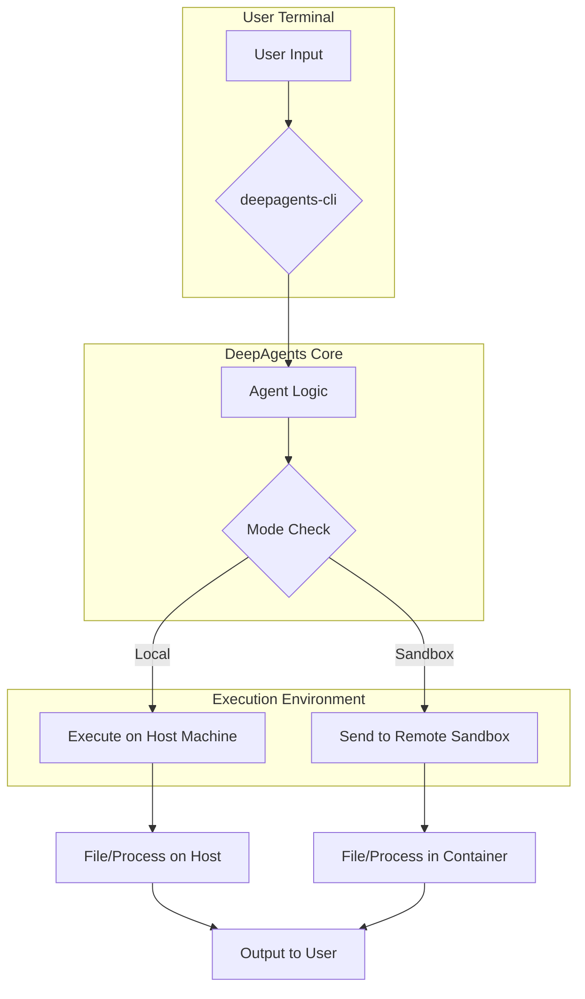
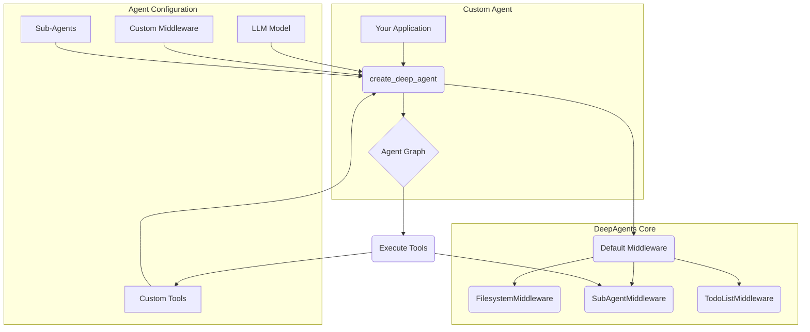
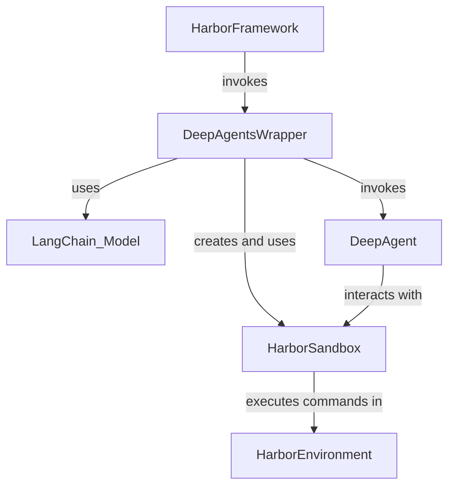

# Tutorials Wiki

> Compact, single-page view of all tutorials. Use the TOC below to jump around.

## Table of Contents
- [01 Quickstart Cli](#01_quickstart_cli)
- [02 Building A Custom Agent](#02_building_a_custom_agent)
- [03 Evaluating With Harbor](#03_evaluating_with_harbor)

<a id="tutorials_wiki"></a>
---
<a id="01_quickstart_cli"></a>
# 01 Quickstart Cli

> **Goal:** Get up and running in minutes. Learn how to install the `deepagents-cli` and use it as a conversational AI coding assistant directly in your terminal for tasks like file manipulation and code execution.

## Introduction

The `deepagents-cli` is a powerful command-line tool that brings a conversational AI coding assistant directly to your terminal. It leverages the `deepagents` library to provide a seamless interface for interacting with an AI that can read and write files, execute code, and learn from your project context. Whether you need to quickly refactor a script, understand a new codebase, or automate a workflow, the DeepAgents CLI is designed to be your go-to partner.

As documented in the knowledge base, the CLI acts as a user-facing application that wraps the core `deepagents` library, managing user sessions and providing a safe environment for code execution through local or remote "sandboxes".

This quickstart guide will walk you through the installation, basic configuration, and essential commands to get you started.

## Installation

Getting the `deepagents-cli` installed is a straightforward process using `pip`. The tool is built for Python 3.11+.

Open your terminal and run the following command:

```bash
pip install "deepagents-cli"
```

This will install the main package along with its essential dependencies, including `rich` for beautiful terminal output and `prompt-toolkit` for the interactive experience.

## Configuration: API Keys

The agent relies on Large Language Models (LLMs) and other third-party services to function. Before you can start, you need to provide API keys for these services.

### Required: OpenAI API Key

The agent uses an OpenAI model (like GPT-4) as its core brain. You must have an `OPENAI_API_KEY` set in your environment.

### Optional: Tavily API Key

For the agent to perform web searches, it uses the Tavily search API. If you want to enable this capability, you'll need a `TAVILY_API_KEY`.

You can set these keys in two ways:

1.  **Environment Variables**:

    ```bash
    export OPENAI_API_KEY="sk-..."
    export TAVILY_API_KEY="tvly-..."
    ```

2.  **.env File**:
    Create a `.env` file in the directory where you plan to run the `deepagents` command and add your keys there:

    ```text
    OPENAI_API_KEY="sk-..."
    TAVILY_API_KEY="tvly-..."
    ```

The CLI will automatically load these variables when it starts.

## Your First Conversation

Once your API keys are configured, you can start your first conversation with the agent. Simply run:

```bash
deepagents
```

You'll be greeted by a welcome message and an interactive prompt. You can now give the agent tasks. Let's try a simple one:

```text
> Write a python script that prints 'Hello, DeepAgents!' to a file named 'hello.py'
```

The agent will propose a plan to accomplish this. It will ask for your approval before executing any commands. Once you approve, it will generate the code and write it to the specified file.

You can then check the contents of the file:

```bash
!cat hello.py
```

> **Tip:** You can execute shell commands directly within the agent prompt by prefixing them with `!`. This is handy for quickly verifying the agent's work.

## How It Works: Local vs. Sandbox

The DeepAgents CLI can execute commands in two modes: **local** and **sandbox**.

*   **Local Mode (Default)**: The agent executes shell commands directly on your machine. This is convenient but requires you to trust the agent, as it has the same permissions as your user account. Use with caution!

*   **Sandbox Mode**: The agent executes commands in a secure, isolated remote environment. This is the safest way to run the agent, especially when dealing with complex or untrusted tasks.

As the knowledge base explains, the CLI uses a `create_sandbox` factory to instantiate a sandbox backend (e.g., Modal, Daytona). This design cleanly separates the execution environment from the core agent logic.

### Architecture Flow

The following diagram illustrates how user input is processed in both local and sandbox modes:



To use a sandbox, you can specify it with the `--sandbox` flag. For example, to use the "modal" sandbox, you would run:

```bash
deepagents --sandbox modal
```

This requires you to have the appropriate sandbox client (e.g., `modal-client`) installed and configured.

## Next Steps

Now that you're familiar with the basics of the `deepagents-cli`, you're ready to explore more advanced topics.

*   **[Building a Custom Agent](./02_building_a_custom_agent.md)**: Learn how to use the `deepagents` Python library to create your own specialized agents with custom tools and capabilities.
*   **[Evaluating with Harbor](./03_evaluating_with_harbor.md)**: Dive into the advanced topic of testing your agent's performance using the Harbor evaluation framework.

[↩ Back to top](#tutorials_wiki)

---
<a id="02_building_a_custom_agent"></a>
# 02 Building A Custom Agent

'''# Building a Custom Agent with the Python Library

While the `deepagents-cli` provides a powerful interactive experience out of the box, the true potential of the DeepAgents framework is unlocked when you use the core `deepagents` Python library to build your own custom agents. This tutorial will guide you through the process of programmatically creating an agent from scratch, empowering you to tailor its capabilities to your specific needs.

By building a custom agent, you can:

- Integrate your own unique tools.
- Add or customize middleware to modify agent behavior.
- Define specialized sub-agents for complex tasks.
- Have full programmatic control over the agent's lifecycle.

We will walk through the essential components and demonstrate how to assemble them into a functional agent.

## Core Concepts

Before we dive into the code, let's understand the key building blocks of the `deepagents` library.

- **`create_deep_agent`**: This is the main entry point for creating any agent. Located in `libs/deepagents/deepagents/graph.py`, this function assembles the agent, integrating the model, tools, middleware, and sub-agents into a cohesive unit. It simplifies the setup process by providing sensible defaults while offering extensive customization options.

- **`AgentMiddleware`**: Middleware are components that intercept and modify the agent's behavior. The `deepagents` framework uses a middleware-based architecture to provide features like filesystem access (`FilesystemMiddleware`), to-do list management (`TodoListMiddleware`), and sub-agent delegation (`SubAgentMiddleware`). This modular design makes it easy to extend and customize the agent's capabilities.

- **`SubAgent`**: A SubAgent is a specialized agent that can be invoked by the main agent to perform a specific, well-defined task. For example, you could have a `code_reviewer` sub-agent or a `database_query` sub-agent. Sub-agents are defined with their own prompts, tools, and models, allowing for a clear separation of concerns and more robust task execution.

## Architecture of a Custom Agent

When you build a custom agent, you are essentially composing these core components. The `create_deep_agent` function acts as the orchestrator, bringing everything together.

Here’s a high-level view of how these pieces fit together:



This diagram shows how your application calls `create_deep_agent` with your custom configurations. The function then combines your inputs with the default middleware to construct the final, executable agent graph.

## Getting Started: Creating Your First Custom Agent

Now, let's get our hands dirty and build a custom agent. We will create an agent that has a custom tool for greeting users and a specialized sub-agent for performing calculations.

First, you'll need to have the `deepagents` library installed. Then, you can create a Python script (e.g., `my_agent.py`) and follow the steps below.

### Step 1: Define Custom Tools

Tools are simple Python functions decorated with `@tool` from LangChain. Let's create a tool that returns a friendly greeting and another for calculations.

```python
from langchain_core.tools import tool

@tool
def say_hello(name: str) -> str:
    """Responds with a friendly greeting."""
    return f"Hello, {name}! It's a pleasure to meet you."

@tool
def calculator(expression: str) -> str:
    """A simple calculator that evaluates a Python expression."""
    try:
        # Using eval is insecure, but fine for this example.
        # In a real application, you should use a safer evaluation method.
        return str(eval(expression))
    except Exception as e:
        return f"Error: {e}"
```

### Step 2: Create the Agent

Next, we will use the `create_deep_agent` function to assemble our agent. We will provide it with a model, our custom tool, and define a sub-agent for calculations.

The main entry point for this is the `create_deep_agent` function, found in `libs/deepagents/deepagents/graph.py`.

```python
from deepagents.graph import create_deep_agent, get_default_model

# 1. Get the default model
model = get_default_model()

# 2. Define a sub-agent for calculations
calculator_subagent = {
    "name": "calculator_agent",
    "description": "An agent that can perform mathematical calculations.",
    "system_prompt": "You are a calculator. Evaluate the given Python expression and return the result.",
    "tools": [calculator],
}

# 3. Create the main agent
deep_agent = create_deep_agent(
    model=model,
    tools=[say_hello],
    system_prompt="You are a helpful assistant. Use your tools to help the user. Delegate to sub-agents when appropriate.",
    subagents=[calculator_subagent],
)

print("Custom agent created successfully!")
```

In this example, we've configured a main agent that knows how to `say_hello` and can delegate mathematical tasks to the `calculator_agent`.

### Step 3: Interacting with Your Agent

To use this agent, you would typically run its `stream` or `invoke` method. Here is a simplified example of how you might interact with it.

```python
# This is a conceptual example of how you might invoke the agent.
# A complete implementation would require handling asynchronous code
# and managing state, which is beyond the scope of this tutorial.

# Example queries:
queries = [
    "Say hi to Alice",
    "What is 42 * 11?"
]

# Conceptual invocation loop:
# for query in queries:
#     print(f"--- Invoking agent with: '{query}' ---")
#     result = deep_agent.invoke({"messages": [("user", query)]})
#     print(result)
```

When the agent receives the message "What is 42 * 11?", it recognizes that the `calculator_agent` is the right specialist for the job. The `SubAgentMiddleware` delegates the task to the `calculator_agent`, which then uses its `calculator` tool to compute the result and return it.
'''

[↩ Back to top](#tutorials_wiki)

---
<a id="03_evaluating_with_harbor"></a>
# 03 Evaluating With Harbor

'''
# Advanced: Evaluating Your Agent with the Harbor Framework

Welcome to the advanced guide on evaluating your DeepAgent. Once you have built a custom agent, it is crucial to measure its performance on standardized tasks. This tutorial will walk you through integrating your agent with the `harbor` evaluation framework, a powerful tool for benchmarking AI agents in sandboxed environments.

This guide will cover:

- The architecture of the `deepagents-harbor` integration.
- How the `HarborSandbox` translates agent actions into safe shell commands.
- The role of the `DeepAgentsWrapper` in orchestrating the evaluation.
- How to run an evaluation and what to expect as output.

## Prerequisites

Before you begin, you should be familiar with the concepts covered in our previous tutorial, "[Building a Custom Agent with the Python Library](02_building_a_custom_agent.md)". A basic understanding of `asyncio` in Python and familiarity with shell commands (`ls`, `pwd`, `grep`) will also be beneficial.

## Architecture: Bridging DeepAgents and Harbor

As documented in the knowledge base, the `deepagents-harbor` library acts as a crucial bridge between your agent and the Harbor evaluation environment. Harbor runs tasks in a secure, isolated sandbox (like a Docker container), and our agent needs a way to interact with that sandbox. This is where the two key components of the integration come in: `DeepAgentsWrapper` and `HarborSandbox`.

Here’s a look at how they fit together:



1.  **Harbor Framework**: The evaluation process starts here. Harbor is responsible for setting up the sandboxed environment and providing the agent with a task, or "instruction."
2.  **`DeepAgentsWrapper`**: This class is the official entry point for our agent in the Harbor ecosystem. It implements Harbor's `BaseAgent` interface. Its primary job is to receive the instruction, initialize the DeepAgent, and manage the task lifecycle.
3.  **`HarborSandbox`**: This is the agent's gateway to the outside world. It implements the `SandboxBackendProtocol` that DeepAgents expect, but with a twist. Instead of executing filesystem operations directly, it translates every action into a shell command that is run within the Harbor environment.
4.  **DeepAgent**: This is your custom agent, created using `create_deep_agent`.
5.  **Harbor Environment**: This is the isolated container where the task is executed. The `HarborSandbox` sends commands to this environment.

## The `HarborSandbox`: Safe Interaction via Shell Commands

The `HarborSandbox` is a critical component for security and portability. Your agent's code runs on a host machine, while the task environment is a separate container. The only way to interact with this container is by executing shell commands.

As detailed in the knowledge base, the `HarborSandbox` abstracts this interaction. When your agent wants to read a file, it calls `backend.aread()`. The sandbox then translates this into a carefully crafted shell command.

Let's look at an example from the source code at `libs/harbor/deepagents_harbor/backend.py`, lines 21-41:

```python
# From libs/harbor/deepagents_harbor/backend.py
async def aread(
    self,
    file_path: str,
    offset: int = 0,
    limit: int = 2000,
) -> str:
    '''Read file content with line numbers using shell commands.'''
    safe_path = shlex.quote(file_path)

    cmd = f"""
if [ ! -f {safe_path} ]; then
    echo "Error: File not found"
    exit 1
fi
# Use awk to add line numbers and handle offset/limit
awk -v offset={offset} -v limit={limit} '
    NR > offset && NR <= offset + limit {{{{ 
        printf "%6d\t%s\n", NR, $0
    }}}}
    NR > offset + limit {{{{ exit }}}}
' {safe_path}
"""
    result = await self.aexecute(cmd)
    # ... (error handling) ...
    return result.output.rstrip()
```

Notice a few key patterns:

-   **`async` by Design**: All methods are asynchronous (`aread`, `awrite`, `aexecute`) because interactions with the Harbor environment are non-blocking I/O operations.
-   **Shell Abstraction**: The method uses `awk` to handle file reading, line numbering, and pagination. This pushes the logic into the sandboxed environment, keeping the Python code clean and simple.
-   **Safety First**: `shlex.quote()` is used to escape the file path, preventing shell injection vulnerabilities.

## The `DeepAgentsWrapper`: Orchestrating the Evaluation

The `DeepAgentsWrapper` class in `libs/harbor/deepagents_harbor/deepagents_wrapper.py` orchestrates the entire evaluation run. Its most important method is `run`.

When Harbor starts a task, it calls `DeepAgentsWrapper.run()` with the task instruction. Here's what happens inside:

1.  It instantiates the `HarborSandbox`.
2.  It dynamically creates a system prompt for the agent. As documented in the knowledge base, this is a key optimization. Before the agent even starts, the wrapper queries the environment for the current working directory and a file listing.
3.  It injects this context directly into the system prompt, so the agent immediately knows its surroundings without having to waste cycles on `pwd` and `ls` commands.

Here is the code that prepares the prompt, from `libs/harbor/deepagents_harbor/deepagents_wrapper.py`, lines 133-146:

```python
# From libs/harbor/deepagents_harbor/deepagents_wrapper.py
async def _get_formatted_system_prompt(self, backend: HarborSandbox) -> str:
    # Get directory information from backend
    ls_info = await backend.als_info(".")
    current_dir = (await backend.aexecute("pwd")).output

    # ... (logic to format file list) ...

    # Format the system prompt with context
    formatted_prompt = SYSTEM_MESSAGE.format(
        current_directory=current_dir.strip() if current_dir else "/app",
        file_listing_header=file_listing_header,
        file_listing=file_listing,
    )

    return formatted_prompt
```

4.  Finally, it invokes the DeepAgent with the instruction and the prepared prompt.

## The Output: `trajectory.json`

The primary output of an evaluation run is a file named `trajectory.json`. This file is a complete, step-by-step log of the entire interaction, including:

-   The initial instruction.
-   Every thought process and action taken by the agent.
-   The full output from every tool execution.
-   The final answer provided by the agent.

This structured log, which follows the "Agent Trajectory Interchange Format" (ATIF), is essential for scoring the agent's performance and for debugging its behavior.

## Example: Running an Evaluation

Running an evaluation typically involves using the `harbor` command-line tool. While the exact command may vary based on your setup, it will look something like this:

```bash
# This is a representative example
harbor run \
  --agent deepagents_harbor.DeepAgentsWrapper \
  --eval-llm-name "gpt-4-turbo" \
  --task "swe-bench-lite/apply-patch-1234.yaml" \
  --output-dir "./outputs/run-1234"
```

This command tells Harbor to:

1.  Use our `DeepAgentsWrapper` as the agent.
2.  Configure it with the `gpt-4-turbo` model.
3.  Run the task defined in a `swe-bench` YAML file.
4.  Save all outputs, including `trajectory.json`, to the specified directory.

## Conclusion

Integrating with an evaluation framework like Harbor is a fundamental step in developing robust and reliable AI agents. The `deepagents-harbor` adapter provides the necessary components to connect your DeepAgent to a standardized, secure testing environment.

By understanding the roles of `DeepAgentsWrapper` and `HarborSandbox`, you can see how the framework translates your agent's high-level actions into secure, executable shell commands, enabling rigorous and repeatable benchmarking.

To continue your journey, we recommend exploring the other tutorials in this series:

-   [Quickstart: Interacting with the DeepAgents CLI](01_quickstart_cli.md)
-   [Building a Custom Agent with the Python Library](02_building_a_custom_agent.md)
'''

[↩ Back to top](#tutorials_wiki)
