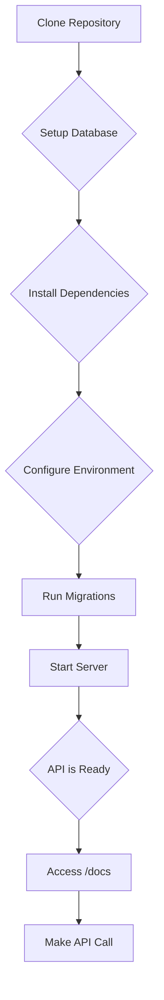

# 01 Quickstart

_# Quickstart: Setup and First API Interaction

This tutorial will guide you through setting up the RealWorld API locally, running the server, and making your first API call using the interactive documentation.

## 1. Environment Setup

First, we need to clone the repository and set up the necessary environment variables.

### Clone the Repository

```bash
git clone https://github.com/nsidnev/fastapi-realworld-example-app
cd fastapi-realworld-example-app
```

### Database Setup

The application uses PostgreSQL as its database. The quickest way to get a database running is by using Docker.

```bash
export POSTGRES_DB=rwdb POSTGRES_PORT=5432 POSTGRES_USER=postgres POSTGRES_PASSWORD=postgres
docker run --name pgdb --rm -e POSTGRES_USER="$POSTGRES_USER" -e POSTGRES_PASSWORD="$POSTGRES_PASSWORD" -e POSTGRES_DB="$POSTGRES_DB" -p 5432:5432 postgres
export POSTGRES_HOST=$(docker inspect -f '''{{range .NetworkSettings.Networks}}{{.IPAddress}}{{end}}''' pgdb)
createdb --host=$POSTGRES_HOST --port=$POSTGRES_PORT --username=$POSTGRES_USER $POSTGRES_DB
```

### Project Dependencies

This project uses `poetry` for dependency management.

```bash
poetry install
poetry shell
```

### Environment Variables

Create a `.env` file in the project root and add the following, replacing the placeholder for `SECRET_KEY`:

```bash
touch .env
echo APP_ENV=dev >> .env
echo DATABASE_URL=postgresql://$POSTGRES_USER:$POSTGRES_PASSWORD@$POSTGRES_HOST:$POSTGRES_PORT/$POSTGRES_DB >> .env
echo SECRET_KEY=$(openssl rand -hex 32) >> .env
```

## 2. Running the Application

With the environment configured, we can now run the database migrations and start the web server.

### Database Migrations

The database schema is managed with Alembic. To apply the latest migrations, run:

```bash
alembic upgrade head
```

### Start the Server

Now, start the FastAPI server:

```bash
uvicorn app.main:app --reload
```

The API will be running at `http://127.0.0.1:8000`.

## 3. First API Interaction

The API includes interactive documentation using Swagger UI, which you can access at `http://127.0.0.1:8000/docs`.

### Using the Interactive Docs

1.  Open your browser and navigate to `http://127.0.0.1:8000/docs`.
2.  You will see a list of API endpoints. Find the `/api/tags` endpoint under the "tags" section.
3.  Click on the endpoint to expand it.
4.  Click the "Try it out" button.
5.  Click the "Execute" button.

### Expected Response

You should see a `200` response with a JSON body containing a list of tags, which will be empty at this stage:

```json
{
  "tags": []
}
```

This confirms that your API is running correctly and you can successfully make unauthenticated requests.

## Architecture Diagram

Here is a diagram illustrating the setup process:


