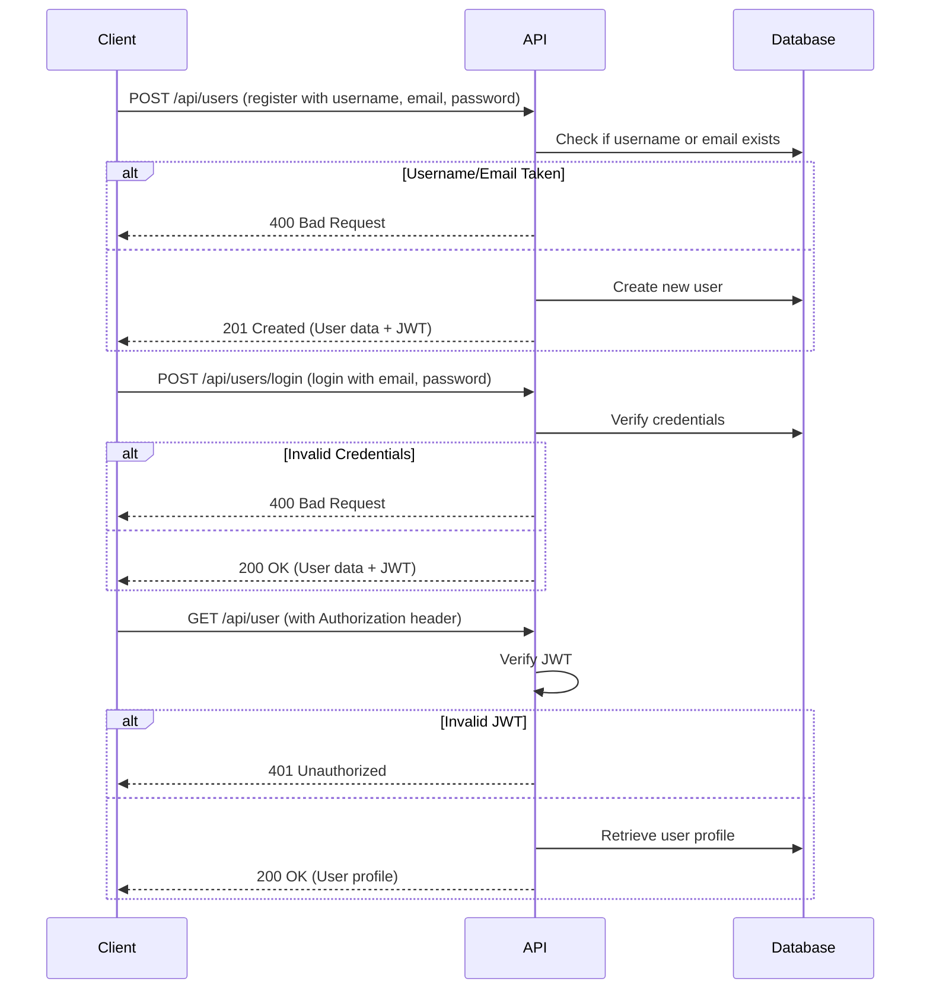

# 02 Authentication And Users

'''
# Creating an Account and Authenticating

This guide will walk you through the complete authentication workflow in the RealWorld API. You will learn how to register a new user, log in to receive a JSON Web Token (JWT), and access a protected endpoint to view your user profile.

## User Registration

Creating a new user account is the first step. This is handled by the `register` function in `app/api/routes/authentication.py` (lines 71-99).

The API expects a `POST` request to `/api/users` with a JSON payload containing the username, email, and password.

### Register a new user

```bash
curl -X POST -H "Content-Type: application/json" -d '{
  "user": {
    "username": "testuser",
    "email": "test.user@example.com",
    "password": "password123"
  }
}' http://localhost:8000/api/users
```

Upon successful registration, the API will respond with a `201 Created` status and a JSON object containing the user's data, including a JWT token.

```json
{
  "user": {
    "username": "testuser",
    "email": "test.user@example.com",
    "bio": "",
    "image": null,
    "token": "YOUR_JWT_TOKEN_HERE"
  }
}
```

## User Login

Once you have a registered account, you can log in to obtain a JWT. The login process is handled by the `login` function in `app/api/routes/authentication.py` (lines 23-57).

The API expects a `POST` request to `/api/users/login` with a JSON payload containing the user's email and password.

### Log in with your new account

```bash
curl -X POST -H "Content-Type: application/json" -d '{
  "user": {
    "email": "test.user@example.com",
    "password": "password123"
  }
}' http://localhost:8000/api/users/login
```

The API will respond with a JSON object containing the user's data and a new JWT token.

```json
{
  "user": {
    "username": "testuser",
    "email": "test.user@example.com",
    "bio": "",
    "image": null,
    "token": "YOUR_NEW_JWT_TOKEN_HERE"
  }
}
```

## Accessing Protected Endpoints

Many API endpoints, such as retrieving the current user's profile, require authentication. To access these endpoints, you must include the JWT in the `Authorization` header of your request, prefixed with `Token `.

The endpoint to retrieve the current user is defined in `app/api/routes/users.py` (lines 21-39).

### Get your user profile

Replace `YOUR_JWT_TOKEN_HERE` with the token you received upon login.

```bash
curl -X GET -H "Authorization: Token YOUR_JWT_TOKEN_HERE" http://localhost:8000/api/user
```

The API will respond with your user profile data.

```json
{
  "user": {
    "username": "testuser",
    "email": "test.user@example.com",
    "bio": "",
    "image": null,
    "token": "YOUR_JWT_TOKEN_HERE"
  }
}
```

## Authentication Flow

The following diagram illustrates the authentication workflow:


'''
