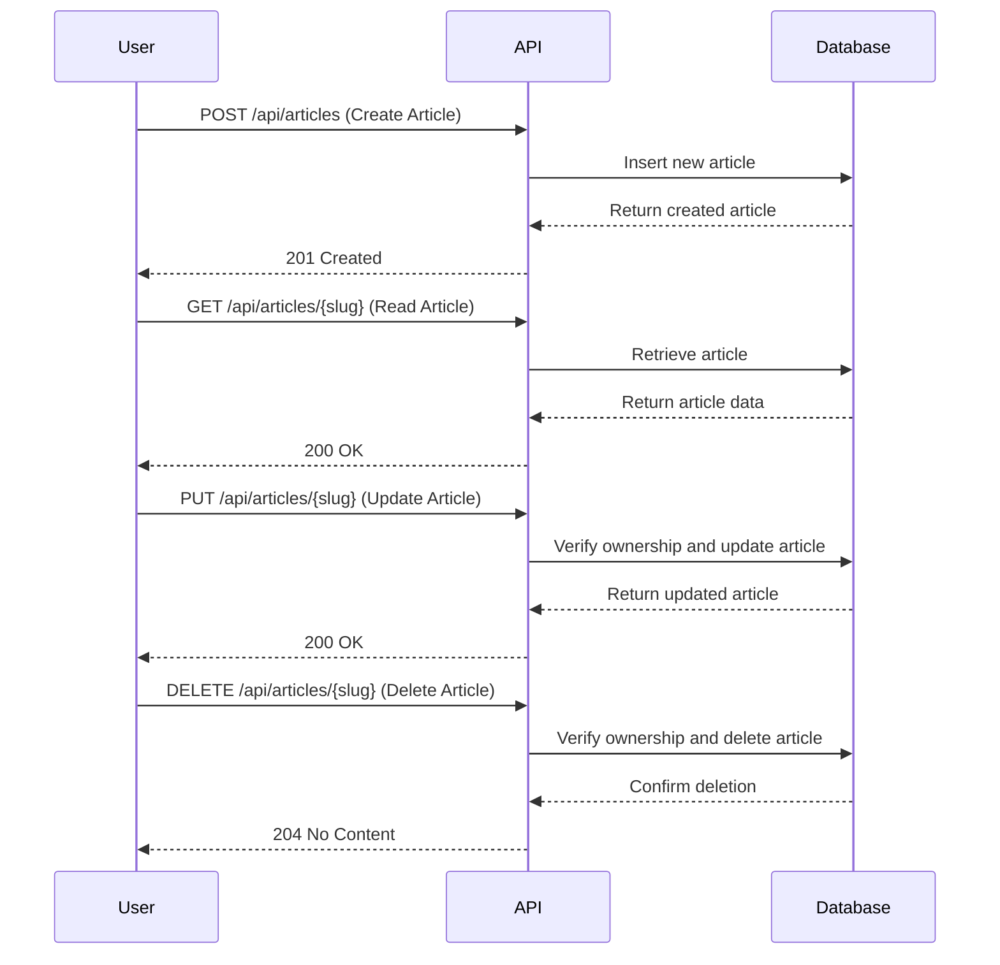

# Publishing and Managing Articles

This tutorial explores the core content workflow by performing authenticated CRUD (Create, Read, Update, Delete) operations on articles. We will also look at how ownership is verified for updates and deletions. All of these operations require authentication.

## Article Management

### Article Creation and Ownership

To create, update, or delete an article, a user must be authenticated. The API associates an article with its author, and ownership is checked for any modification or deletion requests. This ensures that only the original author can manage their content.

Here is a diagram illustrating the article management workflow:



### Creating an Article

To create a new article, you send a `POST` request to the `/api/articles` endpoint. The request body must contain the article's title, description, and body. You can also include a list of tags.

**Request Body:**

```json
{
  "article": {
    "title": "How to train your dragon",
    "description": "Ever wonder how?",
    "body": "You have to believe",
    "tagList": ["reactjs", "angularjs", "dragons"]
  }
}
```

Here is an example using `curl`:

```bash
curl -X POST \
  http://localhost:8000/api/articles \
  -H 'Content-Type: application/json' \
  -H 'Authorization: Token YOUR_JWT_TOKEN_HERE' \
  -d '{
    "article": {
      "title": "How to train your dragon",
      "description": "Ever wonder how?",
      "body": "You have to believe",
      "tagList": ["reactjs", "angularjs", "dragons"]
    }
  }'
```

The API will respond with the newly created article, including a `slug` which is a URL-friendly version of the title.

### Reading an Article

To read an article, you can make a `GET` request to the `/api/articles/{slug}` endpoint, where `{slug}` is the slug of the article you want to retrieve.

Here is an example using `curl`:

```bash
curl -X GET \
  http://localhost:8000/api/articles/how-to-train-your-dragon \
  -H 'Content-Type: application/json'
```

The API will respond with the article data.

### Updating an Article

To update an article, you send a `PUT` request to the `/api/articles/{slug}` endpoint. The request body can contain a new title, description, or body for the article. Only the author of the article can update it.

**Request Body:**

```json
{
  "article": {
    "title": "How to train your dragon 2",
    "description": "Ever wonder how? Part 2",
    "body": "It's a secret."
  }
}
```

Here is an example using `curl`:

```bash
curl -X PUT \
  http://localhost:8000/api/articles/how-to-train-your-dragon \
  -H 'Content-Type: application/json' \
  -H 'Authorization: Token YOUR_JWT_TOKEN_HERE' \
  -d '{
    "article": {
      "title": "How to train your dragon 2",
      "description": "Ever wonder how? Part 2",
      "body": "It's a secret."
    }
  }'
```

The API handles this, and uses a dependency to ensure that the user is the author of the article.

### Deleting an Article

To delete an article, you send a `DELETE` request to the `/api/articles/{slug}` endpoint. Only the author of the article can delete it.

Here is an example using `curl`:

```bash
curl -X DELETE \
  http://localhost:8000/api/articles/how-to-train-your-dragon-2 \
  -H 'Content-Type: application/json' \
  -H 'Authorization: Token YOUR_JWT_TOKEN_HERE'
```

If the request is successful, you will receive a `204 No Content` response.

The API handles the deletion, and it also uses a dependency to verify ownership.
