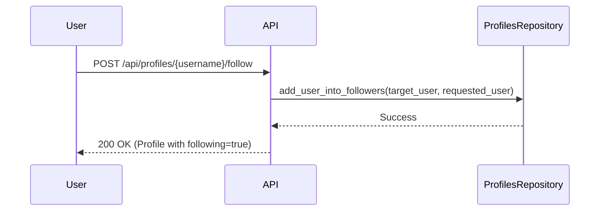

# 04 Social Features

'''# Building a Social Feed: Following, Favoriting, and Commenting

This tutorial will guide you through implementing the social features of the application. You will learn how to follow other users, favorite articles, add comments, and retrieve a personalized feed of articles from the users you follow.

## Following and Unfollowing Users

Following other users is a core social feature. By following users, you can create a personalized feed of their articles.

### How it Works

The API provides endpoints to follow and unfollow users. These endpoints are located in `app/api/routes/profiles.py`.

- `POST /api/profiles/{username}/follow`: Follow a user.
- `DELETE /api/profiles/{username}/follow`: Unfollow a user.

These endpoints require authentication. When you follow a user, their articles will appear in your personalized feed.

### Flowchart: Following a User



### Example: Following a User

To follow a user, you need to make a `POST` request to the `/api/profiles/{username}/follow` endpoint, including your authentication token in the header.

```bash
curl -X POST -H "Authorization: Token YOUR_JWT_TOKEN" http://localhost:8000/api/profiles/jake/follow
```

To unfollow, use the `DELETE` method:

```bash
curl -X DELETE -H "Authorization: Token YOUR_JWT_TOKEN" http://localhost:8000/api/profiles/jake/follow
```

## Favoriting and Unfavoriting Articles

Favoriting is a way to show appreciation for an article and save it for later. The API provides endpoints for favoriting and unfavoriting articles in `app/api/routes/articles/articles_resource.py`.

- `POST /api/articles/{slug}/favorite`: Favorite an article.
- `DELETE /api/articles/{slug}/favorite`: Unfavorite an article.

### Code Snippet: Favoriting an Article

The `favorite_article` function in `app/db/repositories/articles.py` (lines 146-153) handles adding an article to a user'''s favorites.

```python
async def favorite_article(self, *, article: Article, user: User) -> Article:
    async with self.db.acquire_connection() as connection:
        await connection.execute(
            self._favorite_article_query,
            article.id,
            user.id,
        )
    return article.copy(update={"favorited": True, "favorites_count": article.favorites_count + 1})
```

### Example: Favoriting an Article

To favorite an article, make a `POST` request to `/api/articles/{slug}/favorite`:

```bash
curl -X POST -H "Authorization: Token YOUR_JWT_TOKEN" http://localhost:8000/api/articles/how-to-train-your-dragon/favorite
```

To unfavorite, use the `DELETE` method:

```bash
curl -X DELETE -H "Authorization: Token YOUR_JWT_TOKEN" http://localhost:8000/api/articles/how-to-train-your-dragon/favorite
```

## Adding Comments to Articles

Comments allow users to engage in discussions about articles. The API provides endpoints for adding and deleting comments in `app/api/routes/comments.py`.

- `POST /api/articles/{slug}/comments`: Add a comment to an article.
- `DELETE /api/articles/{slug}/comments/{comment_id}`: Delete a comment.
- `GET /api/articles/{slug}/comments`: Get all comments for an article.

### Code Snippet: Creating a Comment

The `create_comment_for_article` function in `app/db/repositories/comments.py` handles creating a comment and associating it with an article and a user.

```python
async def create_comment_for_article(
    self, *, body: str, article: Article, user: User
) -> Comment:
    async with self.db.acquire_connection() as connection:
        comment_row = await connection.fetchrow(
            self._create_comment_for_article_query,
            body,
            article.slug,
            user.id,
        )
    return await self.get_comment_by_id(
        comment_id=comment_row["id"],
        article=article,
        user=user,
    )

```

### Example: Adding a Comment

To add a comment, make a `POST` request to `/api/articles/{slug}/comments` with the comment in the request body:

```bash
curl -X POST -H "Authorization: Token YOUR_JWT_TOKEN" -H "Content-Type: application/json" -d '''{"comment": {"body": "This is a great article!"}}''' http://localhost:8000/api/articles/how-to-train-your-dragon/comments
```

## Getting Your Personalized Feed

Once you follow users, you can retrieve a personalized feed of their most recent articles.

- `GET /api/articles/feed`: Get a feed of articles from the users you follow.

### Code Snippet: Retrieving the Feed

The `get_articles_for_feed` function in `app/db/repositories/articles.py` retrieves the articles for the current user'''s feed.

```python
async def get_articles_for_feed(
    self, *, user: User, limit: int = 20, offset: int = 0
) -> List[Article]:
    async with self.db.acquire_connection() as connection:
        article_rows = await connection.fetch(
            self._get_articles_for_feed_query,
            user.id,
            limit,
            offset,
        )
        return [
            await self.get_article_from_db_row(article_row=article_row, requested_user=user)
            for article_row in article_rows
        ]
```

### Example: Getting Your Feed

To get your feed, make a `GET` request to `/api/articles/feed`:

```bash
curl -X GET -H "Authorization: Token YOUR_JWT_TOKEN" http://localhost:8000/api/articles/feed
```

This will return a list of articles from the users you follow, ordered by the most recent first.
'''
