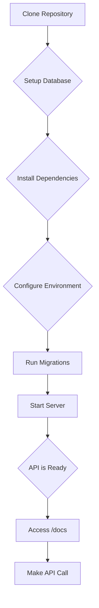
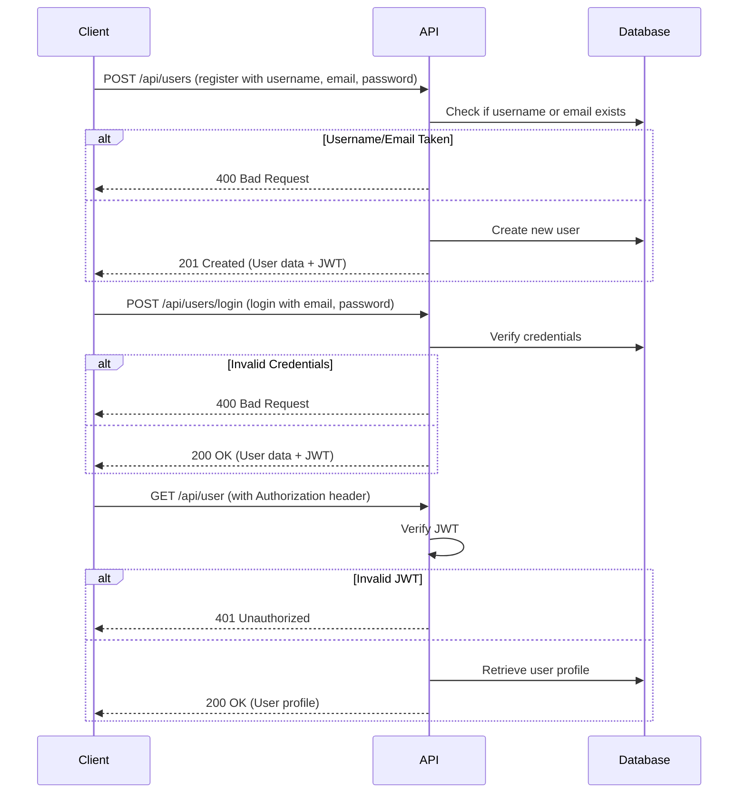
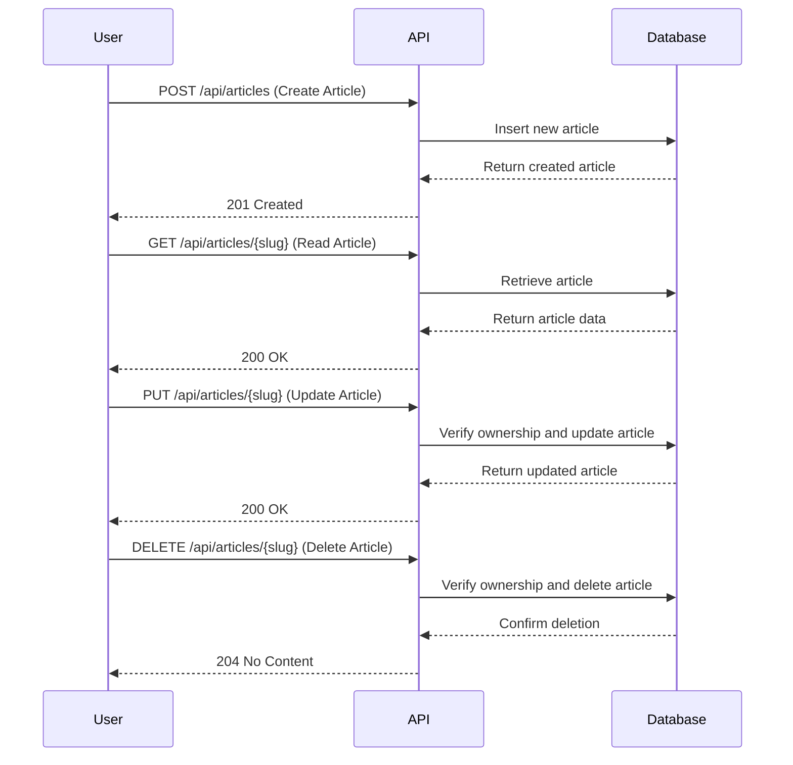
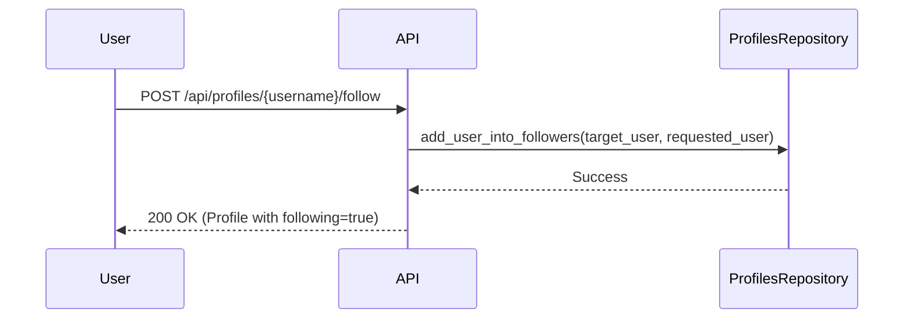

# Tutorials Wiki

> Compact, single-page view of all tutorials. Use the TOC below to jump around.

## Table of Contents
- [01 Quickstart](#01_quickstart)
- [02 Authentication And Users](#02_authentication_and_users)
- [Publishing and Managing Articles](#publishing_and_managing_articles)
- [04 Social Features](#04_social_features)

<a id="tutorials_wiki"></a>
---
<a id="01_quickstart"></a>
# 01 Quickstart

_# Quickstart: Setup and First API Interaction

This tutorial will guide you through setting up the RealWorld API locally, running the server, and making your first API call using the interactive documentation.

## 1. Environment Setup

First, we need to clone the repository and set up the necessary environment variables.

### Clone the Repository

```bash
git clone https://github.com/nsidnev/fastapi-realworld-example-app
cd fastapi-realworld-example-app
```

### Database Setup

The application uses PostgreSQL as its database. The quickest way to get a database running is by using Docker.

```bash
export POSTGRES_DB=rwdb POSTGRES_PORT=5432 POSTGRES_USER=postgres POSTGRES_PASSWORD=postgres
docker run --name pgdb --rm -e POSTGRES_USER="$POSTGRES_USER" -e POSTGRES_PASSWORD="$POSTGRES_PASSWORD" -e POSTGRES_DB="$POSTGRES_DB" -p 5432:5432 postgres
export POSTGRES_HOST=$(docker inspect -f '''{{range .NetworkSettings.Networks}}{{.IPAddress}}{{end}}''' pgdb)
createdb --host=$POSTGRES_HOST --port=$POSTGRES_PORT --username=$POSTGRES_USER $POSTGRES_DB
```

### Project Dependencies

This project uses `poetry` for dependency management.

```bash
poetry install
poetry shell
```

### Environment Variables

Create a `.env` file in the project root and add the following, replacing the placeholder for `SECRET_KEY`:

```bash
touch .env
echo APP_ENV=dev >> .env
echo DATABASE_URL=postgresql://$POSTGRES_USER:$POSTGRES_PASSWORD@$POSTGRES_HOST:$POSTGRES_PORT/$POSTGRES_DB >> .env
echo SECRET_KEY=$(openssl rand -hex 32) >> .env
```

## 2. Running the Application

With the environment configured, we can now run the database migrations and start the web server.

### Database Migrations

The database schema is managed with Alembic. To apply the latest migrations, run:

```bash
alembic upgrade head
```

### Start the Server

Now, start the FastAPI server:

```bash
uvicorn app.main:app --reload
```

The API will be running at `http://127.0.0.1:8000`.

## 3. First API Interaction

The API includes interactive documentation using Swagger UI, which you can access at `http://127.0.0.1:8000/docs`.

### Using the Interactive Docs

1.  Open your browser and navigate to `http://127.0.0.1:8000/docs`.
2.  You will see a list of API endpoints. Find the `/api/tags` endpoint under the "tags" section.
3.  Click on the endpoint to expand it.
4.  Click the "Try it out" button.
5.  Click the "Execute" button.

### Expected Response

You should see a `200` response with a JSON body containing a list of tags, which will be empty at this stage:

```json
{
  "tags": []
}
```

This confirms that your API is running correctly and you can successfully make unauthenticated requests.

## Architecture Diagram

Here is a diagram illustrating the setup process:



[↩ Back to top](#tutorials_wiki)

---
<a id="02_authentication_and_users"></a>
# 02 Authentication And Users

'''
# Creating an Account and Authenticating

This guide will walk you through the complete authentication workflow in the RealWorld API. You will learn how to register a new user, log in to receive a JSON Web Token (JWT), and access a protected endpoint to view your user profile.

## User Registration

Creating a new user account is the first step. This is handled by the `register` function in `app/api/routes/authentication.py` (lines 71-99).

The API expects a `POST` request to `/api/users` with a JSON payload containing the username, email, and password.

### Register a new user

```bash
curl -X POST -H "Content-Type: application/json" -d '{
  "user": {
    "username": "testuser",
    "email": "test.user@example.com",
    "password": "password123"
  }
}' http://localhost:8000/api/users
```

Upon successful registration, the API will respond with a `201 Created` status and a JSON object containing the user's data, including a JWT token.

```json
{
  "user": {
    "username": "testuser",
    "email": "test.user@example.com",
    "bio": "",
    "image": null,
    "token": "YOUR_JWT_TOKEN_HERE"
  }
}
```

## User Login

Once you have a registered account, you can log in to obtain a JWT. The login process is handled by the `login` function in `app/api/routes/authentication.py` (lines 23-57).

The API expects a `POST` request to `/api/users/login` with a JSON payload containing the user's email and password.

### Log in with your new account

```bash
curl -X POST -H "Content-Type: application/json" -d '{
  "user": {
    "email": "test.user@example.com",
    "password": "password123"
  }
}' http://localhost:8000/api/users/login
```

The API will respond with a JSON object containing the user's data and a new JWT token.

```json
{
  "user": {
    "username": "testuser",
    "email": "test.user@example.com",
    "bio": "",
    "image": null,
    "token": "YOUR_NEW_JWT_TOKEN_HERE"
  }
}
```

## Accessing Protected Endpoints

Many API endpoints, such as retrieving the current user's profile, require authentication. To access these endpoints, you must include the JWT in the `Authorization` header of your request, prefixed with `Token `.

The endpoint to retrieve the current user is defined in `app/api/routes/users.py` (lines 21-39).

### Get your user profile

Replace `YOUR_JWT_TOKEN_HERE` with the token you received upon login.

```bash
curl -X GET -H "Authorization: Token YOUR_JWT_TOKEN_HERE" http://localhost:8000/api/user
```

The API will respond with your user profile data.

```json
{
  "user": {
    "username": "testuser",
    "email": "test.user@example.com",
    "bio": "",
    "image": null,
    "token": "YOUR_JWT_TOKEN_HERE"
  }
}
```

## Authentication Flow

The following diagram illustrates the authentication workflow:


'''

[↩ Back to top](#tutorials_wiki)

---
<a id="publishing_and_managing_articles"></a>
# Publishing and Managing Articles

This tutorial explores the core content workflow by performing authenticated CRUD (Create, Read, Update, Delete) operations on articles. We will also look at how ownership is verified for updates and deletions. All of these operations require authentication.

## Article Management

### Article Creation and Ownership

To create, update, or delete an article, a user must be authenticated. The API associates an article with its author, and ownership is checked for any modification or deletion requests. This ensures that only the original author can manage their content.

Here is a diagram illustrating the article management workflow:



### Creating an Article

To create a new article, you send a `POST` request to the `/api/articles` endpoint. The request body must contain the article's title, description, and body. You can also include a list of tags.

**Request Body:**

```json
{
  "article": {
    "title": "How to train your dragon",
    "description": "Ever wonder how?",
    "body": "You have to believe",
    "tagList": ["reactjs", "angularjs", "dragons"]
  }
}
```

Here is an example using `curl`:

```bash
curl -X POST \
  http://localhost:8000/api/articles \
  -H 'Content-Type: application/json' \
  -H 'Authorization: Token YOUR_JWT_TOKEN_HERE' \
  -d '{
    "article": {
      "title": "How to train your dragon",
      "description": "Ever wonder how?",
      "body": "You have to believe",
      "tagList": ["reactjs", "angularjs", "dragons"]
    }
  }'
```

The API will respond with the newly created article, including a `slug` which is a URL-friendly version of the title.

### Reading an Article

To read an article, you can make a `GET` request to the `/api/articles/{slug}` endpoint, where `{slug}` is the slug of the article you want to retrieve.

Here is an example using `curl`:

```bash
curl -X GET \
  http://localhost:8000/api/articles/how-to-train-your-dragon \
  -H 'Content-Type: application/json'
```

The API will respond with the article data.

### Updating an Article

To update an article, you send a `PUT` request to the `/api/articles/{slug}` endpoint. The request body can contain a new title, description, or body for the article. Only the author of the article can update it.

**Request Body:**

```json
{
  "article": {
    "title": "How to train your dragon 2",
    "description": "Ever wonder how? Part 2",
    "body": "It's a secret."
  }
}
```

Here is an example using `curl`:

```bash
curl -X PUT \
  http://localhost:8000/api/articles/how-to-train-your-dragon \
  -H 'Content-Type: application/json' \
  -H 'Authorization: Token YOUR_JWT_TOKEN_HERE' \
  -d '{
    "article": {
      "title": "How to train your dragon 2",
      "description": "Ever wonder how? Part 2",
      "body": "It's a secret."
    }
  }'
```

The API handles this, and uses a dependency to ensure that the user is the author of the article.

### Deleting an Article

To delete an article, you send a `DELETE` request to the `/api/articles/{slug}` endpoint. Only the author of the article can delete it.

Here is an example using `curl`:

```bash
curl -X DELETE \
  http://localhost:8000/api/articles/how-to-train-your-dragon-2 \
  -H 'Content-Type: application/json' \
  -H 'Authorization: Token YOUR_JWT_TOKEN_HERE'
```

If the request is successful, you will receive a `204 No Content` response.

The API handles the deletion, and it also uses a dependency to verify ownership.

[↩ Back to top](#tutorials_wiki)

---
<a id="04_social_features"></a>
# 04 Social Features

'''# Building a Social Feed: Following, Favoriting, and Commenting

This tutorial will guide you through implementing the social features of the application. You will learn how to follow other users, favorite articles, add comments, and retrieve a personalized feed of articles from the users you follow.

## Following and Unfollowing Users

Following other users is a core social feature. By following users, you can create a personalized feed of their articles.

### How it Works

The API provides endpoints to follow and unfollow users. These endpoints are located in `app/api/routes/profiles.py`.

- `POST /api/profiles/{username}/follow`: Follow a user.
- `DELETE /api/profiles/{username}/follow`: Unfollow a user.

These endpoints require authentication. When you follow a user, their articles will appear in your personalized feed.

### Flowchart: Following a User



### Example: Following a User

To follow a user, you need to make a `POST` request to the `/api/profiles/{username}/follow` endpoint, including your authentication token in the header.

```bash
curl -X POST -H "Authorization: Token YOUR_JWT_TOKEN" http://localhost:8000/api/profiles/jake/follow
```

To unfollow, use the `DELETE` method:

```bash
curl -X DELETE -H "Authorization: Token YOUR_JWT_TOKEN" http://localhost:8000/api/profiles/jake/follow
```

## Favoriting and Unfavoriting Articles

Favoriting is a way to show appreciation for an article and save it for later. The API provides endpoints for favoriting and unfavoriting articles in `app/api/routes/articles/articles_resource.py`.

- `POST /api/articles/{slug}/favorite`: Favorite an article.
- `DELETE /api/articles/{slug}/favorite`: Unfavorite an article.

### Code Snippet: Favoriting an Article

The `favorite_article` function in `app/db/repositories/articles.py` (lines 146-153) handles adding an article to a user'''s favorites.

```python
async def favorite_article(self, *, article: Article, user: User) -> Article:
    async with self.db.acquire_connection() as connection:
        await connection.execute(
            self._favorite_article_query,
            article.id,
            user.id,
        )
    return article.copy(update={"favorited": True, "favorites_count": article.favorites_count + 1})
```

### Example: Favoriting an Article

To favorite an article, make a `POST` request to `/api/articles/{slug}/favorite`:

```bash
curl -X POST -H "Authorization: Token YOUR_JWT_TOKEN" http://localhost:8000/api/articles/how-to-train-your-dragon/favorite
```

To unfavorite, use the `DELETE` method:

```bash
curl -X DELETE -H "Authorization: Token YOUR_JWT_TOKEN" http://localhost:8000/api/articles/how-to-train-your-dragon/favorite
```

## Adding Comments to Articles

Comments allow users to engage in discussions about articles. The API provides endpoints for adding and deleting comments in `app/api/routes/comments.py`.

- `POST /api/articles/{slug}/comments`: Add a comment to an article.
- `DELETE /api/articles/{slug}/comments/{comment_id}`: Delete a comment.
- `GET /api/articles/{slug}/comments`: Get all comments for an article.

### Code Snippet: Creating a Comment

The `create_comment_for_article` function in `app/db/repositories/comments.py` handles creating a comment and associating it with an article and a user.

```python
async def create_comment_for_article(
    self, *, body: str, article: Article, user: User
) -> Comment:
    async with self.db.acquire_connection() as connection:
        comment_row = await connection.fetchrow(
            self._create_comment_for_article_query,
            body,
            article.slug,
            user.id,
        )
    return await self.get_comment_by_id(
        comment_id=comment_row["id"],
        article=article,
        user=user,
    )

```

### Example: Adding a Comment

To add a comment, make a `POST` request to `/api/articles/{slug}/comments` with the comment in the request body:

```bash
curl -X POST -H "Authorization: Token YOUR_JWT_TOKEN" -H "Content-Type: application/json" -d '''{"comment": {"body": "This is a great article!"}}''' http://localhost:8000/api/articles/how-to-train-your-dragon/comments
```

## Getting Your Personalized Feed

Once you follow users, you can retrieve a personalized feed of their most recent articles.

- `GET /api/articles/feed`: Get a feed of articles from the users you follow.

### Code Snippet: Retrieving the Feed

The `get_articles_for_feed` function in `app/db/repositories/articles.py` retrieves the articles for the current user'''s feed.

```python
async def get_articles_for_feed(
    self, *, user: User, limit: int = 20, offset: int = 0
) -> List[Article]:
    async with self.db.acquire_connection() as connection:
        article_rows = await connection.fetch(
            self._get_articles_for_feed_query,
            user.id,
            limit,
            offset,
        )
        return [
            await self.get_article_from_db_row(article_row=article_row, requested_user=user)
            for article_row in article_rows
        ]
```

### Example: Getting Your Feed

To get your feed, make a `GET` request to `/api/articles/feed`:

```bash
curl -X GET -H "Authorization: Token YOUR_JWT_TOKEN" http://localhost:8000/api/articles/feed
```

This will return a list of articles from the users you follow, ordered by the most recent first.
'''

[↩ Back to top](#tutorials_wiki)
