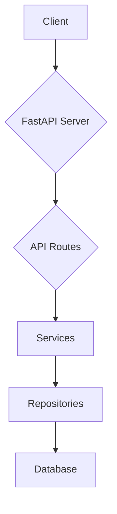

# 01 Quickstart

'''
# Quickstart: Running the RealWorld Server

This guide will walk you through setting up your local environment, installing dependencies, and launching the FastAPI application to get your local server running.

## Prerequisites

Before you begin, ensure you have the following installed:

- [Docker](https://docs.docker.com/get-docker/)
- [Poetry](https://python-poetry.org/docs/#installation)
- [PostgreSQL Client Tools](https://www.postgresql.org/docs/current/app-createdb.html) (for the `createdb` command)

## 1. Set Up the Database

First, we need to get a PostgreSQL database running. We'll use Docker to simplify this process.

```bash
# Set environment variables for the database
export POSTGRES_DB=rwdb
export POSTGRES_PORT=5432
export POSTGRES_USER=postgres
export POSTGRES_PASSWORD=postgres
export POSTGRES_HOST=localhost

# Run PostgreSQL in a Docker container in detached mode
docker run --name pgdb -d --rm -p $POSTGRES_PORT:$POSTGRES_PORT -e POSTGRES_USER="$POSTGRES_USER" -e POSTGRES_PASSWORD="$POSTGRES_PASSWORD" -e POSTGRES_DB="$POSTGRES_DB" postgres

# Wait for the database to be ready
sleep 5

# Create the database
createdb --host=$POSTGRES_HOST --port=$POSTGRES_PORT --username=$POSTGRES_USER $POSTGRES_DB
```

These commands start a PostgreSQL container and create the necessary database for the application.

## 2. Configure and Install the Application

Next, we'll clone the repository, install dependencies using Poetry, and configure the application.

```bash
# Clone the repository
git clone https://github.com/nsidnev/fastapi-realworld-example-app
cd fastapi-realworld-example-app

# Install dependencies
poetry install

# Activate the virtual environment
poetry shell
```

Now, create and populate a `.env` file in the project root to store your environment variables:

```bash
touch .env
echo APP_ENV=dev >> .env
echo DATABASE_URL=postgresql://$POSTGRES_USER:$POSTGRES_PASSWORD@$POSTGRES_HOST:$POSTGRES_PORT/$POSTGRES_DB >> .env
echo SECRET_KEY=$(openssl rand -hex 32) >> .env
```

This file tells the application how to connect to the database and sets a secret key for signing JWTs.

## 3. Run the Server

With everything configured, you can now run the database migrations and start the FastAPI server.

```bash
# Apply database migrations
alembic upgrade head

# Start the server with auto-reload
uvicorn app.main:app --reload
```

Your server is now running! You can access the API documentation at [http://127.0.0.1:8000/docs](http://127.0.0.1:8000/docs).

## Architecture Overview

This application follows a standard layered architecture, which promotes separation of concerns and modularity. As documented in the knowledge base, the main components are:

- **API Routes**: Handle incoming HTTP requests.
- **Services**: Contain the core business logic.
- **Repositories**: Abstract database interactions.

Here is a diagram illustrating the request flow:



The main entry point of the application is `app/main.py`, which you can inspect to see how the FastAPI app is initialized.
'''
