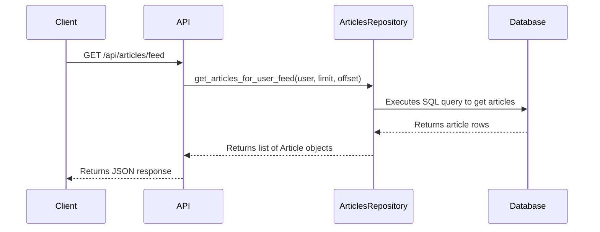

# 02 Request Flow

'''
# Anatomy of an API Request

This tutorial follows a request from an API route through the service and repository layers to understand the application's core architecture and separation of concerns.

As documented in the knowledge base, the application is designed with a clear separation of concerns. This means that different parts of the application have distinct responsibilities. This makes the code easier to understand, maintain, and test.

The main layers are:

*   **API Layer**: Handles incoming HTTP requests and sends back responses. It's responsible for things like routing, request validation, and authentication.
*   **Service Layer**: Contains the business logic of the application.
*   **Repository Layer**: Responsible for all communication with the database.

Let's trace the flow of a request to see how these layers work together.

## The Request

We'll follow a `GET` request to `/api/articles/feed`, which retrieves the most recent articles for the currently logged-in user.

Here is an example of how to make this request using `curl`:

```bash
curl -X GET http://localhost:8000/api/articles/feed \
  -H "Authorization: Token YOUR_JWT_TOKEN"
```

## 1. The API Layer: Routing

The request first hits the API layer. The file `app/api/routes/api.py` is the main entry point for all API routes:

```python
# app/api/routes/api.py:5-13

from fastapi import APIRouter

from app.api.routes import authentication, comments, profiles, tags, users
from app.api.routes.articles import api as articles

router = APIRouter()
router.include_router(authentication.router, tags=["authentication"], prefix="/users")
router.include_router(users.router, tags=["users"], prefix="/user")
router.include_router(profiles.router, tags=["profiles"], prefix="/profiles")
router.include_router(articles.router, tags=["articles"])
router.include_router(
    comments.router,
    tags=["comments"],
    prefix="/articles/{slug}/comments",
)
router.include_router(tags.router, tags=["tags"], prefix="/tags")
```

The `articles.router` is included with the prefix `/articles`. Let's look at `app/api/routes/articles/api.py`:

```python
# app/api/routes/articles/api.py:3-7
from fastapi import APIRouter

from app.api.routes.articles import articles_common, articles_resource

router = APIRouter()

router.include_router(articles_common.router, prefix="/articles")
router.include_router(articles_resource.router, prefix="/articles")
```

Our target endpoint `/feed` is in `articles_common.router` which is defined in `app/api/routes/articles/articles_common.py`:

```python
# app/api/routes/articles/articles_common.py:22-38
@router.get(
    "/feed",
    response_model=ListOfArticlesInResponse,
    name="articles:get-user-feed-articles",
)
async def get_articles_for_user_feed(
    limit: int = Query(DEFAULT_ARTICLES_LIMIT, ge=1),
    offset: int = Query(DEFAULT_ARTICLES_OFFSET, ge=0),
    user: User = Depends(get_current_user_authorizer()),
    articles_repo: ArticlesRepository = Depends(get_repository(ArticlesRepository)),
) -> ListOfArticlesInResponse:
    articles = await articles_repo.get_articles_for_user_feed(
        user=user,
        limit=limit,
        offset=offset,
    )
    articles_for_response = [
        ArticleForResponse(**article.dict()) for article in articles
    ]
    return ListOfArticlesInResponse(
        articles=articles_for_response,
        articles_count=len(articles),
    )
```

This route handler does a few things:

1.  It uses FastAPI's dependency injection system (`Depends`) to get the current user and an instance of the `ArticlesRepository`.
2.  It calls the `get_articles_for_user_feed` method on the `articles_repo`.
3.  It formats the articles for the response.

## 2. The Repository Layer: Data Access

The `ArticlesRepository` is where the application interacts with the database. Let's look at the `get_articles_for_user_feed` method in `app/db/repositories/articles.py`:

```python
# app/db/repositories/articles.py:255-265
    async def get_articles_for_user_feed(
        self,
        *,
        user: User,
        limit: int = 20,
        offset: int = 0,
    ) -> List[Article]:
        articles_rows = await queries.get_articles_for_feed(
            self.connection,
            follower_username=user.username,
            limit=limit,
            offset=offset,
        )
        return [
            await self._get_article_from_db_record(
                article_row=article_row,
                slug=article_row[SLUG_ALIAS],
                author_username=article_row[AUTHOR_USERNAME_ALIAS],
                requested_user=user,
            )
            for article_row in articles_rows
        ]
```

This method fetches the articles from the database by calling `queries.get_articles_for_feed`. The `queries` object is generated from raw SQL files, providing a clean way to interact with the database.

## 3. The Flow in a Diagram

Here is a sequence diagram to visualize the flow:



## Summary

In this tutorial, we followed a request from the API layer all the way down to the database. We saw how the application is structured to separate concerns, making it easier to understand and maintain. The API layer handles HTTP requests, the repository layer handles data access, and dependency injection ties them together.
'''
