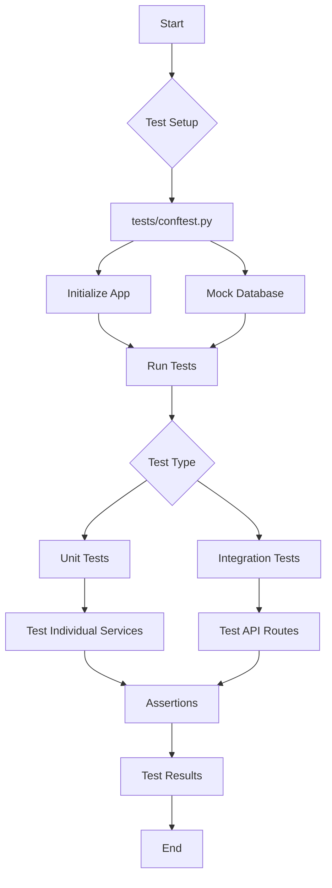

# 03 Writing Tests

> # Testing Your Code with Pytest

This tutorial will guide you through writing and running unit and integration tests for the FastAPI application using `pytest`. You will learn how to use fixtures, mock database connections, and test individual application services and API routes.

As documented in the knowledge base, the project has a `tests` directory that mirrors the application structure, using `pytest` and fixtures (`conftest.py`) to test components in isolation. This ensures that our application is robust and reliable.

## Setting Up the Test Environment

The foundation of our testing setup is `tests/conftest.py`. This file contains fixtures that prepare the necessary components for our tests, such as the FastAPI application instance, a test client, and a mocked database connection.

Here are some of the key fixtures defined in `tests/conftest.py`:

```python
@pytest.fixture
def app() -> FastAPI:
    from app.main import get_application  # local import for testing purpose

    return get_application()

@pytest.fixture
async def initialized_app(app: FastAPI) -> FastAPI:
    async with LifespanManager(app):
        app.state.pool = await FakeAsyncPGPool.create_pool(app.state.pool)
        yield app

@pytest.fixture
async def client(initialized_app: FastAPI) -> AsyncClient:
    async with AsyncClient(
        app=initialized_app,
        base_url="http://testserver",
        headers={"Content-Type": "application/json"},
    ) as client:
        yield client

@pytest.fixture
def authorized_client(
    client: AsyncClient, token: str, authorization_prefix: str
) -> AsyncClient:
    client.headers = {
        "Authorization": f"{authorization_prefix} {token}",
        **client.headers,
    }
    return client
```

These fixtures provide a clean and consistent way to set up the application for testing. For example, the `initialized_app` fixture uses a `FakeAsyncPGPool` to mock the database connection, which is essential for creating isolated and fast tests. You can see this implementation in the `tests/conftest.py` file.

### Unit Testing a Service

Unit tests focus on testing individual components in isolation. Let's look at how to test the JWT service in `tests/test_services/test_jwt.py`.

```python
from datetime import timedelta

import jwt
import pytest

from app.models.domain.users import UserInDB
from app.services.jwt import (
    ALGORITHM,
    create_access_token_for_user,
    create_jwt_token,
    get_username_from_token,
)

def test_creating_jwt_token() -> None:
    token = create_jwt_token(
        jwt_content={"content": "payload"},
        secret_key="secret",
        expires_delta=timedelta(minutes=1),
    )
    parsed_payload = jwt.decode(token, "secret", algorithms=[ALGORITHM])

    assert parsed_payload["content"] == "payload"
```

This test, `test_creating_jwt_token`, verifies that the `create_jwt_token` function correctly creates a JWT with the expected payload. It does not depend on any other part of the application, making it a true unit test.

### Integration Testing an API Route

Integration tests verify that different parts of the application work together correctly. Here is an example from `tests/test_api/test_routes/test_articles.py` that tests the article creation endpoint:

```python
async def test_user_can_create_article(
    app: FastAPI, authorized_client: AsyncClient, test_user: UserInDB
) -> None:
    article_data = {
        "title": "Test Slug",
        "body": "does not matter",
        "description": "¯\\_(ツ)_/¯",
    }
    response = await authorized_client.post(
        app.url_path_for("articles:create-article"), json={"article": article_data}
    )
    article = ArticleInResponse(**response.json())
    assert article.article.title == article_data["title"]
    assert article.article.author.username == test_user.username
```

This test uses the `authorized_client` and `test_user` fixtures to send a POST request to the `/api/articles` endpoint and asserts that the response is correct. This test ensures that the API route, authentication, and article creation logic all work together as expected.

### Testing Workflow

The following diagram illustrates the testing workflow, from setting up the test environment to running unit and integration tests:



### Running the Tests

You can run the tests using the provided scripts in the `scripts/` directory. To run all tests, use the following command:

```bash
./scripts/test
```

To run the tests with coverage and generate an HTML report, use:

```bash
./scripts/test-cov-html
```

This will create a `htmlcov/` directory with a detailed report of your test coverage.

## Conclusion

In this tutorial, you learned how to write and run unit and integration tests for a FastAPI application using `pytest`. You saw how to use fixtures to create a consistent testing environment, how to mock database connections for isolated testing, and how to test both individual services and API routes. By following these patterns, you can ensure your application is well-tested, reliable, and easy to maintain.
